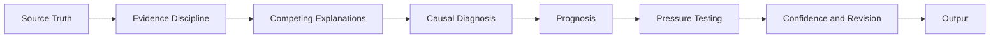
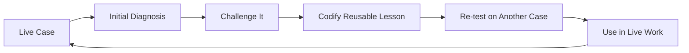

# AI Reasoning Systems for GTM Judgment

*How I am using AI to make executive and GTM reasoning more inspectable, evidence-disciplined, and harder to fool.*

## What This Repository Is

This repository documents a body of work focused on one question.

**How can AI help improve judgment without allowing speed, fluency, or confidence to outrun the evidence?**

I am an enterprise GTM executive, not a software developer. The work here is not a prompt library or a software codebase. It is a public portfolio of reasoning architectures, design principles, experiments, and practical applications developed through repeated use.

The point is not the tooling.

The point is the reasoning discipline underneath it.

## Why It Exists

Most AI workflows optimize for faster output.

In GTM and executive work, speed is not leverage if the diagnosis is wrong. AI can accept the premise too quickly, over-weight a vivid event, smooth over ambiguity, or turn a plausible explanation into more certainty than the evidence deserves.

That creates a larger risk than bad writing.

It can create bad intervention.

A visible issue may be a downstream symptom rather than the condition governing the outcome. A polished answer can make a weak diagnosis more persuasive rather than more accurate.

The core thesis behind this work is simple.

> **Better decisions come from better diagnosis.**

And the operating principle is equally important.

> **The advantage isn’t getting to the first answer faster. It’s knowing when the first answer shouldn’t be trusted.**

## The Core Idea

I use the term **logic lens** to describe a predefined way of examining a problem before AI produces an answer.

A prompt mostly defines the output.

A logic lens defines the reasoning path that should produce the output.

The current implementation is **Full Stack v4**, a reusable reasoning architecture designed to create deliberate friction before a conclusion is trusted.

The purpose is not to make every answer follow the same visible structure.

The purpose is to make the reasoning behind different answers more disciplined.

## Start Here

| Document | What it shows |
| --- | --- |
| [Building Friction Into AI](docs/building-friction-into-ai.md) | Why the work started, how the reasoning system is being built, and what remains unresolved |
| [What I Mean by a Logic Lens](docs/what-is-a-logic-lens.md) | A plain-English explanation of the core concept |
| [Full Stack v4 Public Architecture](architecture/full-stack-v4-public-architecture.md) | The high-level architecture behind the current reasoning system |
| [GTM Diagnostic Framework v8 Public Architecture](architecture/gtm-diagnostic-framework-v8-public-architecture.md) | The compressed public architecture of the private GTM v8 framework and its public/private boundary |
| [GTM Framework Evolution](architecture/gtm-evolution.md) | The documented changes from v7 to v8 and the discipline for future version changes |
| [Evolution of the Reasoning System](architecture/evolution.md) | The design decisions that materially changed the system |
| [Evaluation Approach](evaluation/evaluation-approach.md) | How I am testing whether the architecture improves reasoning rather than merely improving the writing |
| [GTM Diagnostic Reasoning](applications/gtm-diagnostic-reasoning.md) | How the reasoning disciplines become practical GTM diagnosis without exposing the complete private commercial framework |
| [Behavioral Inference Engine](research/behavioral-inference-engine.md) | A work-in-progress research direction for longitudinal behavioral inference without turning observation into unsupported motive |
| [Reconstructed Evaluation Case 01](examples/reconstructed-example-01.md) | A controlled GTM example showing how the reasoning intervention changes diagnosis and the recommended action |
| [Reconstructed Evaluation Case 02](examples/reconstructed-example-02.md) | A counterexample where the baseline is already strong and Full Stack produces no material decision change |
| [Reconstructed Evaluation Case 03](examples/reconstructed-example-03.md) | A degradation case where added causal complexity produces a weaker decision than the baseline |

If you only read one document, start with **Building Friction Into AI**.

If you want the architecture, go directly to **Full Stack v4 Public Architecture**.

If you want the current testing methodology, see **Evaluation Approach**.

If you want to see how the reasoning system applies to commercial operating decisions, read **GTM Diagnostic Reasoning**.

If you want the GTM architecture itself, read **GTM Diagnostic Framework v8 Public Architecture**.

If you want to understand how GTM v7 became v8 and how future versions should be governed, read **GTM Framework Evolution**.

If you want to see an unfinished research direction and its current limits, read **Behavioral Inference Engine**.

If you want to see the methodology applied, read **Cases 01 through 03** together. They show an **Improved** outcome, a **No material change** outcome, and a **Degraded** outcome.

## How the Work Is Developed

The development loop is practical rather than theoretical.

AI serves two roles in that process.

It is the tool being guided by the reasoning system, and it is part of the environment used to expose where the reasoning system fails or overreaches.

A lesson is more useful when it survives a different case rather than merely improving the answer that revealed the weakness.

## Current Evidence and Limits

Full Stack v4 is functional and already used in live GTM thought leadership and executive work.

The evidence today is repeated practical use and iterative testing.

That is not the same as formal validation.

The current work can show observed failure modes, framework revisions, later retesting, and changes in how the system approaches diagnosis. It does not yet include a formal benchmark demonstrating that the architecture consistently improves reasoning quality.

The public [Evaluation Approach](evaluation/evaluation-approach.md) defines a working methodology for moving from practical use toward more structured testing while keeping formal validation as a separate, higher standard.

The [GTM Diagnostic Reasoning](applications/gtm-diagnostic-reasoning.md) application note, [GTM Diagnostic Framework v8 Public Architecture](architecture/gtm-diagnostic-framework-v8-public-architecture.md), and [GTM Framework Evolution](architecture/gtm-evolution.md) are derived from the private GTM Diagnostic Framework v8. The complete v8 framework remains private and is currently a field-test draft rather than a formally validated methodology.

The reconstructed cases apply that method across three outcomes. [Case 01](examples/reconstructed-example-01.md) shows a material improvement in diagnosis and recommended action. [Case 02](examples/reconstructed-example-02.md) shows no material decision change when the baseline is already strong. [Case 03](examples/reconstructed-example-03.md) shows a degraded result where added causal complexity produces a weaker decision. All three are illustrative and author-adjudicated rather than independent validation.

The [Behavioral Inference Engine](research/behavioral-inference-engine.md) is a separate research direction. It is not a finished or validated standalone system. The current public note documents the attribution guardrail, the longitudinal inference problem, and unresolved model-revision questions without claiming that a complete BIE architecture exists.

## Public Architecture and Private Implementation

This repository is intended to make the work inspectable without publishing the complete implementation.

The public material explains the problem, architecture, design principles, evolution, applications, and limits of the work.

The private material retains the detailed operating instructions, execution logic, internal tests, decision rules, and other implementation-level methods used to run the system.

That boundary is deliberate.

Credibility should come from showing that a real system exists, how it evolved, what failure modes it addresses, and where its limits remain.

It does not require publishing every instruction needed to replicate it.

See [Rights and Reuse](RIGHTS.md) for the repository's reuse terms.

## What Is Next

Planned additions include

- additional structured, reconstructed, or anonymized cases using the public evaluation approach
- more structured evaluation as the case set becomes large enough to support stronger testing

These will be added only when the underlying material is strong enough to support the claim the artifact is intended to prove.

## About Scott Schoenfeld

I am an enterprise GTM executive who has spent my career operating in complex technology markets.

I use AI as a reasoning and decision-support tool, not as a substitute for commercial judgment.

This repository makes that approach inspectable. It shows how I am developing, testing, challenging, and revising systems intended to improve diagnosis before action.

The work is practical, versioned, and still evolving.
