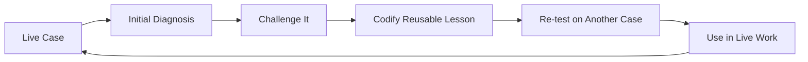

# AI Reasoning Systems for GTM Judgment

*How I am using AI to make executive and GTM reasoning more inspectable, evidence-disciplined, and harder to fool.*

## In 60 Seconds

I am an enterprise GTM executive who has spent my career operating in complex technology markets. I use AI as a reasoning and decision-support tool, not as a substitute for commercial judgment.

This work started with a simple problem.

**AI is very good at producing answers quickly. It is not automatically good at knowing when an answer should be trusted.**

I have been developing reasoning systems that introduce deliberate friction before a conclusion is accepted. The goal is to separate evidence from inference, test competing explanations, diagnose causes rather than symptoms, pressure-test conclusions, and make uncertainty visible when the evidence is weak.

The current body of work includes **Full Stack v4**, the **GTM Diagnostic Framework v8**, a structured evaluation approach, reconstructed test cases, an independent review protocol, and several research and calibration threads that remain deliberately unfinished.

This is not a software codebase or a prompt library.

It is a public record of how the reasoning systems are built, challenged, revised, and sometimes left unchanged when the evidence does not justify a modification.

## Why GitHub

I am not using GitHub because this work is software.

I am using it because the development history matters.

A finished framework can look more certain than the process that produced it. GitHub makes it possible to inspect how the work changes over time, what failure modes caused revisions, what evidence supports a change, what remains unresolved, and when an observation is deliberately held as a hypothesis rather than promoted into the framework.

That distinction is important to the way I work.

**The frameworks are the work. GitHub is the evidence trail.**

## The Problem

Most AI workflows optimize for faster output.

In GTM and executive work, speed is not leverage if the diagnosis is wrong. AI can accept the premise too quickly, over-weight a vivid event, smooth over ambiguity, or turn a plausible explanation into more certainty than the evidence deserves.

That creates a larger risk than bad writing.

It can create bad intervention.

A visible issue may be a downstream symptom rather than the condition governing the outcome. A polished answer can make a weak diagnosis more persuasive rather than more accurate.

The core thesis behind this work is simple.

> **Better decisions come from better diagnosis.**

And the operating principle is equally important.

> **The advantage isn’t getting to the first answer faster. It’s knowing when the first answer shouldn’t be trusted.**

## The Core Idea

I use the term **logic lens** to describe a predefined way of examining a problem before AI produces an answer.

A prompt mostly defines the output.

A logic lens defines the reasoning path that should produce the output.

The current implementation is **Full Stack v4**, a reusable reasoning architecture designed to create deliberate friction before a conclusion is trusted.

The purpose is not to make every answer follow the same visible structure.

The purpose is to make the reasoning behind different answers more disciplined.

## If You Have Five Minutes

Start with these three documents.

| Read | Why |
| --- | --- |
| [Building Friction Into AI](docs/building-friction-into-ai.md) | Why the work started, what problem it is trying to solve, and what remains unresolved |
| [Full Stack v4 Public Architecture](architecture/full-stack-v4-public-architecture.md) | The reasoning architecture behind the current system |
| [GTM Diagnostic Framework v8 Public Architecture](architecture/gtm-diagnostic-framework-v8-public-architecture.md) | How the reasoning approach becomes a practical GTM diagnostic system |

If you want to inspect how the work is tested and revised, continue to the [Evaluation Approach](evaluation/evaluation-approach.md), [Independent Review Protocol v1](evaluation/independent-review-protocol.md), and [GTM Framework Evolution](architecture/gtm-evolution.md).

If you want to see how an observation is preserved without automatically changing the framework, see the [GTM Calibration Log](architecture/gtm-calibration-log.md).

## How the Work Is Developed

This body of work did not begin as an attempt to design a complete AI reasoning architecture. It developed through repeated use of AI on real GTM, leadership, communication, and executive problems.

Most of that work still happens inside separate conversations and projects because the original evidence and context matter. When a case exposes a reasoning failure or produces a lesson that appears useful beyond the immediate situation, that learning may be carried forward, compared against prior work, and tested again before it changes a durable framework.

The development loop is practical rather than theoretical.

AI serves two roles in that process.

It is the tool being guided by the reasoning system, and it is part of the environment used to expose where the reasoning system fails or overreaches.

A lesson is more useful when it survives a different case rather than merely improving the answer that revealed the weakness.

As the work has evolved, one additional operating principle has become visible.

> **Context stays local. Learning moves upstream. Canonical knowledge is earned.**

That is a description of how this body of work is currently being developed, not a claim that the method is universal or formally validated. The frameworks in this repository represent the current durable state of an evolving operating discipline. Some lessons become framework changes. Others remain hypotheses, reveal boundary conditions, or are discarded.

## What Makes the Work Inspectable

The repository is designed to show more than finished artifacts.

It preserves the architecture behind the reasoning systems, the evolution history behind material changes, examples where the system helped and where it did not, the evaluation method used to compare outcomes, and explicit limits on what has and has not been validated.

That includes negative evidence.

A framework should not become more credible merely because every example appears to prove it works. The reconstructed case set includes an improvement, a no-material-change result, a degradation case, a behavioral attribution case, and an indeterminate case where the evidence does not justify forcing a winner.

The same discipline applies to framework development. A useful observation can be recorded without becoming architecture. A proposed change can remain private until there is enough evidence to justify promotion. Version history is intended to show meaningful intellectual evolution rather than cosmetic editing.

## Current Evidence and Limits

Full Stack v4 is functional and already used in live GTM thought leadership and executive work.

The evidence today is repeated practical use and iterative testing.

That is not the same as formal validation.

The current work can show observed failure modes, framework revisions, later retesting, and changes in how the system approaches diagnosis. It does not yet include a formal benchmark demonstrating that the architecture consistently improves reasoning quality.

The public [Evaluation Approach](evaluation/evaluation-approach.md) defines a working methodology for moving from practical use toward more structured testing while keeping formal validation as a separate, higher standard.

The [Independent Review Protocol v1](evaluation/independent-review-protocol.md) defines the next evidence step. The five reconstructed cases have been prepared for blinded pairwise review by domain-qualified external reviewers. The protocol is ready, but no independent review result is claimed until a reviewer actually completes and submits the pack.

The [GTM Diagnostic Reasoning](applications/gtm-diagnostic-reasoning.md) application note, [GTM Diagnostic Framework v8 Public Architecture](architecture/gtm-diagnostic-framework-v8-public-architecture.md), and [GTM Framework Evolution](architecture/gtm-evolution.md) are derived from the private GTM Diagnostic Framework v8. The complete v8 framework remains private and is currently a field-test draft rather than a formally validated methodology.

The reconstructed case set includes all four working outcome categories. [Case 01](examples/reconstructed-example-01.md) shows a material improvement in diagnosis and recommended action. [Case 02](examples/reconstructed-example-02.md) shows no material decision change when the baseline is already strong. [Case 03](examples/reconstructed-example-03.md) shows a degraded result where added causal complexity produces a weaker decision. [Case 04](examples/reconstructed-example-04.md) adds a manager-behavior case where Full Stack improves evidence discipline by separating an observable rescue pattern from unproven motive. [Case 05](examples/reconstructed-example-05.md) is Indeterminate because both AI workflow designs remain defensible under the frozen evidence packet. All five are reconstructed and author-adjudicated rather than independent validation.

The [Behavioral Inference Engine](research/behavioral-inference-engine.md) is a separate research direction. It is not a finished or validated standalone system. The current public note documents the attribution guardrail, the longitudinal inference problem, and unresolved model-revision questions without claiming that a complete BIE architecture exists.

## Repository Map

### Core reasoning system

- [Building Friction Into AI](docs/building-friction-into-ai.md) explains why the work started and how the reasoning system is being developed.
- [What I Mean by a Logic Lens](docs/what-is-a-logic-lens.md) gives a plain-English explanation of the core concept.
- [Full Stack v4 Public Architecture](architecture/full-stack-v4-public-architecture.md) documents the high-level architecture behind the current reasoning system.
- [Evolution of the Reasoning System](architecture/evolution.md) records the design decisions that materially changed the system.

### GTM application

- [GTM Diagnostic Framework v8 Public Architecture](architecture/gtm-diagnostic-framework-v8-public-architecture.md) is the compressed public architecture of the private GTM v8 framework.
- [GTM Diagnostic Reasoning](applications/gtm-diagnostic-reasoning.md) shows how the reasoning disciplines become practical commercial diagnosis.
- [GTM Framework Evolution](architecture/gtm-evolution.md) documents the shift from v7 to v8 and the discipline for future version changes.
- [GTM Calibration Log](architecture/gtm-calibration-log.md) preserves working observations that may deserve future testing without silently changing the framework.

### Evaluation

- [Evaluation Approach](evaluation/evaluation-approach.md) defines how I am testing whether the architecture improves reasoning rather than merely improving the writing.
- [Independent Review Protocol v1](evaluation/independent-review-protocol.md) defines the external review process for the frozen reconstructed cases.
- [Reconstructed Evaluation Case 01](examples/reconstructed-example-01.md) shows an Improved outcome.
- [Reconstructed Evaluation Case 02](examples/reconstructed-example-02.md) shows No material change.
- [Reconstructed Evaluation Case 03](examples/reconstructed-example-03.md) shows a Degraded outcome.
- [Reconstructed Evaluation Case 04](examples/reconstructed-example-04.md) tests behavioral attribution discipline.
- [Reconstructed Evaluation Case 05](examples/reconstructed-example-05.md) shows an Indeterminate outcome.

### Research

- [Behavioral Inference Engine](research/behavioral-inference-engine.md) is a work-in-progress research direction for longitudinal behavioral inference without turning observation into unsupported motive.

## Public Architecture and Private Implementation

This repository is intended to make the work inspectable without publishing the complete implementation.

The public material explains the problem, architecture, design principles, evolution, applications, and limits of the work.

The private material retains the detailed operating instructions, execution logic, internal tests, decision rules, and other implementation-level methods used to run the system.

That boundary is deliberate.

Credibility should come from showing that a real system exists, how it evolved, what failure modes it addresses, and where its limits remain.

It does not require publishing every instruction needed to replicate it.

See [Rights and Reuse](RIGHTS.md) for the repository's reuse terms.

## What Is Next

Planned additions include

- completed independent reviews using the blinded Pack v1 protocol
- preservation of reviewer agreement and disagreement as separate evidence
- additional cases only when they introduce a genuinely different reasoning condition or domain

These will be added only when the underlying material is strong enough to support the claim the artifact is intended to prove.

## About Scott Schoenfeld

I am an enterprise GTM executive who has spent my career operating in complex technology markets.

I use AI systematically to improve diagnosis, reasoning, and decision support in work where human judgment still owns the outcome.

This repository makes that approach inspectable. The work is practical, versioned, and still evolving.
