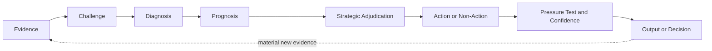
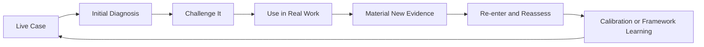

# Human-Directed AI Reasoning Harness for Consequential Judgment

*How I use AI to make executive and GTM reasoning more inspectable, evidence-disciplined, and harder to fool.*

## In 60 Seconds

I am an enterprise GTM executive who uses AI as a reasoning and decision-support tool, not as a substitute for commercial judgment.

The problem that started this work was simple.

**AI is very good at producing answers quickly. It is not automatically good at knowing when an answer should be trusted.**

In consequential work, the larger risk is not bad writing. It is bad diagnosis and, sometimes, a strategically bad intervention built on a correct diagnosis.

AI can accept the premise too easily, overweight a vivid observation, collapse inference into fact, settle on the first plausible causal explanation, or make a weak intervention sound more convincing than the evidence deserves.

I started building systems to introduce deliberate friction before that happens.

The governing idea remains simple.

> **Better decisions come from better diagnosis.**

The current body of work includes **Full Stack v5**, the **GTM Diagnostic Framework v9**, a structured evaluation approach, a v5-specific evaluation plan, reconstructed test cases, an independent review protocol, and research and calibration threads that remain deliberately unfinished.

This is not a software codebase or a prompt library.

It is a public record of how reasoning systems are built, challenged, revised, tested, and sometimes left unchanged when the evidence does not justify a modification.

## The Core Reasoning System

**Full Stack v5 is a reasoning system designed to make the path from evidence to judgment more disciplined.**

It is one implementation of a broader concept I call a **logic lens**.

A prompt mostly defines the output.

A logic lens defines the reasoning path that should produce the output.

When I use Full Stack with AI, it functions as a **human-directed reasoning harness around the model**.

The model provides the underlying capability.

The harness changes what must be inspected, challenged, distinguished, and pressure-tested before I trust the conclusion or act on it.

The human retains responsibility for the judgment.

Full Stack v5 crossed the version threshold by adding one explicit executive discipline to the architecture developed through v4.

> **A correct diagnosis is necessary for a good decision. It does not make every diagnosed problem worth solving.**

That distinction is the reason v5 exists.

## What the Harness Does

At the public level, the reasoning architecture can be understood as connected functions rather than a rigid checklist.

**Evidence** establishes what is actually known and keeps evidence separate from interpretation.

**Challenge** keeps credible competing explanations open before accepting the first plausible story.

**Diagnosis** looks beyond the visible symptom toward the condition materially governing the outcome.

**Prognosis** plays the condition forward and distinguishes the likely consequences of doing nothing, changing the wrong thing, or changing the governing condition.

**Strategic Adjudication** asks whether action is strategically warranted even when the diagnosis is correct. This includes credible irreversible downside and whether solving the problem is worth the scarce resources required.

**Pressure Test and Confidence** asks whether the reasoning survives missing evidence, competing explanations, operating reality, likely failure, and material uncertainty.

Current v5 refinements stay nested inside these functions rather than appearing as additional peer stages. They include Reasoning Depth Routing, Context Intake Discipline, Reflexivity, Cascade Integrity, Decision Trace Integrity, Anchoring Resistance, and Behavioral Inference Discipline.

Context Intake Discipline separates the primary source from supplied comments, related artifacts, operating experience, and user-preferred interpretations before reasoning begins. Agreement with a user angle does not make that angle mandatory in the final output.

Current v5 evidence and operating refinements also make temporal relevance, source independence, reconsideration boundaries, measurement burden, and transition effects more explicit inside the existing reasoning functions. These remain nested refinements rather than new peer capabilities.

Behavioral Inference Discipline operates primarily through Human Pattern 1. It makes one recurring problem more explicit: behavior can matter to a diagnosis even when motive cannot be directly observed. The framework now separates observed behavior, stated accounts, inferred drivers, and structural or systemic explanations, then spends additional behavioral reasoning only when the ambiguity could materially change the decision.

> **Behavioral uncertainty does not automatically require decision uncertainty.**

The detailed implementation remains private.

## Reality Closes the Loop

Full Stack is not intended to produce an answer and then protect it.

When a recommendation, hypothesis, intervention, or deliberate non-intervention encounters the real world, a material response or outcome can become new evidence.

The system then has to reconsider what it previously believed.

A positive outcome can strengthen confidence without automatically proving causality.

A negative outcome can weaken confidence without automatically proving the original diagnosis was wrong.

> **Reality must retain the right to change the model.**

Decision Trace Integrity adds a complementary discipline.

> **Reality should be able to change the model without rewriting what the model believed before reality arrived.**

## GTM Diagnostic Framework v9

GTM Diagnostic Framework v9 is a separate applied system for diagnosing governing commercial constraints and installing operating discipline.

v8 established the governing constraint as the intellectual center of the GTM framework.

v9 keeps that center and adds one explicit operating reality.

> **The governing constraint can move.**

Removing one dependency can expose another. A technical proof can remove product risk while making procurement or commercial duration the next binding constraint. A change in timing can alter negotiating leverage. A commercial concession can change buyer behavior. A leadership decision can change manager behavior, which changes seller behavior and ultimately the customer experience.

v9 therefore reasons more explicitly about

- connected variables around the governing constraint
- reinforcing loops that recreate the condition
- constraint migration when another dependency becomes binding
- evidence re-entry when material facts change
- a conditional Strategic Action Gate when a correct diagnosis does not automatically justify intervention
- commercial system coherence across messaging, discovery, qualification, CRM, forecasting, inspection, coaching, and enablement
- operating continuity across commercial records, field guidance, handoffs, and changes in buying state
- anchoring resistance when a strong preferred explanation exists before evidence review
- evidence dependency when apparent agreement may trace back to the same underlying source
- more disciplined behavioral attribution when human explanations materially affect causal diagnosis
- reconsideration boundaries that make explicit when a prior diagnosis or action decision should be reopened

These are bounded v9 reasoning refinements rather than new peer lenses.

The six-lens GTM architecture remains intact.

The framework is still diagnostic rather than a generic sales methodology.

The private implementation is substantially deeper than the public architecture.

## A GTM Example of Connected Reasoning

Experienced sellers and leaders often know many of the individual commercial truths already.

They may know that buyer evidence matters more than seller activity, that procurement and economic buyers can have different incentives, that timing changes negotiating leverage, that multi-year commitments protect seller economics, that buyers may value optionality, and that technical validation does not guarantee commercial progression.

The framework's value does not depend on claiming each observation is novel.

Its value is in preserving the dependencies among them.

A change in one variable can change the meaning of another.

**Price affects timing. Timing affects procurement leverage. Procurement incentives affect the credibility of a compelling event. Duration affects seller economics. Duration can also affect buyer risk. Buyer risk can change the commercial structure that is likely to work. All of those variables can affect forecast confidence.**

That produces one of the central v9 ideas.

> **The individual truths may be familiar. The advantage comes from preserving the dependencies between them so the diagnosis changes when the evidence changes.**

The framework does not replace experienced judgment.

It makes experienced judgment easier to retrieve, connect, inspect, challenge, and update.

## Current Status of the Body of Work

| System or layer | Role | Current status |
| --- | --- | --- |
| **Logic Lens** | General concept for designing problem-specific reasoning discipline | Concept used across the current body of work |
| **Full Stack v5** | Core reasoning harness for diagnosis, strategic adjudication, and decision support | Current canonical architecture; v5-specific evaluation is still in progress |
| **Full Stack v4** | Prior major version that made the diagnostic architecture and recursive evidence loop explicit | Historical canonical version preserved for evidence and version history |
| **GTM Diagnostic Framework v9** | Applied GTM system for diagnosing governing constraints, connected dependencies, and operating interventions | Current canonical GTM architecture; field-test, not formally validated |
| **GTM Diagnostic Framework v8** | Prior GTM version that established the governing constraint as the intellectual center | Historical prior version preserved in the public evidence trail |
| **Full Stack v5 Evaluation Plan** | Public plan for testing Strategic Adjudication and current v5 refinements | Work in progress |
| **Behavioral Inference Engine** | Research direction for how behavioral hypotheses should persist and revise across time; several bounded disciplines now inform Full Stack v5 | Work in progress |

These are related pieces of the same body of work, but they do not all have the same maturity, evidence base, or purpose.

## Why GitHub

GitHub is not the work.

The reasoning systems are the work.

I use GitHub because the development history matters.

A finished framework can hide the failures, contradictions, rejected ideas, and evidence that produced it. GitHub makes it possible to inspect how the work changes over time, what failure modes caused revisions, what evidence supports a change, what remains unresolved, and when an observation is deliberately held as a hypothesis rather than promoted into the framework.

> **The frameworks are the work. GitHub is the evidence trail.**

## If You Have Five Minutes

Start with two short stops.

1. Read [The Core Reasoning System](#the-core-reasoning-system) for the governing idea and why a correct diagnosis does not automatically justify action.
2. Open [Reconstructed Evaluation Case 01](examples/reconstructed-example-01.md#decision-question). Read the decision question, then [What Materially Changed](examples/reconstructed-example-01.md#what-materially-changed) to see how the reasoning changes a pipeline decision. This is an illustrative v4 comparison, not formal validation.

For a related applied operating project, see [Related Applied Project](#related-applied-project).

**Optional deeper inspection**

The current public architectures are [Full Stack v5](architecture/full-stack-v5-public-architecture.md) and [GTM Diagnostic Framework v9](architecture/gtm-diagnostic-framework-v9-public-architecture.md). [Human Pattern 1](architecture/human-pattern-1.md) shows how the current Full Stack architecture handles human behavior, structural pressure, and motive uncertainty. [Full Stack Evolution](architecture/evolution.md) and [GTM Framework Evolution](architecture/gtm-evolution.md) explain why the systems changed.

The [Full Stack v5 Evaluation Plan](evaluation/full-stack-v5-evaluation-plan.md) describes the current evaluation work. The [GTM Calibration Log](architecture/gtm-calibration-log.md) records working observations alongside approved refinements. The repository map below retains the historical architectures.

## How the Work Is Developed

This body of work did not begin as an attempt to design a complete AI reasoning architecture.

It developed through repeated use of AI on real GTM, leadership, communication, and executive problems.

Most of that work still happens inside separate conversations and projects because the original evidence and context matter. When a case exposes a reasoning failure or produces a lesson that appears useful beyond the immediate situation, that learning may be carried forward, compared against prior work, and tested again before it changes a durable framework.

A lesson is more useful when it survives a different case rather than merely improving the answer that revealed the weakness.

One operating principle has become increasingly important.

> **Context stays local. Learning moves upstream. Canonical knowledge is earned.**

Some lessons become framework changes.

Others remain hypotheses, reveal boundary conditions, or are discarded.

## What Makes the Work Inspectable

The repository is designed to show more than finished artifacts.

It preserves

- the architecture behind the reasoning systems
- the evolution history behind material changes
- reconstructed examples where the reasoning improves and where it does not
- evaluation methods
- current limits
- negative evidence
- calibration observations that have not earned framework status

A framework should not become more credible merely because every example appears to prove it works.

The same discipline applies to framework development.

A useful observation can be recorded without becoming architecture.

A proposed change can remain separate until there is enough evidence to justify promotion.

Version history is intended to show meaningful intellectual evolution rather than cosmetic editing.

## Evaluation and Limits

The current work can show observed failure modes, framework revisions, later retesting, structured reconstructed comparisons, live calibration, and changes in how the systems approach diagnosis and decision support.

That is meaningful evidence.

It is not yet a formal benchmark demonstrating that the architectures consistently improve reasoning quality across domains.

The [Independent Review Protocol v1](evaluation/independent-review-protocol.md) defines the external review process for the frozen v4 reconstructed cases.

The [Full Stack v5 Evaluation Plan](evaluation/full-stack-v5-evaluation-plan.md) defines separate tests for Strategic Adjudication and current v5 refinements.

The [GTM Diagnostic Reasoning](applications/gtm-diagnostic-reasoning.md), [GTM Diagnostic Framework v9 Public Architecture](architecture/gtm-diagnostic-framework-v9-public-architecture.md), and [GTM Framework Evolution](architecture/gtm-evolution.md) are derived from the private GTM Diagnostic Framework v9.

GTM v9 is canonical in the sense that it is the current operating architecture. It remains a field-test framework rather than a formally validated methodology.

Several commercial observations inside the private framework remain explicitly classified as field hypotheses rather than universal truths.

The [Behavioral Inference Engine](research/behavioral-inference-engine.md) remains a separate work-in-progress research direction.

## Related Applied Project

[From Poor-Quality Images to a Governed Data System](https://github.com/sschoenfeld-scotty/poorquality-image-data-case-study) is a related applied AI operating project. It demonstrates the broader operating philosophy through human-directed orchestration and evidence discipline in a persistent workflow. It also shows how execution failures shaped control design and moved human judgment into the operating system around the workflow.

The case remains in its own repository. It is not direct validation of Full Stack v5 or GTM Diagnostic Framework v9, and it does not establish that a particular framework version was used.

## Repository Map

### Core reasoning system

- [Building Friction Into AI](docs/building-friction-into-ai.md) explains why the work started and how the reasoning system evolved.
- [What I Mean by a Logic Lens](docs/what-is-a-logic-lens.md) gives a plain-English explanation of the core concept.
- [Full Stack v5 Public Architecture](architecture/full-stack-v5-public-architecture.md) documents the high-level architecture behind the current reasoning harness.
- [Human Pattern 1](architecture/human-pattern-1.md) documents the public behavioral-reasoning architecture inside Full Stack v5 without exposing the complete operating implementation.
- [Full Stack v4 Public Architecture](architecture/full-stack-v4-public-architecture.md) preserves the prior major version.
- [Evolution of the Reasoning System](architecture/evolution.md) records the design decisions that materially changed Full Stack.

### GTM application

- [GTM Diagnostic Framework v9 Public Architecture](architecture/gtm-diagnostic-framework-v9-public-architecture.md) is the compressed public architecture of the current private GTM v9 framework.
- [GTM Diagnostic Framework v8 Public Architecture](architecture/gtm-diagnostic-framework-v8-public-architecture.md) preserves the prior GTM architecture as historical evidence.
- [GTM Diagnostic Reasoning](applications/gtm-diagnostic-reasoning.md) shows how the reasoning disciplines become practical commercial diagnosis.
- [GTM Framework Evolution](architecture/gtm-evolution.md) documents the material changes from v7 through v9.
- [GTM Calibration Log](architecture/gtm-calibration-log.md) preserves working observations without silently changing the framework.

### Evaluation

- [Full Stack v5 Evaluation Plan](evaluation/full-stack-v5-evaluation-plan.md)
- [External Evidence Fixtures 01](evaluation/external-evidence-fixtures-01.md)
- [Evaluation Approach](evaluation/evaluation-approach.md)
- [Independent Review Protocol v1](evaluation/independent-review-protocol.md)
- [Reconstructed Evaluation Case 01](examples/reconstructed-example-01.md)
- [Reconstructed Evaluation Case 02](examples/reconstructed-example-02.md)
- [Reconstructed Evaluation Case 03](examples/reconstructed-example-03.md)
- [Reconstructed Evaluation Case 04](examples/reconstructed-example-04.md)
- [Reconstructed Evaluation Case 05](examples/reconstructed-example-05.md)

### Evidence and live observations

These entries preserve live observations and bounded external evidence. They do not establish formal validation.

- [Full Stack v5 Routing Evaluation Case 01](examples/full-stack-v5-routing-evaluation-case-01.md) records sequential observations under changing information. The runs are consistent with intended routing behavior without isolating its causal effect.
- [Full Stack v5 Evaluation Case 02](examples/full-stack-v5-audience-translation-evaluation-case-02.md) records a retrospective anonymized audience-translation case where factual accuracy remained intact but communication function and operating meaning changed across a stakeholder boundary.
- [Full Stack v5 Evaluation Case 03](examples/full-stack-v5-behavioral-context-evaluation-case-03.md) records a retrospective anonymized high-context behavioral case that separates reasoning value from output value and preserves the possibility that the experienced human produced the stronger public expression.
- [Full Stack v5 Evaluation Case 04](examples/full-stack-v5-causal-sufficiency-evaluation-case-04.md) records a retrospective observational comparison where a fluent champion-demo conclusion crossed unresolved buyer dependencies and initially influenced the evaluator before domain judgment exposed the causal gap.
- [Applied Evaluation Case 05](examples/applied-evaluation-case-05-executive-investment-decision-readiness.md) records an anonymized retrospective executive investment case where a human-directed Full Stack v5 and GTM v9 process materially improved decision readiness around an already strong thesis while preserving the framework failure and human correction that occurred during the work.
- [LinkedIn Judgment Field Case](evidence/2026-09-20-full-stack-v5-linkedin-judgment-field-case.md) preserves a naturalistic LinkedIn execution that produced a strong subjective quality signal after substantial same-day framework revision. It does not attribute the result to any specific refinement.
- [Model-Tier Confidence Effect N-of-1 Pilot](evidence/2026-09-20-model-tier-confidence-n1-pilot.md) records an indeterminate randomized-label pilot, the critique-validity lesson it exposed, and a bounded BIE evidence-environment research implication.
- [Open-ended Collaboration](evidence/2026-09-14-open-ended-collaboration.md) is a contemporaneous observation and working hypothesis captured before the outcome was known. It records no canonical framework change.
- [Open-ended Collaboration Post-outcome Review](evidence/2026-09-24-open-ended-collaboration-post-outcome-review.md) compares PR #29 with the frozen pre-outcome state, records modest support for the earlier working hypothesis, preserves Spark Tsai's independent authorship, and leaves Full Stack and BIE unchanged.
- [Independent Execution Variance](evidence/2026-09-19-full-stack-v5-independent-execution-variance.md) preserves an observational comparison between independent Full Stack v5 executions without claiming an environment advantage.
- [Fresh-Context Review After Self-Audit](evidence/2026-09-20-fresh-context-review-after-self-audit.md) records a second observational case in which a fresh review exposed a valid miss after same-context self-audit, supporting review independence as an evaluation variable without claiming that fresh context is always superior.
- [CognitiveLens External Evidence Review](evidence/2026-09-20-cognitivelens-external-evidence-review.md) records a source-grounded external review that produced an upstream contribution while leaving the canonical frameworks unchanged.
- [External Repository Review Batch 01](evidence/2026-09-20-external-repository-review-batch-01.md) records four separately adjudicated external reviews. It also records the upstream actions and the evaluation fixtures earned from the batch. The canonical frameworks remain unchanged.

### Research

- [Behavioral Inference Engine](research/behavioral-inference-engine.md) is a work-in-progress research direction for longitudinal behavioral inference. Several bounded behavioral disciplines now inform Full Stack v5, while persistence, accumulation, contradiction, context change, and model revision remain research problems.

## Public Architecture and Private Implementation

This repository is intended to prove that a real reasoning architecture, development process, and evidence discipline exist without publishing the complete implementation.

The public material exposes the problem, architecture, design principles, evolution, applications, evidence, failures, and limits.

The private material retains detailed operating instructions, execution logic, internal tests, decision rules, operating prompts, complete question libraries, commercial implementation methods, and other implementation-level material used to run the systems.

That boundary is deliberate.

Credibility should come from showing that a real system exists, how it evolved, what failure modes it addresses, and where its limits remain.

It does not require publishing every instruction needed to replicate it.

See [Rights and Reuse](RIGHTS.md) for the repository's reuse terms.

## What Is Next

For Full Stack, the next major work is evidence rather than another version number.

For GTM v9, the next work is field calibration.

The highest-value questions include whether dynamic dependency reasoning improves diagnosis across unrelated cases, whether constraint migration can be observed reliably enough to improve decisions, whether explicit commercial-system coherence inspection reveals execution failures that component-by-component inspection misses, whether Operating Continuity exposes failures that coherence inspection alone does not surface, and whether the current reasoning refinements improve diagnosis without adding false skepticism or unnecessary analytical friction.

That calibration now includes Anchoring resistance, Evidence dependency, the expanded Behavioral inference guardrail, and Reconsideration boundaries.

Future material changes should accumulate until they justify another numbered version.

No dot releases are planned for the GTM framework.

## About Scott Schoenfeld

I am an enterprise GTM executive who has spent my career operating in complex technology markets.

I use AI systematically to improve diagnosis, reasoning, and decision support in work where human judgment still owns the outcome.

This repository makes that approach inspectable. The work is practical, versioned, evidence-disciplined, and still evolving.
