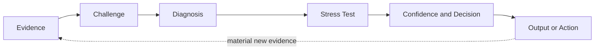
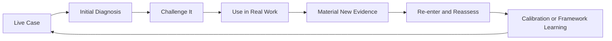

# Human-Directed AI Reasoning Harness for Consequential Judgment

*How I use AI to make executive and GTM reasoning more inspectable, evidence-disciplined, and harder to fool.*

## In 60 Seconds

I am an enterprise GTM executive who uses AI as a reasoning and decision-support tool, not as a substitute for commercial judgment.

The problem that started this work was simple.

**AI is very good at producing answers quickly. It is not automatically good at knowing when an answer should be trusted.**

In consequential work, the larger risk is not bad writing. It is bad diagnosis.

AI can accept the premise too easily, overweight a vivid observation, collapse inference into fact, settle on the first plausible causal explanation, or make a weak intervention sound more convincing than the evidence deserves.

I started building systems to introduce deliberate friction before that happens.

The governing idea is simple.

> **Better decisions come from better diagnosis.**

The current body of work includes **Full Stack v4**, the **GTM Diagnostic Framework v8**, a structured evaluation approach, reconstructed test cases, an independent review protocol, and research and calibration threads that remain deliberately unfinished.

This is not a software codebase or a prompt library.

It is a public record of how reasoning systems are built, challenged, revised, tested, and sometimes left unchanged when the evidence does not justify a modification.

## The Core Reasoning System

**Full Stack v4 is a diagnostic reasoning system designed to make the path from evidence to judgment more disciplined.**

It is one implementation of a broader concept I call a **logic lens**.

A prompt mostly defines the output.

A logic lens defines the reasoning path that should produce the output.

When I use Full Stack with AI, it functions as a **human-directed reasoning harness around the model**.

The model provides the underlying capability.

The harness changes what must be inspected, challenged, distinguished, and pressure-tested before I trust the conclusion.

The human retains responsibility for the judgment.

## What the Harness Does

At the public level, the reasoning architecture can be understood as five connected functions.

**Evidence**

Establish what is actually known and keep evidence separate from interpretation.

**Challenge**

Keep credible competing explanations open before accepting the first plausible story.

**Diagnosis**

Look beyond the visible symptom toward the condition materially governing the outcome.

**Stress Test**

Play the diagnosis forward and challenge whether it survives missing evidence, competing explanations, operating reality, and likely failure.

**Confidence and Revision**

Make material uncertainty visible and allow new evidence to strengthen, weaken, or change the previous conclusion.

The detailed implementation remains private.

## Reality Closes the Loop

Full Stack is not intended to produce an answer and then protect it.

When a recommendation, hypothesis, or intervention encounters the real world, a material response or outcome can become new evidence.

The system then has to reconsider what it previously believed.

A positive outcome can strengthen confidence without automatically proving causality.

A negative outcome can weaken confidence without automatically proving the original diagnosis was wrong.

The principle is more important than defending any previous answer.

> **Reality must retain the right to change the model.**

## Evidence and Current Status

Full Stack v4 is functional and already used in live GTM thought leadership and executive work.

Its current evidence includes repeated practical use, observed reasoning failures, iterative revision, later retesting, and structured reconstructed comparisons.

That matters.

These are not claims based only on a framework that looks sensible on paper. The system has repeatedly been used against real reasoning problems, challenged, revised when warranted, and tested again.

Recursive Evidence Re-entry now makes the relationship between the system and later real-world evidence explicit when a material response or outcome exists.

That does not mean Full Stack has been formally validated or that every successful outcome can be attributed to the framework.

It means there is already evidence to inspect while a higher standard of evaluation continues to develop.

The public [Evaluation Approach](evaluation/evaluation-approach.md) documents how I separate practical evidence, structured testing, and eventual formal validation rather than collapsing them into one claim.

## The Body of Work

Full Stack sits inside a larger body of reasoning work.

| System or layer | Role | Current status |
| --- | --- | --- |
| **Logic Lens** | General concept for designing problem-specific reasoning discipline | Concept used across the current body of work |
| **Full Stack v4** | Core diagnostic reasoning system | Functional and in active use |
| **GTM Diagnostic Framework v8** | Separate applied system for diagnosing governing GTM constraints and installing operating discipline | Field-test draft |
| **Evaluation Approach** | Public methodology for testing reasoning quality rather than writing quality | Work in progress |
| **Behavioral Inference Engine** | Research direction for longitudinal behavioral inference without unsupported motive attribution | Work in progress |

These are related pieces of the same body of work, but they do not all have the same maturity, evidence base, or purpose.

## Why GitHub

GitHub is not the work.

The reasoning systems are the work.

I use GitHub because the development history matters.

A finished framework can hide the failures, contradictions, rejected ideas, and evidence that produced it. GitHub makes it possible to inspect how the work changes over time, what failure modes caused revisions, what evidence supports a change, what remains unresolved, and when an observation is deliberately held as a hypothesis rather than promoted into the framework.

> **The frameworks are the work. GitHub is the evidence trail.**

## If You Have Five Minutes

Start with these documents.

| Read | Why |
| --- | --- |
| [Full Stack v4 Public Architecture](architecture/full-stack-v4-public-architecture.md) | The public architecture of the core reasoning system and how it functions as a reasoning harness in AI-assisted work |
| [Building Friction Into AI](docs/building-friction-into-ai.md) | Why the work started, what problem it is trying to solve, and what remains unresolved |
| [Evaluation Approach](evaluation/evaluation-approach.md) | How I am testing reasoning quality rather than merely comparing writing quality |
| [GTM Diagnostic Framework v8 Public Architecture](architecture/gtm-diagnostic-framework-v8-public-architecture.md) | How a separate diagnostic system applies related evidence and causal disciplines to GTM operating problems |

If you want to inspect how the work is tested and revised, continue to the [Independent Review Protocol v1](evaluation/independent-review-protocol.md), [Evolution of the Reasoning System](architecture/evolution.md), and [GTM Framework Evolution](architecture/gtm-evolution.md).

If you want to see how an observation is preserved without automatically changing a framework, see the [GTM Calibration Log](architecture/gtm-calibration-log.md).

## How the Work Is Developed

This body of work did not begin as an attempt to design a complete AI reasoning architecture. It developed through repeated use of AI on real GTM, leadership, communication, and executive problems.

Most of that work still happens inside separate conversations and projects because the original evidence and context matter. When a case exposes a reasoning failure or produces a lesson that appears useful beyond the immediate situation, that learning may be carried forward, compared against prior work, and tested again before it changes a durable framework.

The development loop is practical rather than theoretical.

Material new evidence does not appear after every case. When it does, it can strengthen, weaken, or change the earlier reasoning without being treated as automatic proof of causality.

AI serves two roles in that process.

It is the tool being guided by the reasoning system, and it is part of the environment used to expose where the reasoning system fails or overreaches.

A lesson is more useful when it survives a different case rather than merely improving the answer that revealed the weakness.

As the work has evolved, one additional operating principle has become visible.

> **Context stays local. Learning moves upstream. Canonical knowledge is earned.**

That is a description of how this body of work is currently being developed, not a claim that the method is universal or formally validated. Some lessons become framework changes. Others remain hypotheses, reveal boundary conditions, or are discarded.

## What Makes the Work Inspectable

The repository is designed to show more than finished artifacts.

It preserves the architecture behind the reasoning systems, the evolution history behind material changes, examples where the system helped and where it did not, the evaluation method used to compare outcomes, and explicit limits on what has and has not been validated.

That includes negative evidence.

A framework should not become more credible merely because every example appears to prove it works. The reconstructed case set includes an improvement, a no-material-change result, a degradation case, a behavioral attribution case, and an indeterminate case where the evidence does not justify forcing a winner.

The same discipline applies to framework development. A useful observation can be recorded without becoming architecture. A proposed change can remain separate until there is enough evidence to justify promotion. Version history is intended to show meaningful intellectual evolution rather than cosmetic editing.

## Evaluation and Limits

The current work can show observed failure modes, framework revisions, later retesting, structured reconstructed comparisons, and changes in how the system approaches diagnosis.

That is meaningful evidence.

It is not yet a formal benchmark demonstrating that the architecture consistently improves reasoning quality across domains.

The [Independent Review Protocol v1](evaluation/independent-review-protocol.md) defines the next evidence step. The five reconstructed cases have been prepared for blinded pairwise review by domain-qualified external reviewers. The protocol is ready, but no independent review result is claimed until a reviewer actually completes and submits the pack.

The reconstructed case set includes all four working outcome categories. [Case 01](examples/reconstructed-example-01.md) shows a material improvement in diagnosis and recommended action. [Case 02](examples/reconstructed-example-02.md) shows no material decision change when the baseline is already strong. [Case 03](examples/reconstructed-example-03.md) shows a degraded result where added causal complexity produces a weaker decision. [Case 04](examples/reconstructed-example-04.md) tests behavioral attribution discipline by separating an observable rescue pattern from unproven motive. [Case 05](examples/reconstructed-example-05.md) is Indeterminate because both AI workflow designs remain defensible under the frozen evidence packet. All five are reconstructed and author-adjudicated rather than independent validation.

The [GTM Diagnostic Reasoning](applications/gtm-diagnostic-reasoning.md) application note, [GTM Diagnostic Framework v8 Public Architecture](architecture/gtm-diagnostic-framework-v8-public-architecture.md), and [GTM Framework Evolution](architecture/gtm-evolution.md) are derived from the private GTM Diagnostic Framework v8. The complete v8 framework remains private and is currently a field-test draft rather than a formally validated methodology.

The [Behavioral Inference Engine](research/behavioral-inference-engine.md) is a separate research direction. It is not a finished or validated standalone system. The current public note documents the attribution guardrail, the longitudinal inference problem, and unresolved model-revision questions without claiming that a complete BIE architecture exists.

## Repository Map

### Core reasoning system

- [Building Friction Into AI](docs/building-friction-into-ai.md) explains why the work started and how the reasoning system is being developed.
- [What I Mean by a Logic Lens](docs/what-is-a-logic-lens.md) gives a plain-English explanation of the core concept.
- [Full Stack v4 Public Architecture](architecture/full-stack-v4-public-architecture.md) documents the high-level architecture behind the current reasoning system.
- [Evolution of the Reasoning System](architecture/evolution.md) records the design decisions that materially changed the system.

### GTM application

- [GTM Diagnostic Framework v8 Public Architecture](architecture/gtm-diagnostic-framework-v8-public-architecture.md) is the compressed public architecture of the private GTM v8 framework.
- [GTM Diagnostic Reasoning](applications/gtm-diagnostic-reasoning.md) shows how the reasoning disciplines become practical commercial diagnosis.
- [GTM Framework Evolution](architecture/gtm-evolution.md) documents the shift from v7 to v8 and the discipline for future version changes.
- [GTM Calibration Log](architecture/gtm-calibration-log.md) preserves working observations that may deserve future testing without silently changing the framework.

### Evaluation

- [Evaluation Approach](evaluation/evaluation-approach.md) defines how I am testing whether the architecture improves reasoning rather than merely improving the writing.
- [Independent Review Protocol v1](evaluation/independent-review-protocol.md) defines the external review process for the frozen reconstructed cases.
- [Reconstructed Evaluation Case 01](examples/reconstructed-example-01.md) shows an Improved outcome.
- [Reconstructed Evaluation Case 02](examples/reconstructed-example-02.md) shows No material change.
- [Reconstructed Evaluation Case 03](examples/reconstructed-example-03.md) shows a Degraded outcome.
- [Reconstructed Evaluation Case 04](examples/reconstructed-example-04.md) tests behavioral attribution discipline.
- [Reconstructed Evaluation Case 05](examples/reconstructed-example-05.md) shows an Indeterminate outcome.

### Research

- [Behavioral Inference Engine](research/behavioral-inference-engine.md) is a work-in-progress research direction for longitudinal behavioral inference without turning observation into unsupported motive.

## Public Architecture and Private Implementation

This repository is intended to prove that a real reasoning architecture, development process, and evidence discipline exist without publishing the complete implementation.

The public material exposes the problem, architecture, design principles, evolution, applications, evidence, failures, and limits.

The private material retains detailed operating instructions, execution logic, internal tests, decision rules, operating prompts, and other implementation-level methods used to run the systems.

That boundary is deliberate.

Credibility should come from showing that a real system exists, how it evolved, what failure modes it addresses, and where its limits remain.

It does not require publishing every instruction needed to replicate it.

See [Rights and Reuse](RIGHTS.md) for the repository's reuse terms.

## What Is Next

Planned additions include

- completed independent reviews using the blinded Pack v1 protocol
- preservation of reviewer agreement and disagreement as separate evidence
- additional cases only when they introduce a genuinely different reasoning condition or domain
- continued capture of material real-world evidence through recursive re-entry when later outcomes are available

These will be added only when the underlying material is strong enough to support the claim the artifact is intended to prove.

## About Scott Schoenfeld

I am an enterprise GTM executive who has spent my career operating in complex technology markets.

I use AI systematically to improve diagnosis, reasoning, and decision support in work where human judgment still owns the outcome.

This repository makes that approach inspectable. The work is practical, versioned, evidence-disciplined, and still evolving.
