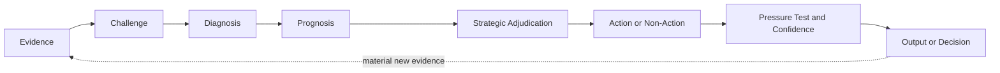
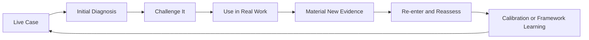

# Human-Directed AI Reasoning Harness for Consequential Judgment

*How I use AI to make executive and GTM reasoning more inspectable, evidence-disciplined, and harder to fool.*

## In 60 Seconds

I am an enterprise GTM executive who uses AI as a reasoning and decision-support tool, not as a substitute for commercial judgment.

The problem that started this work was simple.

**AI is very good at producing answers quickly. It is not automatically good at knowing when an answer should be trusted.**

In consequential work, the larger risk is not bad writing. It is bad diagnosis and, sometimes, a strategically bad intervention built on a correct diagnosis.

AI can accept the premise too easily, overweight a vivid observation, collapse inference into fact, settle on the first plausible causal explanation, or make a weak intervention sound more convincing than the evidence deserves.

I started building systems to introduce deliberate friction before that happens.

The governing idea remains simple.

> **Better decisions come from better diagnosis.**

The current body of work includes **Full Stack v5**, the **GTM Diagnostic Framework v8**, a structured evaluation approach, a v5-specific evaluation plan, reconstructed test cases, an independent review protocol, and research and calibration threads that remain deliberately unfinished.

This is not a software codebase or a prompt library.

It is a public record of how reasoning systems are built, challenged, revised, tested, and sometimes left unchanged when the evidence does not justify a modification.

## The Core Reasoning System

**Full Stack v5 is a reasoning system designed to make the path from evidence to judgment more disciplined.**

It is one implementation of a broader concept I call a **logic lens**.

A prompt mostly defines the output.

A logic lens defines the reasoning path that should produce the output.

When I use Full Stack with AI, it functions as a **human-directed reasoning harness around the model**.

The model provides the underlying capability.

The harness changes what must be inspected, challenged, distinguished, and pressure-tested before I trust the conclusion or act on it.

The human retains responsibility for the judgment.

Full Stack v5 crossed the version threshold by adding one explicit executive discipline to the architecture developed through v4.

> **A correct diagnosis is necessary for a good decision. It does not make every diagnosed problem worth solving.**

That distinction is the reason v5 exists.

## What the Harness Does

At the public level, the reasoning architecture can be understood as connected functions rather than a rigid checklist.

Before Full Stack routes reasoning depth, the user establishes how consequential it would be to get the reasoning wrong. The model then uses observable reasoning properties to determine whether deeper scrutiny is required.

**Evidence**

Establish what is actually known and keep evidence separate from interpretation.

**Challenge**

Keep credible competing explanations open before accepting the first plausible story.

**Diagnosis**

Look beyond the visible symptom toward the condition materially governing the outcome.

**Prognosis**

Play the condition forward and distinguish the likely consequences of doing nothing, changing the wrong thing, or changing the governing condition.

**Strategic Adjudication**

Ask whether action is strategically warranted even when the diagnosis is correct. This includes checking for credible irreversible downside and whether solving the problem is worth the scarce resources required.

**Pressure Test and Confidence**

Challenge whether the reasoning survives missing evidence, competing explanations, operating reality, likely failure, and material uncertainty.

Current v5 refinements stay nested inside these functions rather than appearing as additional peer stages. Reasoning Depth Routing now combines explicit user-declared consequence with observable reasoning risk. The user establishes how much the situation matters. The model may escalate for evidence, causal, stakeholder, tradeoff, or irreversibility concerns, but it does not independently invent subjective importance. Other refinements inspect when signaling changes operating reality, test whether strategy survives organizational translation, preserve enough of the original decision state to distinguish later explanation from what was actually believed at the time, and add a conditional Deep Path check so a substantive user-supplied preferred hypothesis can guide investigation without controlling the evidence search.

The detailed implementation remains private.

## A New v5 Failure Mode

Full Stack v4 became increasingly strong at diagnosis.

It separated evidence from interpretation, generated competing explanations, identified governing constraints, established prognosis, pressure-tested the first answer, and made recursive evidence re-entry explicit.

That exposed a different problem.

A system can correctly diagnose the governing constraint and still make the wrong executive decision by assuming the constraint should be fixed.

Full Stack v5 adds an explicit decision gate between prognosis and intervention.

Two ideas sit inside that gate.

**Ruin and Irreversibility** asks whether expected upside is being purchased with credible material downside that is difficult or impossible to reverse.

**Strategic Worth** asks whether removing the constraint creates enough strategic value to justify the scarce resources and opportunity cost required.

A separate **Communication Function** check is available when misunderstanding what a statement is for could materially change the diagnosis.

These are conditional reasoning capabilities, not mandatory extra ceremony in every case.

That major version change is distinct from the later v5 refinements. **Reasoning Depth Routing**, **Reflexivity**, **Cascade Integrity**, **Decision Trace Integrity**, and **Anchoring Resistance** sharpen existing functions without changing the governing reasoning spine or creating a new numbered version.

## Reality Closes the Loop

Full Stack is not intended to produce an answer and then protect it.

When a recommendation, hypothesis, intervention, or deliberate non-intervention encounters the real world, a material response or outcome can become new evidence.

The system then has to reconsider what it previously believed.

A positive outcome can strengthen confidence without automatically proving causality.

A negative outcome can weaken confidence without automatically proving the original diagnosis was wrong.

If the new evidence changes the strategic decision boundary, the action itself should be reconsidered.

The principle is more important than defending any previous answer.

> **Reality must retain the right to change the model.**

Decision Trace Integrity adds a complementary discipline.

> **Reality should be able to change the model without rewriting what the model believed before reality arrived.**

## Evidence and Current Status

Full Stack v5 is the current canonical Full Stack architecture. The private Operating Manual and Execution Prompt are complete and matched to the same v5 architecture.

The broader Full Stack development has meaningful evidence from repeated practical use, observed reasoning failures, iterative revision, later retesting, and structured reconstructed comparisons developed under v4.

That evidence matters, but version discipline matters too.

The existing reconstructed comparisons and Independent Review Protocol remain evidence about v4. They should not be silently relabeled as validation of the new v5 Strategic Adjudication capability or the current v5 refinements.

The v5 changes and current refinements are accepted architecture changes grounded in identified reasoning gaps and pressure testing. They still require v5-specific evaluation.

The public [Full Stack v5 Evaluation Plan](evaluation/full-stack-v5-evaluation-plan.md) defines the next evidence step for Strategic Adjudication and the current v5 refinements.

The existing [Evaluation Approach](evaluation/evaluation-approach.md) and [Independent Review Protocol v1](evaluation/independent-review-protocol.md) remain part of the v4 evidence trail.

## The Body of Work

Full Stack sits inside a larger body of reasoning work.

| System or layer | Role | Current status |
| --- | --- | --- |
| **Logic Lens** | General concept for designing problem-specific reasoning discipline | Concept used across the current body of work |
| **Full Stack v5** | Core reasoning harness for diagnosis, strategic adjudication, and decision support | Current canonical architecture; Strategic Adjudication and current v5 refinements require v5-specific evaluation |
| **Full Stack v4** | Prior major version that made the diagnostic architecture and recursive evidence loop explicit | Historical canonical version preserved for evidence and version history |
| **GTM Diagnostic Framework v8** | Separate applied system for diagnosing governing GTM constraints and installing operating discipline | Field-test draft |
| **Full Stack v5 Evaluation Plan** | Public plan for testing Strategic Adjudication and the current v5 refinements | Work in progress |
| **Behavioral Inference Engine** | Research direction for longitudinal behavioral inference without unsupported motive attribution | Work in progress |

These are related pieces of the same body of work, but they do not all have the same maturity, evidence base, or purpose.

## Why GitHub

GitHub is not the work.

The reasoning systems are the work.

I use GitHub because the development history matters.

A finished framework can hide the failures, contradictions, rejected ideas, and evidence that produced it. GitHub makes it possible to inspect how the work changes over time, what failure modes caused revisions, what evidence supports a change, what remains unresolved, and when an observation is deliberately held as a hypothesis rather than promoted into the framework.

> **The frameworks are the work. GitHub is the evidence trail.**

## If You Have Five Minutes

Start with these documents.

| Read | Why |
| --- | --- |
| [Full Stack v5 Public Architecture](architecture/full-stack-v5-public-architecture.md) | The current public architecture of the core reasoning harness, the v5 strategic-adjudication change, and later v5 refinements |
| [Building Friction Into AI](docs/building-friction-into-ai.md) | Why the work started, how it evolved from v4 to v5, and what remains unresolved |
| [Full Stack v5 Evaluation Plan](evaluation/full-stack-v5-evaluation-plan.md) | How Strategic Adjudication and the current v5 refinements will be tested without rewriting the v4 evidence history |
| [GTM Diagnostic Framework v8 Public Architecture](architecture/gtm-diagnostic-framework-v8-public-architecture.md) | How a separate diagnostic system applies related evidence and causal disciplines to GTM operating problems |

If you want to inspect how the work evolved, continue to the [Evolution of the Reasoning System](architecture/evolution.md) and the preserved [Full Stack v4 Public Architecture](architecture/full-stack-v4-public-architecture.md).

If you want to inspect the earlier v4 evaluation work, continue to the [Evaluation Approach](evaluation/evaluation-approach.md), [Independent Review Protocol v1](evaluation/independent-review-protocol.md), and reconstructed case set.

If you want to see how an observation is preserved without automatically changing a framework, see the [GTM Calibration Log](architecture/gtm-calibration-log.md).

## How the Work Is Developed

This body of work did not begin as an attempt to design a complete AI reasoning architecture. It developed through repeated use of AI on real GTM, leadership, communication, and executive problems.

Most of that work still happens inside separate conversations and projects because the original evidence and context matter. When a case exposes a reasoning failure or produces a lesson that appears useful beyond the immediate situation, that learning may be carried forward, compared against prior work, and tested again before it changes a durable framework.

The development loop is practical rather than theoretical.

Material new evidence does not appear after every case. When it does, it can strengthen, weaken, or change the earlier reasoning without being treated as automatic proof of causality.

AI serves two roles in that process.

It is the tool being guided by the reasoning system, and it is part of the environment used to expose where the reasoning system fails or overreaches.

A lesson is more useful when it survives a different case rather than merely improving the answer that revealed the weakness.

As the work has evolved, one additional operating principle has become visible.

> **Context stays local. Learning moves upstream. Canonical knowledge is earned.**

That is a description of how this body of work is currently being developed, not a claim that the method is universal or formally validated. Some lessons become framework changes. Others remain hypotheses, reveal boundary conditions, or are discarded.

## What Makes the Work Inspectable

The repository is designed to show more than finished artifacts.

It preserves the architecture behind the reasoning systems, the evolution history behind material changes, examples where the system helped and where it did not, the evaluation methods used to compare outcomes, and explicit limits on what has and has not been validated.

That includes negative evidence.

A framework should not become more credible merely because every example appears to prove it works. The reconstructed v4 case set includes an improvement, a no-material-change result, a degradation case, a behavioral attribution case, and an indeterminate case where the evidence does not justify forcing a winner.

The same discipline applies to framework development. A useful observation can be recorded without becoming architecture. A proposed change can remain separate until there is enough evidence to justify promotion. Version history is intended to show meaningful intellectual evolution rather than cosmetic editing.

v5 follows that same discipline. Its current architecture is public, but its evaluation status is deliberately narrower than the older v4 evidence base.

## Evaluation and Limits

The current work can show observed failure modes, framework revisions, later retesting, structured reconstructed comparisons, and changes in how the system approaches diagnosis and decision support.

That is meaningful evidence.

It is not yet a formal benchmark demonstrating that the architecture consistently improves reasoning quality across domains.

The [Independent Review Protocol v1](evaluation/independent-review-protocol.md) defines the next evidence step for the frozen v4 reconstructed cases. The protocol is ready, but no independent review result is claimed until a reviewer actually completes and submits the pack.

The [Full Stack v5 Evaluation Plan](evaluation/full-stack-v5-evaluation-plan.md) defines separate tests for Strategic Adjudication and the current v5 refinements. Its primary question remains whether v5 can preserve a correct diagnosis and still improve the decision about whether and how to act. The plan also tests whether consequence is established before routing, whether selected reasoning depth respects both user judgment and observable reasoning risk, whether reflexivity, organizational translation, and decision-trace integrity improve judgment without creating new failure modes, and whether Anchoring Resistance can protect Deep Path reasoning from user-framing effects without manufacturing disagreement or unnecessary analytical ceremony.

The [GTM Diagnostic Reasoning](applications/gtm-diagnostic-reasoning.md), [GTM Diagnostic Framework v8 Public Architecture](architecture/gtm-diagnostic-framework-v8-public-architecture.md), and [GTM Framework Evolution](architecture/gtm-evolution.md) are derived from the private GTM Diagnostic Framework v8. The complete v8 framework remains private and is currently a field-test draft rather than a formally validated methodology.

The [Behavioral Inference Engine](research/behavioral-inference-engine.md) is a separate research direction. It is not a finished or validated standalone system.

## Repository Map

### Core reasoning system

- [Building Friction Into AI](docs/building-friction-into-ai.md) explains why the work started and how the reasoning system evolved from v4 to v5.
- [What I Mean by a Logic Lens](docs/what-is-a-logic-lens.md) gives a plain-English explanation of the core concept using v5 as the current example.
- [Full Stack v5 Public Architecture](architecture/full-stack-v5-public-architecture.md) documents the high-level architecture behind the current reasoning system.
- [Full Stack v4 Public Architecture](architecture/full-stack-v4-public-architecture.md) preserves the prior major version as part of the historical evidence trail.
- [Evolution of the Reasoning System](architecture/evolution.md) records the design decisions that materially changed the system.

### GTM application

- [GTM Diagnostic Framework v8 Public Architecture](architecture/gtm-diagnostic-framework-v8-public-architecture.md) is the compressed public architecture of the private GTM v8 framework.
- [GTM Diagnostic Reasoning](applications/gtm-diagnostic-reasoning.md) shows how the reasoning disciplines become practical commercial diagnosis.
- [GTM Framework Evolution](architecture/gtm-evolution.md) documents the shift from v7 to v8 and the discipline for future version changes.
- [GTM Calibration Log](architecture/gtm-calibration-log.md) preserves working observations that may deserve future testing without silently changing the framework.

### Evaluation

- [Full Stack v5 Evaluation Plan](evaluation/full-stack-v5-evaluation-plan.md) defines how Strategic Adjudication and the current v5 refinements should be tested.
- [Evaluation Approach](evaluation/evaluation-approach.md) preserves the public methodology used for the v4 comparison work.
- [Independent Review Protocol v1](evaluation/independent-review-protocol.md) defines the external review process for the frozen reconstructed v4 cases.
- [Reconstructed Evaluation Case 01](examples/reconstructed-example-01.md) shows an Improved outcome.
- [Reconstructed Evaluation Case 02](examples/reconstructed-example-02.md) shows No material change.
- [Reconstructed Evaluation Case 03](examples/reconstructed-example-03.md) shows a Degraded outcome.
- [Reconstructed Evaluation Case 04](examples/reconstructed-example-04.md) tests behavioral attribution discipline.
- [Reconstructed Evaluation Case 05](examples/reconstructed-example-05.md) shows an Indeterminate outcome.

### Research

- [Behavioral Inference Engine](research/behavioral-inference-engine.md) is a work-in-progress research direction for longitudinal behavioral inference without turning observation into unsupported motive.

## Public Architecture and Private Implementation

This repository is intended to prove that a real reasoning architecture, development process, and evidence discipline exist without publishing the complete implementation.

The public material exposes the problem, architecture, design principles, evolution, applications, evidence, failures, and limits.

The private material retains detailed operating instructions, execution logic, internal tests, decision rules, operating prompts, and other implementation-level methods used to run the systems.

That boundary is deliberate.

Credibility should come from showing that a real system exists, how it evolved, what failure modes it addresses, and where its limits remain.

It does not require publishing every instruction needed to replicate it.

See [Rights and Reuse](RIGHTS.md) for the repository's reuse terms.

## What Is Next

The next Full Stack work is evidence, not another version number.

Planned additions include

- v5-specific cases that test Strategic Adjudication, Reasoning Depth Routing with the Mandatory Consequence Declaration, Reflexivity, Cascade Integrity, Decision Trace Integrity, and Anchoring Resistance against both positive and negative examples
- completed independent reviews of the frozen v4 case pack
- preservation of reviewer agreement and disagreement as separate evidence
- continued capture of material real-world evidence through recursive re-entry when later outcomes are available
- additional cases only when they introduce a genuinely different reasoning condition or domain

These will be added only when the underlying material is strong enough to support the claim the artifact is intended to prove.

## About Scott Schoenfeld

I am an enterprise GTM executive who has spent my career operating in complex technology markets.

I use AI systematically to improve diagnosis, reasoning, and decision support in work where human judgment still owns the outcome.

This repository makes that approach inspectable. The work is practical, versioned, evidence-disciplined, and still evolving.