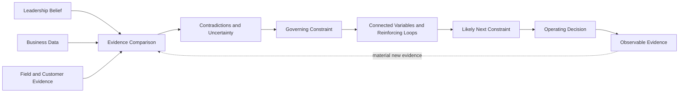

# GTM Diagnostic Reasoning

*How I apply evidence discipline, causal diagnosis, and dynamic dependency reasoning to consequential GTM decisions*

> Public application note | September 2026  
> Derived from GTM Diagnostic Framework v9, the current private canonical field-test framework

## Status and Scope

This document is a **public abstraction** of how I approach GTM diagnosis.

The canonical source is **GTM Diagnostic Framework v9**, a private commercial framework and field-test architecture.

This public note does not publish the complete v9 blueprint, diagnostic question library, detailed opportunity rules, engagement methodology, operating templates, commercial tactics, or implementation rules.

Its purpose is narrower.

It shows how disciplined reasoning becomes practical GTM judgment.

## The Operating Problem

Growth problems rarely announce themselves accurately.

Leadership sees pipeline below plan, forecast misses, weak conversion, inconsistent sellers, poor manager execution, stalled deals, procurement friction, or an AI initiative that is not producing business impact.

Those conditions are real.

The harder question is whether they have been diagnosed correctly.

A visible problem may be the outcome of another unresolved condition.

More activity can amplify weak qualification.

More pipeline can make a forecast less trustworthy.

A technically successful POC can still leave a weak commercial buying motion untouched.

More enablement can produce better artifacts without changing seller behavior.

More automation can scale a motion the organization never made inspectable.

The operating thesis is

> **Diagnosis without execution is observation. Execution without diagnosis is guessing.**

## What the Framework Is Trying to Determine

The public version begins with one question.

**What condition must change before the desired commercial outcome becomes materially more likely?**

v9 adds another.

**What else changes if that condition moves, and what is likely to become binding next?**

That second question reflects the primary v9 evolution.

The governing constraint is not assumed to remain permanent.

The framework is not looking for complexity for its own sake.

It is looking for the earliest operating condition that is defensible enough to guide action, while preserving the dependencies that can change the diagnosis later.

## Three Evidence Views

One of the most important disciplines in GTM diagnosis is refusing to let one source of truth dominate the analysis.

I compare three views.

| Evidence view | What it can reveal |
| --- | --- |
| **Leadership belief** | Strategy, growth thesis, priorities, assumptions, and the explanation leadership currently trusts |
| **Business data** | Pipeline, conversion, forecast, bookings, velocity, retention, expansion, pricing, capacity, and other measurable operating signals |
| **Field and customer evidence** | What buyers actually do, what sellers and managers actually do, what conversations reveal, how procurement behaves, and where handoffs or decisions break |

Agreement across the three increases confidence when the underlying support is meaningfully distinct.

If leadership belief, the dashboard, and field inspection all inherit the same seller-entered assumption, the apparent agreement is weaker than three independent confirmations.

Disagreement is often more useful.

A company may believe pipeline is healthy while the data shows aging and the field shows weak buyer commitment.

A leadership team may believe the product has an urgency problem while customer evidence shows the value is understood but decision authority is missing.

A seller may describe a deal as late stage while the buyer has not taken the actions required to justify that position.

The contradiction is not something to average away.

It is where diagnosis begins.

## Evidence Before Narrative

Commercial organizations generate persuasive stories quickly.

The framework keeps different kinds of evidence from collapsing into one another.

A reported belief is not a verified fact.

An observable behavior does not prove motive.

A stakeholder role can suggest an incentive without proving intent.

A repeated pattern may justify a working hypothesis without proving causality.

A recommendation should be no more confident than the evidence supporting the diagnosis.

This matters because operating narratives can become self-reinforcing.

A leadership explanation can shape the dashboard.

The dashboard can shape manager inspection.

Manager inspection can shape seller behavior.

Seller behavior can then appear to confirm the original explanation.

The purpose of evidence discipline is to interrupt that loop when the evidence does not support it.

The same discipline applies at the beginning of the diagnostic. A strong leadership explanation is useful context, but it should remain a hypothesis rather than an instruction about which evidence deserves attention.

Human behavior requires the same restraint. Observable behavior can support a hypothesis about what is driving it. It does not prove motive. When the behavioral explanation matters to the diagnosis, I also test whether incentives, role design, authority, information, or other structural conditions could produce the same behavior.

## Causality Over Chronology

Most operating reviews are good at chronology.

What happened last week?

What changed in the forecast?

What stage is the deal in?

How many meetings were created?

What happened after the campaign launched?

Those questions are useful, but they do not establish causality.

The diagnostic question is different.

> **Why can't this outcome happen today?**

Applied to a deal, that may mean asking what buyer commitment is still missing.

Applied to pipeline, it may mean distinguishing insufficient demand creation from weak conversion of created demand into buyer movement.

Applied to forecast, it may mean identifying the buyer evidence that makes the timing trustworthy rather than inspecting seller confidence.

Applied to AI, it may mean asking whether the workflow itself is strong enough to accelerate.

Chronology explains where the motion has been.

Causal diagnosis asks what is preventing movement now.

## The Constraint Can Move

v9 adds a discipline that became visible through live application.

Removing one dependency can expose another.

A technical proof can remove product risk and expose procurement or commercial duration.

A stronger buyer deadline can remove timing uncertainty and expose legal or paper process.

A pricing concession can remove one objection while changing negotiating leverage or making another commercial variable more important.

The diagnosis therefore has to preserve the relationships among variables.

The operating questions become

- what is binding now
- what variables materially affect it
- what keeps recreating the condition
- what would change downstream if the constraint moved
- what is likely to become binding next
- what evidence would show that the diagnosis needs to change

This is not an argument for endless analysis.

It is a way to avoid treating a dynamic system as though one diagnosis remains correct forever.

For material decisions, v9 can also establish a reconsideration boundary. That is an observable condition that requires the prior diagnosis or action decision to be reopened. Crossing it is not automatic proof that the prior call was wrong. It is a reason to re-enter the evidence and determine whether the causal hypothesis weakened, execution failed, or another constraint became binding.

## Buyer Movement Over Seller Activity

GTM systems naturally measure seller activity because it is visible.

Calls made.

Meetings booked.

Opportunities created.

Stages advanced.

Demos completed.

Those measures can be useful.

They are not the same as customer progress.

The more important question is what changed on the buyer side.

Did a more powerful stakeholder engage?

Did the customer validate the business consequence?

Did uncertainty decrease?

Did the customer take ownership of a next step?

Did the decision process become more explicit?

Did a technical test validate an agreed requirement?

Did the buyer make a commitment that was not present before?

Activity is an input.

Buyer movement is stronger evidence that the commercial system is working.

## Buyer Progression as a Dependency Problem

The private v9 framework makes several opportunity dependencies more explicit without prescribing a sales methodology.

At a public level, I distinguish four motions.

**Qualification** asks whether a credible buying motion exists and whether further seller investment is justified.

**Discovery** develops the understanding of the customer problem, desired outcome, consequence, people, decision process, timing, alternatives, and risk.

**Solution Education** uses what was learned to form a customer-specific solution hypothesis.

**Validation** tests whether the business and technical hypothesis can actually be proven.

The labels are less important than the dependencies.

A company can combine or rename CRM stages.

The diagnostic question is whether the underlying buyer progression is observable and evidence based.

A broad product demonstration can create interest without establishing the specific customer hypothesis that Validation should test. When a proof event is still teaching the buyer why to care, I inspect whether the failure occurred in Solution Education before diagnosing Validation itself.

That produces an important implication.

> **A weak POC may not be a POC problem.**

The failure may have occurred earlier because the opportunity entered validation without a sufficiently strong buying motion or customer-specific hypothesis.

## Time and the Compelling Event

One of the strongest v9 refinements is the treatment of time.

Buyer interest is not buyer urgency.

A customer can see value without having a reason to act within a specific period.

The public principle is

> **A compelling event is not a date. It is the credible consequence that makes the date matter.**

A seller may uncover a buyer-owned reason to act or help the buyer recognize a legitimate consequence or value difference that makes earlier action rational.

But seller-developed urgency becomes useful timing evidence only when the buyer confirms that the consequence is real and affects the buying decision.

An internal quarter-end target is not buyer urgency merely because the seller wants the deal closed.

This distinction matters for forecast integrity.

Sales stage describes the buyer's position in the buying process.

Forecast category expresses confidence in whether and when an opportunity will close.

The category should change because the evidence changed, not because the seller became more optimistic.

## Stakeholder Incentives Matter

Urgency is not necessarily an account-level property.

Different members of the buying system can experience the same transaction differently.

An economic buyer may care primarily about business outcome and timing.

Procurement may care more heavily about terms, risk, savings, and negotiating leverage.

That does not prove how any individual procurement leader will behave.

It does mean the diagnostic should not assume that one stakeholder's urgency controls the entire buying system.

A useful question is

> **Who benefits from waiting?**

That question often exposes whether the claimed compelling event is strong enough to survive the incentives of the people who can delay the transaction.

## Price Is Not the Same as Duration or Optionality

Commercial friction is often flattened into a price problem.

v9 makes a cleaner diagnostic distinction among price, duration, total contract value, renewal economics, and buyer optionality.

These variables interact without being interchangeable.

A buyer may accept the product value and still resist a long commitment because the buyer values flexibility.

Another discount may not solve that problem.

The public reasoning principle is simple.

**Change the variable the buyer is actually resisting.**

One current field hypothesis is that rapid change in AI and SaaS markets may increase the value some buyers place on contractual optionality.

That hypothesis is preserved as a calibration question rather than presented as a universal truth.

## From Diagnosis to Intervention

Diagnosis is only valuable if it changes what leadership does.

A strong GTM diagnosis should make the relationship between evidence, intervention, ownership, and expected effect inspectable.

| Visible issue | Weak intervention logic | Better diagnostic question |
| --- | --- | --- |
| Pipeline below plan | Increase activity | Is the constraint creation, acceptance, conversion, targeting, or buyer urgency? |
| Forecast misses | Demand cleaner CRM data | What buyer evidence makes the forecast category and timing trustworthy? |
| POCs do not convert | Add more technical content | Was the POC validating an agreed requirement or compensating for weak discovery or solution education? |
| Sellers are inconsistent | Add training | What behavior is missing, and what do managers actually inspect and reinforce? |
| Commercial negotiation stalls | Discount further | Is the buyer actually resisting price, duration, risk, or optionality? |
| AI adoption is low | Add tools or prompt training | Is the workflow, evidence standard, context, ownership model, and human judgment clear enough to scale? |

The goal is not to delay action indefinitely.

The goal is to avoid scaling the wrong intervention.

## A Correct Diagnosis Does Not Always Require Action

v9 also makes one decision boundary more explicit.

When consequence, scarce-resource tradeoffs, or difficult-to-reverse downside are material, leadership should ask whether the diagnosed constraint is actually worth changing now.

The organization may choose to fix, contain, tolerate, defer, work around, simplify, exit, or reallocate.

This is a conditional gate rather than an extra layer of ceremony for every decision.

The purpose is to prevent a correct diagnosis from automatically becoming a strategically weak intervention.

## Installed Discipline

A GTM framework is not useful because it produces an executive readout.

It is useful when the diagnosis changes the operating system.

That can mean changing

- what leadership inspects
- what evidence managers require
- which decisions recurring meetings are expected to produce
- who owns the outcome
- what sellers must establish before an opportunity advances
- what customer behavior counts as progress
- what timing evidence supports forecast confidence
- which operating measures indicate that the constraint is changing
- what evidence should reopen the diagnosis

The intended outcome is not permanent dependence on the framework.

It is stronger internal diagnostic capability.

## Commercial System Coherence

Installed discipline only works when the mechanisms around the seller reinforce one another.

A company can have strong messaging, useful discovery guidance, a qualification method, CRM stages, a forecasting process, manager coaching, and substantial enablement while still producing inconsistent field execution.

The failure can sit in the handoffs.

If messaging teaches one definition of customer value, discovery collects different evidence, CRM stages reward activity, forecasting relies on another standard, and managers inspect something else again, the seller is forced to translate between disconnected operating models.

v9 therefore adds a coherence test.

The question is whether the same commercial logic survives across messaging, discovery, qualification, opportunity progression, CRM, forecasting, manager inspection, coaching, and enablement.

The requirement is coherence, not uniformity. Each mechanism has a different job.

The diagnostic looks for the governing break in the chain rather than assuming every connected component should be redesigned at once.

Content is an input. Enabling is the process that turns useful inputs into repeatable field behavior through practice, inspection, coaching, and reinforcement.

## Operating Continuity

A coherent commercial system can still fail if truth is lost during transitions.

v9 therefore adds a second operating test.

Commercial System Coherence asks whether the mechanisms reinforce the same logic.

Operating Continuity asks whether evidence, decision context, and operating guidance survive as work moves across records, teams, and changes in buying state.

In practice, that means inspecting questions such as

- which commercial record governs which decision
- whether buyer evidence survives handoffs without unnecessary duplication or loss
- whether sellers and managers can reach current authoritative guidance when the work requires it
- whether ending an active buying motion preserves the evidence needed to recognize a rational future re-entry condition

The framework does not require a specific account plan, deal plan, mutual plan, sales playbook, CRM schema, or post-sale artifact.

The requirement is that commercial truth remains usable across the operating transitions that matter.

Closure protects pipeline truth.

Re-entry continuity protects prior learning.

## AI Is a Leverage Layer, Not the Diagnosis

AI is material to modern GTM systems, but it is not the identity of this framework.

The governing principle remains

> **AI does not fix the motion. It accelerates the motion that already exists.**

If qualification is weak, AI can create weak qualification faster.

If CRM definitions are unreliable, AI can make unreliable information easier to distribute.

If managers cannot distinguish buyer evidence from seller optimism, automated deal coaching can industrialize the same confusion.

v9 adds another public guardrail.

> **Capture can be automated. Commercial interpretation remains accountable judgment.**

AI can help capture activity and surface contradictions.

Material commercial judgments still require governed evidence, clear ownership, human decision rights, and exception handling.

The first question is not whether a GTM process can be automated.

It is whether the process is worth accelerating and whether the operating context is trustworthy enough to support it.

## How This Connects to Full Stack v5

[Full Stack v5](../architecture/full-stack-v5-public-architecture.md) is a general reasoning architecture.

GTM Diagnostic Framework v9 is a domain-specific commercial framework.

They are not the same artifact.

They share disciplines such as

- source and evidence discipline
- competing explanations
- causal diagnosis
- prognosis and consequence
- strategic decision friction when consequence warrants it
- confidence calibration
- pressure testing
- separation of observation from inference
- revision when material evidence changes

Full Stack asks whether the reasoning deserves confidence and whether action is strategically warranted.

The GTM framework applies related discipline to commercial systems where diagnosis has to become an operating decision.

The distinction matters.

A concept exposed while Full Stack reviews the GTM framework does not automatically become GTM architecture. It still has to improve the domain framework on its own terms.

## Reconstructed Examples

The repository's evaluation cases provide small public examples of this diagnostic style.

[Reconstructed Evaluation Case 01](../examples/reconstructed-example-01.md) examines a pipeline problem where the first intervention is to increase seller activity.

The reasoning changes when the case distinguishes demand creation from conversion of created demand into buyer movement.

[Reconstructed Evaluation Case 02](../examples/reconstructed-example-02.md) examines POC conversion.

The baseline is already strong, so additional reasoning does not receive credit merely for being more elaborate.

[Reconstructed Evaluation Case 03](../examples/reconstructed-example-03.md) examines forecast discipline.

In that case, additional causal exploration makes the decision worse because the simple operating explanation is already strongly supported and cheaply testable.

Together, the examples reinforce an important point.

**Better diagnosis does not mean more diagnosis.**

It means applying enough reasoning friction to improve the decision without turning analysis into drag.

## Current Evidence and Limits

GTM Diagnostic Framework v9 is the current canonical **field-test architecture**.

It reflects direct operating experience, live framework calibration, development from v8, a full Full Stack v5 review, and a separate self-audit.

That is not the same as formal validation.

The framework should continue to be challenged through live application, evidence capture, calibration, and major-version discipline.

Several current observations remain explicitly classified as field hypotheses rather than universal truths.

A single engagement or successful example should not automatically change the architecture.

## Public and Private Boundary

The complete GTM Diagnostic Framework v9 remains private.

This repository can make the system credible without publishing everything required to reproduce it.

The public material can show

- the operating problem
- the reasoning principles
- the evidence discipline
- the relationship between symptom and governing constraint
- the v9 concept of connected variables and constraint migration
- the emphasis on buyer movement and timing evidence
- the translation from diagnosis into operating decision
- the role of AI
- reconstructed examples
- evidence status and limits

The private material retains substantially more detail, including the complete architecture, diagnostic question library, detailed commercial logic, engagement design, operating artifacts, execution rules, and implementation methods.

That boundary is deliberate.

The portfolio is intended to make the work inspectable.

It is not intended to publish the entire commercial methodology.

## What This Application Is Intended to Demonstrate

The point of this work is not that I can ask AI better GTM questions.

It is that I have developed a disciplined way to examine GTM systems before recommending what leadership should change, and to reconsider the diagnosis when the system changes.

The public sequence is

**Establish what is true → identify what is governing the outcome → inspect the dependencies around it → determine what becomes binding next → decide whether intervention is warranted when consequence is material → install the operating discipline → re-enter when evidence changes**

The implementation behind that sequence is deeper.

The executive value is straightforward.

Do not accelerate the motion until you understand the motion.
