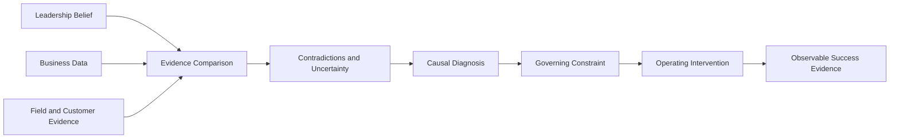

# GTM Diagnostic Reasoning

*How I apply evidence discipline and causal diagnosis to consequential GTM decisions*

> Public application note | September 2026  
> Derived from GTM Diagnostic Framework v8, a private field-test framework

## Status and Scope

This document is a **public abstraction** of how I approach GTM diagnosis.

The canonical source is **GTM Diagnostic Framework v8**, a private commercial framework and field-test draft.

This public note does not publish the complete v8 architecture, diagnostic question library, engagement methodology, operating templates, commercial model, or implementation rules.

Its purpose is narrower.

It shows how disciplined reasoning becomes practical GTM judgment.

## The Operating Problem

Growth problems rarely announce themselves accurately.

Leadership sees pipeline below plan, forecast misses, weak conversion, inconsistent sellers, poor manager execution, stalled deals, or an AI initiative that is not producing business impact.

Those conditions are real.

The harder question is whether they have been **diagnosed correctly**.

A visible problem may be the outcome of another unresolved condition.

More activity can amplify weak qualification.

More pipeline can make a forecast less trustworthy.

More enablement can produce better artifacts without changing seller behavior.

More automation can scale a motion the organization never made inspectable.

That is why the operating thesis behind the GTM framework is

> **Diagnosis without execution is observation. Execution without diagnosis is guessing.**

## What the Framework Is Trying to Determine

The public version can be reduced to one question.

**What condition must change before the desired commercial outcome becomes materially more likely?**

That question shifts the work from describing performance to diagnosing the system producing it.

The framework is not looking for complexity for its own sake.

It is looking for the earliest operating condition that is both defensible and useful enough to change.

## Three Evidence Views

One of the most important disciplines in GTM diagnosis is refusing to let one source of truth dominate the analysis.

I compare three views.

| Evidence view | What it can reveal |
| --- | --- |
| **Leadership belief** | Strategy, growth thesis, priorities, assumptions, and the explanation leadership currently trusts |
| **Business data** | Pipeline, conversion, forecast, bookings, velocity, retention, expansion, capacity, and other measurable operating signals |
| **Field and customer evidence** | What buyers actually do, what sellers and managers actually do, what conversations reveal, and where handoffs or decisions break |

Agreement across the three increases confidence.

Disagreement is often more useful.

A company may believe pipeline is healthy while the data shows aging and the field shows weak buyer commitment.

A leadership team may believe the product has an urgency problem while customer evidence shows the value is understood but decision authority is missing.

A seller may describe a deal as late stage while the buyer has not taken the actions required to justify that position.

The contradiction is not something to average away.

It is where diagnosis begins.

## Evidence Before Narrative

Commercial organizations generate persuasive stories quickly.

The framework keeps different kinds of evidence from collapsing into one another.

A reported belief is not a verified fact.

An observable behavior does not prove motive.

A pattern may justify a working hypothesis without proving causality.

A recommendation should be no more confident than the evidence supporting the diagnosis.

This is particularly important in GTM because operating narratives can become self-reinforcing.

A leadership explanation can shape the dashboard.

The dashboard can shape manager inspection.

Manager inspection can shape seller behavior.

Seller behavior can then appear to confirm the original explanation.

The purpose of evidence discipline is to interrupt that loop when the evidence does not support it.

## Causality Over Chronology

Most operating reviews are good at chronology.

What happened last week?

What changed in the forecast?

What stage is the deal in?

How many meetings were created?

What happened after the campaign launched?

Those questions are useful, but they do not establish causality.

The diagnostic question is different.

> **Why can’t this outcome happen today?**

Applied to a deal, that may mean asking what buyer commitment is still missing.

Applied to pipeline, it may mean distinguishing insufficient demand creation from weak conversion of created demand.

Applied to forecast, it may mean identifying the evidence that makes the number trustworthy rather than inspecting the seller's confidence.

Applied to AI, it may mean asking whether the workflow itself is strong enough to accelerate.

Chronology explains where the motion has been.

Causal diagnosis asks what is preventing movement now.

## Buyer Movement Over Seller Activity

GTM systems naturally measure seller activity because it is visible.

Calls made.

Meetings booked.

Opportunities created.

Stages advanced.

Demos completed.

Those measures can be useful.

They are not the same as customer progress.

The more important question is what changed on the buyer side.

Did a more powerful stakeholder engage?

Did the customer validate the business consequence?

Did uncertainty decrease?

Did the customer take ownership of a next step?

Did the decision process become more explicit?

Did a technical test validate an agreed requirement?

Did the buyer make a commitment that was not present before?

Activity is an input.

Buyer movement is evidence that the commercial system is working.

## From Diagnosis to Intervention

Diagnosis is only valuable if it changes what leadership does.

A strong GTM diagnosis should make the relationship between evidence, intervention, ownership, and expected effect inspectable.

For example

| Visible issue | Weak intervention logic | Better diagnostic question |
| --- | --- | --- |
| Pipeline below plan | Increase activity | Is the constraint creation, acceptance, conversion, targeting, or buyer urgency? |
| Forecast misses | Demand cleaner CRM data | What buyer evidence makes the forecast category trustworthy? |
| POCs do not convert | Add more technical content | Was the POC validating an agreed requirement or compensating for weak discovery? |
| Sellers are inconsistent | Add training | What behavior is missing, and what do managers actually inspect and reinforce? |
| AI adoption is low | Add tools or prompt training | Is the workflow, evidence standard, ownership model, and human judgment clear enough to scale? |

The goal is not to delay action indefinitely.

The goal is to avoid scaling the wrong intervention.

## Installed Discipline

A GTM framework is not useful because it produces an executive readout.

It is useful when the diagnosis changes the operating system.

That can mean changing

- what leadership inspects
- what evidence managers require
- which decisions recurring meetings are expected to produce
- who owns the outcome
- what sellers must establish before an opportunity advances
- what customer behavior counts as progress
- which operating measures indicate that the constraint is actually changing

The intended outcome is not permanent dependence on the framework.

It is stronger internal diagnostic capability.

The organization should become better able to distinguish evidence from narrative and activity from movement after the diagnostic work is finished.

## AI Is a Leverage Layer, Not the Diagnosis

AI is material to modern GTM systems, but it is not the identity of this framework.

The principle is simple.

> **AI does not fix the motion. It accelerates the motion that already exists.**

If qualification is weak, AI can create weak qualification faster.

If CRM definitions are unreliable, AI can make unreliable information easier to distribute.

If managers cannot distinguish buyer evidence from seller optimism, automated deal coaching can industrialize the same confusion.

AI becomes leverage when the organization understands the workflow, evidence standard, decision rights, ownership, and human judgment that need to remain.

The first question is therefore not whether a GTM process **can** be automated.

It is whether the process is worth accelerating.

## How This Connects to Full Stack v4

[Full Stack v4](../architecture/full-stack-v4-public-architecture.md) is a general reasoning architecture.

GTM Diagnostic Framework v8 is a domain-specific commercial framework.

They are not the same artifact.

They share several reasoning disciplines

- source and evidence discipline
- competing explanations
- causal diagnosis
- prognosis and consequence
- confidence calibration
- pressure testing
- explicit separation of observation from inference
- revision when evidence changes

Full Stack asks whether the reasoning deserves confidence.

The GTM framework applies that discipline to commercial systems where diagnosis eventually has to become an operating decision.

## Reconstructed Examples

The repository's evaluation cases provide small public examples of this diagnostic style.

[Reconstructed Evaluation Case 01](../examples/reconstructed-example-01.md) examines a pipeline problem where the first intervention is to increase seller activity.

The reasoning changes when the case distinguishes demand creation from conversion of created demand into buyer movement.

[Reconstructed Evaluation Case 02](../examples/reconstructed-example-02.md) examines POC conversion.

The baseline is already strong, so additional reasoning does not receive credit merely for being more elaborate.

[Reconstructed Evaluation Case 03](../examples/reconstructed-example-03.md) examines forecast discipline.

In that case, additional causal exploration makes the decision worse because the simple operating explanation is already strongly supported and cheaply testable.

Together, the examples reinforce an important point.

**Better diagnosis does not mean more diagnosis.**

It means applying enough reasoning friction to improve the decision without turning analysis into drag.

## Current Evidence and Limits

GTM Diagnostic Framework v8 is a **field-test draft**.

It reflects direct operating experience, framework development, and structured commercial reasoning.

That is not the same as formal validation.

The framework should be challenged through live application, evidence capture, calibration, and version discipline.

A single engagement or successful example should not automatically change the architecture.

Potential improvements should be separated from client execution and evaluated before becoming canonical framework changes.

## Public and Private Boundary

The complete GTM Diagnostic Framework v8 remains private.

This repository can make the system credible without publishing everything required to reproduce it.

The public material can show

- the operating problem
- the reasoning principles
- the evidence discipline
- the relationship between symptom and governing constraint
- the emphasis on buyer movement
- the translation from diagnosis into operating intervention
- the role of AI
- reconstructed examples
- evidence status and limits

The private material retains substantially more detail, including the complete architecture, diagnostic question library, engagement design, operating artifacts, execution rules, and commercial implementation.

That boundary is deliberate.

The portfolio is intended to make the work inspectable.

It is not intended to publish the entire commercial methodology.

## What This Application Is Intended to Demonstrate

The point of this work is not that I can ask AI better GTM questions.

It is that I have developed a disciplined way to examine GTM systems before recommending what leadership should change.

The core sequence is simple enough to state publicly.

**Establish what is true → identify what is governing the outcome → determine what happens if it persists → choose the earliest useful intervention → inspect whether the system actually changes**

The implementation behind that sequence is deeper.

The executive value is straightforward.

Do not accelerate the motion until you understand the motion.
