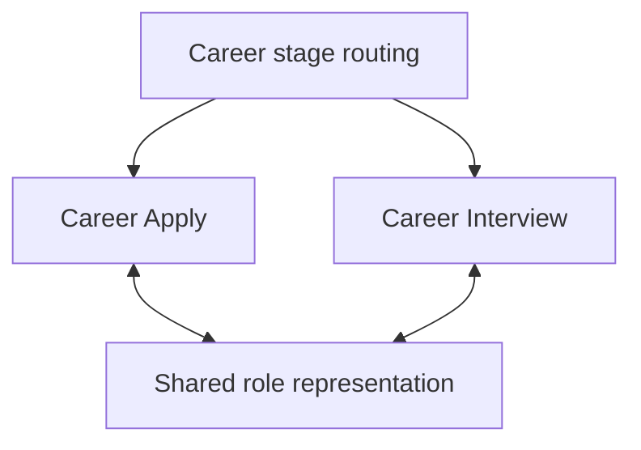

# Career Reasoning System

*Public architecture for candidate-side application and interview reasoning*

## Status and scope

This is a public derivative of approved private canonical architecture. It describes one career reasoning system with two specialized lenses and shared role-representation infrastructure.

The private sources are Candidate Application Logic Lens v3 and Executive Interview Logic Lens v1, supported by the Role Success Profile Schema. The schema is infrastructure, not a third Logic Lens.

The architecture is current. The overall system is not formally validated.

## The problem

Application and interview work often starts with a request for another artifact, from a tailored résumé to prepared interview answers.

Treating each request separately can produce polished material built on different interpretations of the same opportunity. It can also preserve an early assumption long after an employer conversation has made it doubtful.

The Career Reasoning System keeps the interpretation of the opportunity connected across stages. What was learned can carry forward without becoming permanent truth.

Application reasoning asks what the opportunity appears to require and what candidate evidence supports it. Interview reasoning tests that interpretation through employer engagement and selects proof against the current mandate.

## One front door, different decision jobs

The user-facing entry point is Career. When the current work is already clear, generic Career routing may select the relevant stage.

| Invocation | Decision job |
| --- | --- |
| **Career Apply** | Govern role-specific application reasoning and the application artifacts that are warranted |
| **Career Interview** | Govern interview reasoning and live preparation against the current understanding of the role |

The diagram shows reasoning relationships, not a compulsory execution sequence. Each lens remains independently governed. Interview preparation can begin without a prior Career Apply run, and a request for a new application artifact can return work to Career Apply after interviewing has started.

## Career Apply

Career Apply governs role-specific application reasoning through Candidate Application Logic Lens v3. It supersedes ATS Cover v2.1 for new application work.

Its starting point is an evidence-bounded model of the opportunity. It considers what the role appears to require and whether the candidate's actual record supports those requirements. Material gaps remain visible.

That reasoning determines which application changes are warranted. A résumé may need focused adaptation, while a required narrative response may need a different argument. An existing artifact can remain unchanged when it already does its job.

More tailoring is not evidence of a stronger application. The objective is to make relevant candidate truth easier to recognize without changing the candidate's professional history or inventing fit.

## Shared role representation

Both lenses use a shared representation of the role so the opportunity is not silently redefined at each stage.

At the architectural level, it connects the role's identity and business mandate to the outcomes it appears to require. It also preserves the distinction between ownership and dependency, with attention to the evidence needed to demonstrate fit and the risks that remain material.

A shared structure does not give the candidate the employer's knowledge. The candidate's understanding remains bounded by legitimately available evidence. An inferred mandate is not an internal employer fact, and missing authority cannot be supplied by a job title.

The shared representation supports continuity. It does not make application reasoning and interview reasoning interchangeable.

## Career Interview

Career Interview governs interview reasoning and live preparation through Executive Interview Logic Lens v1.

Meaningful employer-stage evidence can change what the role appears to require. Interview preparation updates that interpretation and selects proof against the current mandate rather than mechanically repeating the application.

The live artifact is a compact decision map. It helps the candidate navigate the conversation and retrieve relevant evidence when the discussion changes direction. It is not a generic interview script or a tour of everything the candidate knows.

Its purpose includes learning whether the opportunity is what the candidate initially understood, not simply defending an earlier positioning choice.

## Continuity without forced consistency

Application-stage reasoning can seed interview preparation. Progression to an interview does not prove that the original opportunity model was correct.

Employer-stage evidence may strengthen an earlier interpretation. It may also weaken it or materially change the decision requirement. Interview positioning is allowed to change with that evidence.

Truthful candidate claims already submitted should remain factually coherent. A changed understanding of the role does not justify changing what the candidate actually did.

The system preserves the distinction between what was reasonably understood at submission and what is understood now. Later evidence improves the current decision without rewriting the history of the earlier one.

This is continuity in the reasoning, not an obligation to repeat the same narrative.

## Human judgment

The system helps make reasoning more inspectable. The candidate remains accountable for the claims made and the decision to pursue an opportunity.

Neither AI nor a shared role model removes the information gap between candidate and employer. Unknowns remain unknown when the evidence does not support more certainty. A genuine fit gap remains a gap.

## Evidence status and limits

| Part of the system | Current evidence boundary |
| --- | --- |
| **Career Apply** | The canonical source records structured scenario testing across materially different application conditions, including interview continuity and nonlinear hiring. This is structured development evidence, not formal validation. |
| **Career Interview** | The canonical source records design tests and a passed desk-based navigation test. Live interview usability evaluation and measured retrieval validation remain incomplete. |

Design and scenario tests can examine whether the architecture behaves as intended under specified conditions. A desk test cannot establish live interview usability.

Field use and hiring outcomes are separate evidence categories. Application progression alone does not establish that the system caused the result. This public derivative makes no formal benchmark claim or quantitative performance claim.

Publication makes the architecture inspectable. It does not validate it.

## Public and private boundary

This page explains the architecture and the relationship between stages. It does not publish the private canonical documents or replace their authority.

Detailed execution logic and implementation prompts remain private. So do candidate records and source ledgers, along with confidential employer information and private recruiter or employee intelligence. The full schema and internal decision rules are not reproduced here.

The public purpose is to explain why the system exists and what its current evidence supports without disclosing the complete operating implementation.
