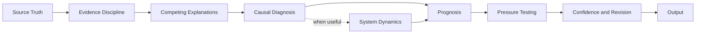

# Full Stack v4 Public Architecture

*Public architecture specification for a private reasoning system*

**Status**  
Functional and in active use. Current evidence is repeated practical use and iterative testing, not formal validation.

## Purpose

Full Stack v4 is a reasoning architecture designed to improve diagnosis before AI produces a recommendation, explanation, or piece of writing.

> **Better decisions come from better diagnosis.**

The system exists because fluent output can hide weak reasoning. A plausible explanation can become a confident conclusion before the evidence deserves it. An observable behavior can become an assumed motive. A visible symptom can be mistaken for the condition governing the outcome.

Full Stack v4 introduces deliberate reasoning friction before a conclusion is trusted.

This document describes the public architecture only. The detailed operating instructions, execution logic, internal tests, and decision rules remain private.

## Architecture Overview

The architecture is connected rather than mechanically linear. Different problems may require different emphasis, but the reasoning discipline remains consistent.

## The Seven Public Layers

### 1. Source Truth

The system begins with what the available evidence can actually support.

The objective is to keep source material separate from the story the model may be tempted to tell about it.

### 2. Evidence Discipline

Full Stack keeps observation, interpretation, uncertainty, and recommendation from collapsing into one another.

The central rule is simple. Strong writing should not create stronger confidence than the underlying evidence warrants.

### 3. Competing Explanations

The first plausible explanation is not automatically accepted.

The architecture keeps credible alternatives open long enough to reduce premature certainty, unsupported motive attribution, and other stories that can fill gaps in the evidence.

When a problem spans multiple stakeholders, the system may compare how the same condition appears from different operating positions. The purpose is to surface competing evidence, incentives, constraints, and consequences without inventing motives or fictional authority.

### 4. Causal Diagnosis

The system distinguishes what happened from what is governing the outcome.

It looks beyond the visible symptom for the unresolved dependency, operating condition, assumption, behavior, or decision that materially constrains movement.

#### Optional system dynamics scan

A governing constraint explains what currently blocks the outcome. It does not always explain why the blocking condition keeps returning.

When recurrence matters, Full Stack can inspect reinforcing feedback loops, incentives, asymmetries, dependencies, and behaviors that may reproduce the condition over time.

This does not assume that every repeated problem is a system pattern. Recurrence must be supported by evidence rather than inferred from one vivid example.

### 5. Prognosis

Diagnosis establishes the current condition.

Prognosis asks what that condition is most likely to produce if it persists, what risk follows from changing the wrong thing, and what becomes more likely if the governing condition changes.

Prognosis is treated as reasoned judgment, not certainty.

### 6. Pressure Testing

The first coherent answer is challenged before it is trusted.

The architecture tests whether the diagnosis remains defensible against credible alternatives, missing context, and likely rebuttal.

It also tests whether the reasoning survives contact with operating reality. An experienced operator may notice evidence, ownership, measurability, handoffs, incentives, or execution constraints that a more abstract analysis misses. That difference is useful only when it can be supported rather than asserted as authority.

The purpose is not endless revision. It is stronger reasoning.

### 7. Confidence and Revision

The system separates confidence in the output from confidence in the reasoning that produced it.

Material uncertainty remains visible when it could change the conclusion.

Reusable lessons may improve later versions of the framework, but one-off insights are not automatically promoted into permanent rules.

## Two-Part Private Implementation

Full Stack v4 currently operates through two private components.

| Component | Public description |
| --- | --- |
| **Operating Manual** | The deeper playbook for complex or high-stakes reasoning |
| **Execution Prompt** | The faster application layer used for recurring day-to-day work |

Both implement the same underlying architecture at different levels of depth.

The private implementation contains substantially more procedural detail than this public specification.

## What Full Stack v4 Is Not

Full Stack v4 is not a universal checklist.

It is not a claim that every problem has one simple root cause.

It is not a claim that every recurring problem is a feedback loop.

It is not a substitute for executive judgment, domain expertise, reliable evidence, or human accountability.

It is not formally validated as a benchmarked reasoning system.

Its purpose is not to make every output look the same.

Its purpose is to make the thinking behind different outputs more disciplined.

## Current Evidence and Limits

Full Stack v4 is already used in live GTM thought leadership and executive work.

The evidence today is repeated practical use, observed reasoning failures, iterative revision, and later retesting.

That is useful evidence of development.

It is not the same as formal validation.

A later evaluation layer should test whether the architecture improves diagnostic quality over time rather than relying only on whether the final writing improves.

## Related Public Documents

- [Building Friction Into AI](../docs/building-friction-into-ai.md)
- [What I Mean by a Logic Lens](../docs/what-is-a-logic-lens.md)
- [Evolution of the Reasoning System](./evolution.md)

## Public and Private Boundary

This repository is intended to make the reasoning system inspectable without publishing the complete implementation.

The public material shows the problem, architecture, development logic, applications, evidence, and limits.

The private material retains the detailed methods used to execute the system.

That boundary is deliberate.
