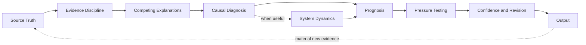

# Full Stack v4

*A human-directed reasoning harness for AI-assisted judgment*

**Status**  
Functional and in active use. Current evidence includes repeated practical use, observed reasoning failures, iterative revision, later retesting, and structured reconstructed comparisons. This is meaningful evidence of system behavior and development, not formal validation.

## Purpose

Full Stack v4 is a diagnostic reasoning system designed to improve diagnosis before a recommendation, explanation, or piece of writing is trusted.

When used with AI, it functions as a **human-directed reasoning harness around the model**.

The model provides the underlying capability. Full Stack changes what must be inspected, challenged, distinguished, and pressure-tested before the human operator accepts the conclusion.

> **Better decisions come from better diagnosis.**

The system exists because fluent output can hide weak reasoning. A plausible explanation can become a confident conclusion before the evidence deserves it. An observable behavior can become an assumed motive. A visible symptom can be mistaken for the condition governing the outcome.

Full Stack v4 introduces deliberate reasoning friction before a conclusion is trusted.

This document describes the public architecture only. The detailed operating instructions, execution logic, internal tests, and decision rules remain private.

## Architecture Overview

The architecture is connected rather than mechanically linear. Different problems may require different emphasis, but the reasoning discipline remains consistent.

The output is not necessarily the end of the reasoning cycle. When a response, observed outcome, or real-world intervention produces material new evidence, that evidence can re-enter the architecture at Source Truth. Only the downstream reasoning materially affected by the new evidence needs to be reopened.

## The Seven Public Layers

### 1. Source Truth

The system begins with what the available evidence can actually support.

The objective is to keep source material separate from the story the model may be tempted to tell about it.

Material evidence that appears after an output or intervention is treated as new source truth rather than merely as context for the next response.

### 2. Evidence Discipline

Full Stack keeps observation, interpretation, uncertainty, and recommendation from collapsing into one another.

The central rule is simple. Strong writing should not create stronger confidence than the underlying evidence warrants.

Observed outcomes can strengthen or weaken a diagnosis, but they do not automatically prove why the outcome occurred. Positive and negative outcomes are both subject to attribution discipline.

The same principle applies to visible behavior. Compliance is not treated as equivalent to commitment. A person or organization may follow a process without demonstrating ownership, judgment, adoption, or durable behavioral change.

### 3. Competing Explanations

The first plausible explanation is not automatically accepted.

The architecture keeps credible alternatives open long enough to reduce premature certainty, unsupported motive attribution, and other stories that can fill gaps in the evidence.

When a problem spans multiple stakeholders, the system may compare how the same condition appears from different operating positions. The purpose is to surface competing evidence, incentives, constraints, and consequences without inventing motives or fictional authority.

When new evidence appears after an intervention, competing explanations are reopened when needed before the result is treated as validation or falsification of the earlier diagnosis.

### 4. Causal Diagnosis

The system distinguishes what happened from what is governing the outcome.

It looks beyond the visible symptom for the unresolved dependency, operating condition, assumption, behavior, or decision that materially constrains movement.

#### Optional system dynamics scan

A governing constraint explains what currently blocks the outcome. It does not always explain why the blocking condition keeps returning.

When recurrence matters, Full Stack can inspect reinforcing feedback loops, incentives, asymmetries, dependencies, and behaviors that may reproduce the condition over time.

This does not assume that every repeated problem is a system pattern. Recurrence must be supported by evidence rather than inferred from one vivid example.

### 5. Prognosis

Diagnosis establishes the current condition.

Prognosis asks what that condition is most likely to produce if it persists, what risk follows from changing the wrong thing, and what becomes more likely if the governing condition changes.

Prognosis is treated as reasoned judgment, not certainty.

When material new evidence changes the diagnosis or confidence level, the prognosis can be revised rather than protected for consistency.

### 6. Pressure Testing

The first coherent answer is challenged before it is trusted.

The architecture tests whether the diagnosis remains defensible against credible alternatives, missing context, and likely rebuttal.

It also tests whether the reasoning survives contact with operating reality. An experienced operator may notice evidence, ownership, measurability, handoffs, incentives, or execution constraints that a more abstract analysis misses. That difference is useful only when it can be supported rather than asserted as authority.

The purpose is not endless revision. It is stronger reasoning.

### 7. Confidence and Revision

The system separates confidence in the output from confidence in the reasoning that produced it.

Material uncertainty remains visible when it could change the conclusion.

A conclusion remains provisional when reality introduces material new evidence. New evidence can strengthen the diagnosis, weaken it, favor a competing explanation, introduce another explanation, or show that the original problem was framed incorrectly.

Reusable lessons may improve later versions of the framework, but one-off insights are not automatically promoted into permanent rules.

## Recursive Evidence Re-entry

Full Stack v4 is designed to remain open to reality after an output is produced.

When an output, recommendation, hypothesis, or intervention encounters the real world, a material response or outcome becomes new evidence. The system does not automatically defend the previous diagnosis and does not automatically discard it.

The evidence re-enters at Source Truth, is reclassified according to the same evidence discipline as the original case, and then reopens only the downstream reasoning that the new information materially affects.

This creates an important asymmetry.

The system is allowed to learn from outcomes, but it is not allowed to convert an outcome directly into a causal story.

A successful intervention can increase confidence that the earlier diagnosis was material without proving a single-cause explanation. A failed intervention can weaken confidence without proving that the diagnosis itself was wrong.

The governing principle is simple.

> **Reality must retain the right to change the model.**

## Two-Part Private Implementation

Full Stack v4 currently operates through two private components.

| Component | Public description |
| --- | --- |
| **Operating Manual** | The deeper playbook for complex or high-stakes reasoning |
| **Execution Prompt** | The faster application layer used for recurring day-to-day work |

Both implement the same underlying architecture at different levels of depth.

When Full Stack is used with AI, these components provide the operating logic for the reasoning harness. The private implementation contains substantially more procedural detail than this public specification.

## What Full Stack v4 Is Not

Full Stack v4 is not an AI model, an alignment technique, an agent runtime, or a claim about model internals.

It is not a universal checklist.

It is not a claim that every problem has one simple root cause.

It is not a claim that every recurring problem is a feedback loop.

It is not a claim that a positive or negative result automatically proves the causal explanation behind it.

It is not a substitute for executive judgment, domain expertise, reliable evidence, or human accountability.

It is not formally validated as a benchmarked reasoning system.

Its purpose is not to make every output look the same.

Its purpose is to make the thinking behind different outputs more disciplined.

## Current Evidence and Limits

Full Stack v4 is already used in live GTM thought leadership and executive work.

The evidence today includes repeated practical use, observed reasoning failures, iterative revision, later retesting, and structured reconstructed comparisons.

Those are real test instances of the system encountering reasoning problems and being challenged against evidence.

They do not establish a generalized performance claim, and they are not the same as formal validation.

The public [Evaluation Approach](../evaluation/evaluation-approach.md) defines a separate portfolio-level methodology for testing whether the architecture improves diagnostic quality rather than merely improving writing quality.

Recursive Evidence Re-entry strengthens the ongoing evidence loop by allowing material real-world responses and outcomes to return as new source truth. Those outcomes can strengthen, weaken, or change an earlier diagnosis without being converted automatically into a causal claim.

## Related Public Documents

- [Building Friction Into AI](../docs/building-friction-into-ai.md)
- [What I Mean by a Logic Lens](../docs/what-is-a-logic-lens.md)
- [Evaluation Approach](../evaluation/evaluation-approach.md)
- [Evolution of the Reasoning System](./evolution.md)

## Public and Private Boundary

This repository is intended to make the reasoning system inspectable without publishing the complete implementation.

The public material shows the problem, architecture, development logic, applications, evidence, and limits.

The private material retains the detailed methods used to execute the system.

That boundary is deliberate.
