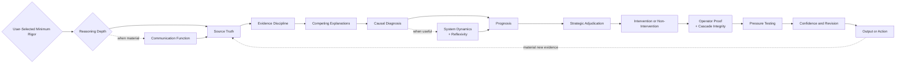

# Full Stack v5

*A human-directed reasoning harness for diagnosis, strategic adjudication, and consequential judgment*

**Status**  
Current canonical Full Stack architecture. Functional as a reasoning system and matched private Operating Manual and Execution Prompt. The strategic-adjudication capability introduced in v5 and the current v5 refinements still require v5-specific evaluation and should not be described as formally validated.

## Purpose

Full Stack v5 is a reasoning system designed to improve the path from evidence to judgment before a recommendation, explanation, or action is trusted.

When used with AI, it functions as a **human-directed reasoning harness around the model**.

The model provides the underlying capability. Full Stack changes what must be inspected, distinguished, challenged, and pressure-tested before the human operator accepts a conclusion or commits to action.

> **Better decisions come from better diagnosis.**

v5 preserves that thesis and adds an explicit executive discipline.

> **A correct diagnosis is necessary for a good decision. It does not make every diagnosed problem worth solving.**

That distinction is the reason v5 exists.

Full Stack v4 became increasingly effective at separating evidence from interpretation, keeping competing explanations open, diagnosing governing constraints, establishing prognosis, challenging the first answer, and allowing later real-world evidence to reopen the reasoning cycle.

A remaining failure mode sat after diagnosis.

The system could correctly identify what was governing an outcome and still move too quickly toward intervention.

Full Stack v5 adds an explicit strategic decision gate between prognosis and intervention so a correct diagnosis does not automatically become a mandate to act.

The current v5 refinement work makes existing functions more deterministic without adding another peer layer to the governing reasoning spine. It requires the user to select a minimum reasoning depth before routing, then uses observable reasoning risk to determine whether deeper scrutiny is warranted. It also makes reflexive narrative effects explicit inside System Dynamics, makes organizational translation explicit inside Operator Proof, distinguishes retrospective explanations from contemporaneous evidence of the reasoning that produced an earlier decision, adds a conditional Deep Path check when a user enters the analysis with a preferred hypothesis or conclusion, and adds explicit Context Intake Discipline for supplied conversation, artifacts, operating experience, and user-supplied interpretations.

This document describes the public architecture only. Detailed operating instructions, execution logic, internal tests, decision rules, and implementation prompts remain private.

## Architecture Overview

The architecture is connected rather than mechanically linear. Conditional elements are invoked when they materially change the reasoning rather than being forced into every case.

User-selected minimum rigor is an entry condition rather than another diagnostic stage. If the minimum reasoning depth has not already been established, Full Stack asks the user before routing. The user's selection sets the minimum reasoning depth. Observable reasoning properties such as reversibility, evidence quality, causal uncertainty, stakeholder complexity, scarce-resource tradeoffs, and credible irreversible downside can justify escalation, but they do not downgrade the user's selected minimum.

A short output can require deep reasoning. A long output can still be low risk. The router should not infer subjective importance from artifact length, topic, tone, seniority, or model intuition about what ought to matter.

## What Changed From v4

The v4 architecture primarily asked whether the reasoning had correctly identified the problem, its governing condition, and its likely trajectory.

v5 keeps that architecture and adds two changes.

### Communication Function when material

Some statements can serve more than one function. A public statement may operate differently as field direction, investor communication, board framing, market positioning, customer reassurance, or competitive signaling.

When that distinction could materially change the diagnosis, Full Stack checks the communication function before treating the statement as a literal operating claim.

This is not permission to invent motive. Unverified intent remains a hypothesis, and strategic signaling does not erase operational consequences.

### Strategic Adjudication before intervention

After prognosis, Full Stack now asks whether acting on the diagnosis is strategically warranted.

Strategic Adjudication contains two public reasoning tests.

**Ruin and Irreversibility**

Expected upside does not automatically justify exposure to credible material downside that is difficult or impossible to reverse. The system distinguishes ordinary variance from downside that could materially impair the ability to continue pursuing the broader objective.

The test is not an automatic veto on risk. The downside must be credible and material, and the analysis should consider whether exposure can be bounded, staged, reversed, isolated, governed, or otherwise controlled.

**Strategic Worth**

A diagnosed constraint does not automatically deserve scarce resources.

The system asks whether removing the constraint creates enough strategic value to justify the capital, executive attention, time, talent, trust, organizational capacity, or other scarce resources required relative to credible competing uses.

The result may still be intervention. It may also be deliberate non-intervention, containment, deferral, simplification, work-around, exit, or reallocation.

The important change is that Full Stack can preserve the diagnosis while changing the decision.

## Current v5 Refinements

Six later observations exposed narrower gaps inside the accepted v5 architecture. They were added as refinements because they deepen existing functions rather than changing Full Stack's purpose or inserting another peer stage.

### Reasoning Depth Routing

The framework now requires the user to explicitly select the minimum reasoning depth before it selects Fast, Standard, or Deep reasoning.

If the minimum reasoning depth is already explicit in the current context, the router uses it without asking again. Otherwise Full Stack obtains that user selection before producing the framework output.

The user's declaration sets the minimum reasoning depth. The model then inspects observable reasoning properties such as reversibility, evidence quality, causal uncertainty, stakeholder complexity, material tradeoffs, and credible irreversible downside. Those indicators may justify escalation, but they do not downgrade the user's declared minimum.

The governing principle is

> **Reasoning depth should reflect the user-selected minimum rigor and observable reasoning risk, not output length or unsupported model judgment about what ought to matter.**

This makes the division of responsibility explicit. The user establishes how much the situation matters. The model evaluates evidence-supported reasons that deeper reasoning may be required.

### Reflexivity inside System Dynamics

Communication Function distinguishes what a statement may be doing. Reflexivity asks a different question.

Can the communication itself change the system?

A strategic signal may alter capital availability, talent flows, customer confidence, partner or competitor behavior, employee commitment, market expectations, or resource allocation. Those reactions may then make the original claim more feasible, less feasible, or self-defeating.

This does not mean narrative creates reality by assertion. The same evidence and outcome-attribution discipline still applies. The public architectural point is that belief can sometimes become part of the causal system and should be inspected as such when the evidence supports it.

The same discipline distinguishes internally generated response from independent validation. When a claim materially depends on an external actor or environment, Full Stack asks what evidence would show that the claim survived contact with that environment.

### Cascade Integrity inside Operator Proof

A strategy can be coherent at the executive level and still arrive at the frontline in materially different form.

Cascade Integrity examines whether strategic intent survives organizational translation across functions, management layers, incentives, process design, handoffs, and frontline execution.

The purpose is not to assume that middle management blocks strategy. Local translation may weaken, distort, delay, improve, or correctly adapt an executive decision in light of field evidence.

The public test is therefore translation variance rather than automatic obstruction.

### Decision Trace Integrity across evidence and revision

A later explanation of a decision can be sincere and coherent without proving that the same reasoning actually produced the original choice.

Decision Trace Integrity separates the current account of a prior decision from contemporaneous evidence of what was known, assumed, expected, and chosen at the time.

When consequence warrants it, Full Stack preserves enough of the original decision state to support later comparison. When the decision is revisited, later outcomes can update the model without silently rewriting the history of the reasoning that preceded them.

The purpose is not to distrust self-report by default. Retrospective explanation remains evidence, but its strength depends on provenance, timing, consistency, incentives, and corroboration.

> **Reality should be able to change the model without rewriting what the model believed before reality arrived.**

### Context Intake Discipline across source truth and framing

Full Stack distinguishes the primary source from additional context supplied with it before substantive reasoning begins.

Surrounding conversation and related artifacts can reveal what has already been said, which claims are circulating, and where a more additive intellectual move may exist. Those materials remain subject to normal evidence classification. A third-party comment is context, not automatic fact.

User-supplied data, operating experience, interpretation, and preferred angles are also separated. Factual claims remain subject to evidence standards. Relevant experience can inform prior plausibility without establishing the current case. A preferred interpretation is something to test rather than an answer the framework is required to preserve.

Agreement with the user's original angle does not create an obligation to use it in the final output. Full Stack still searches the complete source and context for the strongest supported intellectual move. A valid user angle may be sharpened, combined with another insight, or omitted entirely when another supported move is stronger for the objective.

When independent human-versus-model judgment has evidentiary value, the cleaner sequence is source first, preserved model read second, user interpretation third.

### Anchoring Resistance across routing and evidence discipline

A preferred hypothesis can improve investigation by giving the reasoning something concrete to test. It can also influence what evidence is noticed, collected, weighted, or treated as sufficient.

Anchoring Resistance is a conditional Deep Path refinement for cases where the user has supplied a substantive preferred hypothesis, diagnosis, conclusion, recommendation, or argument before adjudication.

At the public level, Full Stack first establishes what the available evidence supports without allowing the preferred position to determine the answer. It then tests the strongest defensible version of the preferred position and checks whether the framing materially changed evidence selection, weighting, confidence, diagnosis, or action.

If the preferred hypothesis existed before some evidence was collected, the framework does not assume the evidence set itself is neutral. It looks for discriminating evidence capable of testing the favored explanation against the strongest credible alternative.

The extra reasoning is not forced into Fast or Standard work, and it is not exposed as three separate outputs unless the comparison materially changes the conclusion.

> **On consequential work, a preferred hypothesis may guide investigation, but it must not control the searchlight.**

### Behavioral Inference Discipline through Human Pattern 1

Human behavior can be material to a diagnosis without making motive directly observable.

Behavioral Inference Discipline is a conditional v5 refinement executed primarily through Human Pattern 1. It activates when the reasoning materially depends on explaining why a person or group behaved as observed.

At the public level, the framework separates observed behavior, the actor's stated account, and the inferred behavioral driver. It tests the strongest credible alternative and explicitly asks whether structural or systemic conditions could produce the same behavior before attributing it primarily to personal motive.

Structural pressure and personal agency are not treated as mutually exclusive. Incentives, role design, reporting mechanics, organizational politics, resource constraints, and other operating conditions can shape behavior while individual judgment still matters.

Relevant operator experience may inform the prior plausibility of an explanation. It does not prove the current case. Current-case evidence determines how strongly the explanation should survive.

The framework spends additional behavioral reasoning only when the ambiguity could materially change the diagnosis, confidence, prognosis, or candidate action. If the distinction does not change the reasoning, uncertainty is preserved rather than forced into a psychological story.

When competing behavioral explanations may reflect different interpretations of the same evidence, the framework can test whether the actors are assigning materially different causal meaning to what they observe. Any inferred interpretive model remains a hypothesis, and the check stays dormant when another existing reasoning mechanism already explains the outcome.

> **Behavioral uncertainty does not automatically require decision uncertainty.**

When material uncertainty remains, it is carried into Strategic Adjudication rather than converted into false motive certainty or automatic delay.

The detailed gate and clarification mechanics remain private.

## Public Reasoning Functions

### Source Truth and Evidence Discipline

The system begins with what the available evidence can actually support.

Observation, interpretation, uncertainty, and recommendation are kept from collapsing into one another. Strong writing should not create stronger confidence than the evidence warrants.

A person's retrospective explanation of a prior decision is treated as evidence of the current account rather than automatic proof of the causal reasoning that produced the original choice. When that distinction matters, contemporaneous records, observed behavior, available alternatives, assumptions, and other evidence can be compared against the later account.

On Deep Path work, when the user arrives with a preferred position, the framework can also distinguish evidence that supports the position from evidence that was selected or gathered after the position had already become attractive. The latter is not treated as invalid, but its selection process may require additional scrutiny.

Outcomes can strengthen or weaken a diagnosis, but they do not automatically prove why the outcome occurred.

When a material conclusion depends heavily on self-report, internal reporting, or dependent sources, the framework distinguishes repeated reporting from independent corroboration rather than counting repetition as stronger evidence.

For behavioral reasoning, observed behavior, a person's stated account, and the inferred driver remain distinct. Repetition, incentives, familiarity, or operator experience can change confidence or prior plausibility without becoming proof of motive.

Evidence can remain historically accurate while becoming stale for the current decision. When a material fact depends on time or changing conditions, Full Stack inspects whether it remains decision-relevant and what change would require reassessment. Self-report and repeated internal reporting are evaluated by provenance and independence rather than being silently treated as corroboration.

### Competing Explanations

The first plausible explanation is not automatically accepted.

Credible alternatives remain open long enough to reduce premature certainty, unsupported motive attribution, and narratives that fill gaps in the evidence.

When multiple stakeholders matter, the system can compare their different evidence, incentives, constraints, and consequences without inventing fictional authority or assumed motives.

When human behavior materially affects the diagnosis, the framework also tests whether structural or systemic conditions could produce the same observed behavior and preserves the strongest credible alternative only when it could change the reasoning.

### Causal Diagnosis

The system distinguishes what happened from what is materially governing the outcome.

It looks beyond the visible symptom for the unresolved dependency, operating condition, assumption, behavior, or decision that constrains movement.

When recurrence matters and evidence supports it, an optional System Dynamics scan can inspect the feedback structures that may keep regenerating the condition. When signaling itself can change resources or behavior, that same scan can inspect whether a reflexive loop has become part of the causal system.

### Prognosis

Diagnosis establishes the current condition.

Prognosis asks what that condition is likely to produce if it persists, what risk follows from changing the wrong thing, and what becomes more likely if the governing condition changes.

Prognosis remains probabilistic rather than certain.

When an intervention requires a material transition before stable execution, Prognosis also plays the transition forward rather than evaluating only the intended steady state. When an intervention materially changes the external strategic environment, credible external responses can be included when the evidence supports them. Full Stack does not manufacture adversaries or speculative counter-moves.

### Strategic Adjudication

Strategic Adjudication separates diagnostic correctness from strategic action.

It asks whether the proposed path exposes the system to credible irreversible downside and whether the problem is worth solving relative to competing uses of scarce resources.

This is a decision gate inside Full Stack, not a claim that the framework can determine enterprise strategy without domain evidence and human judgment.

Unresolved behavioral uncertainty can enter this stage as part of the decision state. Strategic Adjudication determines whether acting under that uncertainty is preferable to waiting; Human Pattern 1 does not make that action decision itself.

When deliberate tolerance, deferral, containment, or another persistent form of non-intervention is chosen, Full Stack can establish a reconsideration boundary. Crossing that boundary reopens the decision rather than automatically triggering intervention.

### Intervention, Operator Proof, and Pressure Testing

If action is warranted, the system identifies the practical change most likely to alter the trajectory. If non-intervention is strategically stronger, that becomes an explicit decision rather than a failure to recommend something.

The reasoning is then tested against operating reality, including ownership, evidence, measurability, handoffs, incentives, implementation constraints, and likely rebuttal.

When a decision must travel through organizational layers before action, Operator Proof also tests whether the strategic intent is likely to survive translation into actual frontline behavior and customer experience.

Operator Proof also tests whether the burden of proving or monitoring an intervention is proportionate to the decision value and whether the organization can absorb material transition effects without undermining the intervention before stable execution is reached.

The first coherent answer remains something to challenge rather than protect.

### Confidence and Revision

Material uncertainty remains visible when it could change the conclusion or decision.

A later outcome can strengthen the diagnosis, weaken it, favor a competing explanation, change the prognosis, alter Strategic Adjudication, or show that the original framing was wrong.

When an earlier decision trace exists, revision can compare what was actually believed and expected before the outcome with the explanation available afterward. This reduces the risk that success launders weak reasoning into apparent foresight or that failure erases a decision that was sound given the evidence available at the time.

Reusable lessons may improve later versions, but one-off insights are not automatically promoted into permanent rules.

## Recursive Evidence Re-entry

v5 retains the closed-loop discipline introduced explicitly in v4.

When an output, recommendation, hypothesis, intervention, or deliberate non-intervention encounters reality, a material response or outcome becomes new evidence.

The system re-enters at Source Truth and reopens only the downstream reasoning materially affected by that evidence.

A successful intervention can increase confidence without proving a single-cause explanation. A failed intervention can weaken confidence without proving that the original diagnosis was wrong.

If an earlier decision trace exists, the new evidence is compared against the reasoning state that was preserved before the outcome was known. The system should update the model without retroactively changing the record of what the model believed, expected, or would have treated as disconfirming evidence at the time.

If new evidence changes the strategic decision boundary, Strategic Adjudication must also be reconsidered rather than preserving the previous action for consistency.

> **Reality must retain the right to change the model.**

## Two-Part Private Implementation

Full Stack v5 operates through two private components.

| Component | Public description |
| --- | --- |
| **Operating Manual** | The deeper playbook for complex or high-stakes reasoning and decision support |
| **Execution Prompt** | The faster application layer for recurring day-to-day work, with entry routing that can remain fast, use the standard v5 path, or escalate to deeper reasoning |

Both implement the same underlying architecture at different levels of depth.

## What Full Stack v5 Is Not

Full Stack v5 is not an AI model, an alignment technique, an agent runtime, a risk-management methodology, or a capital-allocation framework.

It is not a universal checklist.

It does not assume every communication has hidden strategic intent.

It does not assume narratives automatically create operating reality.

It does not assume organizational translation is necessarily distortion.

It does not assume retrospective self-report is unreliable merely because it was given later.

It does not treat a user's preferred hypothesis as evidence that the hypothesis is correct.

It does not infer personal or strategic importance merely from topic, tone, seniority, or artifact form.

It does not reject action because severe downside is theoretically possible.

It does not treat opportunity cost as permission to avoid difficult but necessary work.

It does not claim that every diagnosed problem should be fixed.

It is not a substitute for executive judgment, domain expertise, reliable evidence, or human accountability.

It is not formally validated as a benchmarked reasoning system.

## Evidence and Limits

The broader Full Stack development has meaningful evidence from repeated practical use, observed reasoning failures, iterative revision, later retesting, and structured reconstructed comparisons developed under v4.

That evidence remains evidence about v4 and about the development process. It should not be silently relabeled as validation of the new v5 Strategic Adjudication capability or the current v5 refinements.

The v5 changes are accepted architecture changes grounded in identified reasoning gaps and pressure testing. They still require v5-specific evaluation.

The public [Full Stack v5 Evaluation Plan](../evaluation/full-stack-v5-evaluation-plan.md) defines the next evidence step for testing whether Strategic Adjudication, Reasoning Depth Routing, Reflexivity, Cascade Integrity, Decision Trace Integrity, and Anchoring Resistance improve decision quality without creating new failure modes such as generalized risk aversion, analytical bloat, causal overreach, translation bias, hindsight reconstruction, unnecessary trace bureaucracy, consequence-inference overreach, routing-gate bypass, user-anchor capture, or unnecessary Deep Path ceremony.

The existing [Evaluation Approach](../evaluation/evaluation-approach.md) and [Independent Review Protocol v1](../evaluation/independent-review-protocol.md) remain part of the v4 evidence trail.

## Version Discipline

Full Stack v5 supersedes v4 for new work.

Full Stack v4 remains preserved as historical canonical source material and as a public architecture artifact in this repository.

Reasoning Depth Routing, Reflexivity, Cascade Integrity, Decision Trace Integrity, Anchoring Resistance, and Behavioral Inference Discipline are refinements inside v5. They make existing functions more deterministic without changing the governing reasoning spine, so they do not create v5.1 or v6.

The Mandatory Reasoning Depth Selection is a refinement inside Reasoning Depth Routing. The Routing Framing Guardrail and Context Intake Discipline make that execution more deterministic without adding another peer stage or creating a new numbered release.

A future major version should require another meaningful change in purpose, architecture, or reasoning capability rather than wording, examples, routing logic, or nested reasoning refinements.

## Related Public Documents

- [Building Friction Into AI](../docs/building-friction-into-ai.md)
- [What I Mean by a Logic Lens](../docs/what-is-a-logic-lens.md)
- [Evolution of the Reasoning System](./evolution.md)
- [Human Pattern 1](./human-pattern-1.md)
- [Full Stack v5 Evaluation Plan](../evaluation/full-stack-v5-evaluation-plan.md)
- [Full Stack v4 Public Architecture](./full-stack-v4-public-architecture.md)

## Public and Private Boundary

This repository is intended to make the reasoning system inspectable without publishing the complete implementation.

The public material shows the problem, architecture, development logic, applications, evidence, failures, and limits.

The private material retains the detailed methods used to execute the system.

That boundary is deliberate.
