# Full Stack v5

*A human-directed reasoning harness for diagnosis, strategic adjudication, and consequential judgment*

**Status**  
Current canonical Full Stack architecture. Functional as a reasoning system and matched private Operating Manual and Execution Prompt. The strategic-adjudication capability introduced in v5 still requires v5-specific evaluation and should not be described as formally validated.

## Purpose

Full Stack v5 is a reasoning system designed to improve the path from evidence to judgment before a recommendation, explanation, or action is trusted.

When used with AI, it functions as a **human-directed reasoning harness around the model**.

The model provides the underlying capability. Full Stack changes what must be inspected, distinguished, challenged, and pressure-tested before the human operator accepts a conclusion or commits to action.

> **Better decisions come from better diagnosis.**

v5 preserves that thesis and adds an explicit executive discipline.

> **A correct diagnosis is necessary for a good decision. It does not make every diagnosed problem worth solving.**

That distinction is the reason v5 exists.

Full Stack v4 became increasingly effective at separating evidence from interpretation, keeping competing explanations open, diagnosing governing constraints, establishing prognosis, challenging the first answer, and allowing later real-world evidence to reopen the reasoning cycle.

A remaining failure mode sat after diagnosis.

The system could correctly identify what was governing an outcome and still move too quickly toward intervention.

Full Stack v5 adds an explicit strategic decision gate between prognosis and intervention so a correct diagnosis does not automatically become a mandate to act.

This document describes the public architecture only. Detailed operating instructions, execution logic, internal tests, decision rules, and implementation prompts remain private.

## Architecture Overview

```mermaid
flowchart LR
    CF[Communication Function\nwhen material] --> A[Source Truth]
    A --> B[Evidence Discipline]
    B --> C[Competing Explanations]
    C --> D[Causal Diagnosis]
    D -. when useful .-> SD[System Dynamics]
    D --> E[Prognosis]
    SD --> E
    E --> SA[Strategic Adjudication]
    SA --> I[Intervention or Non-Intervention]
    I --> OP[Operator Proof]
    OP --> PT[Pressure Testing]
    PT --> CR[Confidence and Revision]
    CR --> O[Output or Action]
    O -. material new evidence .-> A
```

The architecture is connected rather than mechanically linear. Conditional elements are invoked when they materially change the reasoning rather than being forced into every case.

## What Changed From v4

The v4 architecture primarily asked whether the reasoning had correctly identified the problem, its governing condition, and its likely trajectory.

v5 keeps that architecture and adds two changes.

### Communication Function when material

Some statements can serve more than one function. A public statement may operate differently as field direction, investor communication, board framing, market positioning, customer reassurance, or competitive signaling.

When that distinction could materially change the diagnosis, Full Stack checks the communication function before treating the statement as a literal operating claim.

This is not permission to invent motive. Unverified intent remains a hypothesis, and strategic signaling does not erase operational consequences.

### Strategic Adjudication before intervention

After prognosis, Full Stack now asks whether acting on the diagnosis is strategically warranted.

Strategic Adjudication contains two public reasoning tests.

**Ruin and Irreversibility**

Expected upside does not automatically justify exposure to credible material downside that is difficult or impossible to reverse. The system distinguishes ordinary variance from downside that could materially impair the ability to continue pursuing the broader objective.

The test is not an automatic veto on risk. The downside must be credible and material, and the analysis should consider whether exposure can be bounded, staged, reversed, isolated, governed, or otherwise controlled.

**Strategic Worth**

A diagnosed constraint does not automatically deserve scarce resources.

The system asks whether removing the constraint creates enough strategic value to justify the capital, executive attention, time, talent, trust, organizational capacity, or other scarce resources required relative to credible competing uses.

The result may still be intervention. It may also be deliberate non-intervention, containment, deferral, simplification, work-around, exit, or reallocation.

The important change is that Full Stack can preserve the diagnosis while changing the decision.

## Public Reasoning Functions

### Source Truth and Evidence Discipline

The system begins with what the available evidence can actually support.

Observation, interpretation, uncertainty, and recommendation are kept from collapsing into one another. Strong writing should not create stronger confidence than the evidence warrants.

Outcomes can strengthen or weaken a diagnosis, but they do not automatically prove why the outcome occurred.

### Competing Explanations

The first plausible explanation is not automatically accepted.

Credible alternatives remain open long enough to reduce premature certainty, unsupported motive attribution, and narratives that fill gaps in the evidence.

When multiple stakeholders matter, the system can compare their different evidence, incentives, constraints, and consequences without inventing fictional authority or assumed motives.

### Causal Diagnosis

The system distinguishes what happened from what is materially governing the outcome.

It looks beyond the visible symptom for the unresolved dependency, operating condition, assumption, behavior, or decision that constrains movement.

When recurrence matters and evidence supports it, an optional System Dynamics scan can inspect the feedback structures that may keep regenerating the condition.

### Prognosis

Diagnosis establishes the current condition.

Prognosis asks what that condition is likely to produce if it persists, what risk follows from changing the wrong thing, and what becomes more likely if the governing condition changes.

Prognosis remains probabilistic rather than certain.

### Strategic Adjudication

Strategic Adjudication separates diagnostic correctness from strategic action.

It asks whether the proposed path exposes the system to credible irreversible downside and whether the problem is worth solving relative to competing uses of scarce resources.

This is a decision gate inside Full Stack, not a claim that the framework can determine enterprise strategy without domain evidence and human judgment.

### Intervention, Operator Proof, and Pressure Testing

If action is warranted, the system identifies the practical change most likely to alter the trajectory. If non-intervention is strategically stronger, that becomes an explicit decision rather than a failure to recommend something.

The reasoning is then tested against operating reality, including ownership, evidence, measurability, handoffs, incentives, implementation constraints, and likely rebuttal.

The first coherent answer remains something to challenge rather than protect.

### Confidence and Revision

Material uncertainty remains visible when it could change the conclusion or decision.

A later outcome can strengthen the diagnosis, weaken it, favor a competing explanation, change the prognosis, alter Strategic Adjudication, or show that the original framing was wrong.

Reusable lessons may improve later versions, but one-off insights are not automatically promoted into permanent rules.

## Recursive Evidence Re-entry

v5 retains the closed-loop discipline introduced explicitly in v4.

When an output, recommendation, hypothesis, intervention, or deliberate non-intervention encounters reality, a material response or outcome becomes new evidence.

The system re-enters at Source Truth and reopens only the downstream reasoning materially affected by that evidence.

A successful intervention can increase confidence without proving a single-cause explanation. A failed intervention can weaken confidence without proving that the original diagnosis was wrong.

If new evidence changes the strategic decision boundary, Strategic Adjudication must also be reconsidered rather than preserving the previous action for consistency.

> **Reality must retain the right to change the model.**

## Two-Part Private Implementation

Full Stack v5 operates through two private components.

| Component | Public description |
| --- | --- |
| **Operating Manual** | The deeper playbook for complex or high-stakes reasoning and decision support |
| **Execution Prompt** | The faster application layer for recurring day-to-day work |

Both implement the same underlying architecture at different levels of depth.

## What Full Stack v5 Is Not

Full Stack v5 is not an AI model, an alignment technique, an agent runtime, a risk-management methodology, or a capital-allocation framework.

It is not a universal checklist.

It does not assume every communication has hidden strategic intent.

It does not reject action because severe downside is theoretically possible.

It does not treat opportunity cost as permission to avoid difficult but necessary work.

It does not claim that every diagnosed problem should be fixed.

It is not a substitute for executive judgment, domain expertise, reliable evidence, or human accountability.

It is not formally validated as a benchmarked reasoning system.

## Evidence and Limits

The broader Full Stack development has meaningful evidence from repeated practical use, observed reasoning failures, iterative revision, later retesting, and structured reconstructed comparisons developed under v4.

That evidence remains evidence about v4 and about the development process. It should not be silently relabeled as validation of the new v5 Strategic Adjudication capability.

The v5 changes are accepted architecture changes grounded in an identified reasoning gap and pressure testing. They still require v5-specific evaluation.

The public [Full Stack v5 Evaluation Plan](../evaluation/full-stack-v5-evaluation-plan.md) defines the next evidence step for testing whether Strategic Adjudication improves decision quality without creating new failure modes such as generalized risk aversion, unnecessary paralysis, or unsupported opportunity-cost reasoning.

The existing [Evaluation Approach](../evaluation/evaluation-approach.md) and [Independent Review Protocol v1](../evaluation/independent-review-protocol.md) remain part of the v4 evidence trail.

## Version Discipline

Full Stack v5 supersedes v4 for new work.

Full Stack v4 remains preserved as historical canonical source material and as a public architecture artifact in this repository.

A future major version should require another meaningful change in purpose, architecture, or reasoning capability rather than wording, examples, or minor implementation refinements.

## Related Public Documents

- [Building Friction Into AI](../docs/building-friction-into-ai.md)
- [What I Mean by a Logic Lens](../docs/what-is-a-logic-lens.md)
- [Evolution of the Reasoning System](./evolution.md)
- [Full Stack v5 Evaluation Plan](../evaluation/full-stack-v5-evaluation-plan.md)
- [Full Stack v4 Public Architecture](./full-stack-v4-public-architecture.md)

## Public and Private Boundary

This repository is intended to make the reasoning system inspectable without publishing the complete implementation.

The public material shows the problem, architecture, development logic, applications, evidence, failures, and limits.

The private material retains the detailed methods used to execute the system.

That boundary is deliberate.
