# Full Stack v5.1

*A human-directed reasoning harness for consequential diagnosis and judgment*

**Status**

Public derivative of the current canonical Full Stack v5.1 architecture. It reflects the current reasoning spine and Compressed Diagnosis without publishing the private execution procedure. The v5.1 addition is current architecture, not formal validation.

## Purpose

Full Stack v5.1 is a reasoning system designed to improve the path from evidence to judgment before a recommendation or action is trusted.

When used with AI, it functions as a **human-directed reasoning harness around the model**.

The model provides the underlying capability. Full Stack changes what must be inspected, distinguished, challenged, and pressure-tested before the human operator accepts a conclusion or commits to action.

> **Better decisions come from better diagnosis.**

v5 established one governing executive distinction.

> **A correct diagnosis is necessary for a good decision. It does not make every diagnosed problem worth solving.**

v5.1 preserves that reasoning spine and adds one conditional capability.

> **Experience can compress diagnosis without bypassing it.**

Compressed Diagnosis governs when accumulated prior evidence and experienced pattern recognition are strong enough that more diagnostic expansion has lower expected decision value than acting and then updating from observed results.

The change does not permit prescription without diagnosis. It changes how much additional diagnosis may be required after the evidence has been classified.

This document describes the public architecture only. Detailed operating instructions, execution logic, internal tests, decision rules, and implementation prompts remain private.

## Architecture Overview

```mermaid
flowchart LR
    U[Full Stack Invocation] --> R[Deep Path / Maximum Execution]
    R --> A[Source Truth]
    R -. when material .-> CF[Communication Function]
    CF --> A
    A --> B[Evidence Discipline]
    B -. when eligible .-> CD[Compressed Diagnosis]
    B --> C[Competing Explanations]
    CD --> C
    C --> D[Causal Diagnosis]
    D -. when useful .-> SD[System Dynamics]
    D --> E[Prognosis]
    SD --> E
    E --> SA[Strategic Adjudication]
    SA --> I[Intervention or Non-Intervention]
    I --> OP[Operator Proof]
    OP --> PT[Pressure Testing]
    PT --> CR[Confidence and Revision]
    CR --> O[Output or Action]
    O -. material new evidence .-> A
```

The architecture is connected rather than mechanically linear. Conditional capabilities activate only when they can materially improve the reasoning.

Current v5.1 invocation uses Deep Path and maximum Full Stack execution by default. Fast Path and Standard Path remain defined as dormant routing modes for potential future use.

Maximum execution means the complete architecture is considered at the deepest available reasoning level. A function can resolve as not material, but material reasoning is not omitted merely to reduce analytical effort.

The stopping rule is marginal reasoning value. Reasoning continues while another increment could materially improve or weaken the strongest defensible conclusion, materially change confidence, favor a credible alternative, change the decision boundary, or change what should be done.

This does not require unlimited evidence collection. Compressed Diagnosis operates inside maximum execution and can determine that the evidence-sufficiency threshold has already been reached when additional investigation has lower expected decision value than acting, observing, and updating.

## What Changed From v5 to v5.1

v5 already contained evidence discipline, competing explanations, causal diagnosis, prognosis, Strategic Adjudication, operator proof, recursive evidence re-entry, and conditional reasoning-depth routing.

The missing question appeared in repeated practical use.

When prior evidence is strong and materially analogous, how much new diagnostic work is enough before action becomes more valuable than further investigation?

Without an explicit answer, a framework built to prevent premature prescription could drift toward the opposite failure. It could keep expanding the diagnosis after the expected value of more information had become lower than the cost of waiting.

v5.1 adds Compressed Diagnosis to address that problem.

The capability is conditional. It does not convert experience into current fact. It does not treat a familiar pattern as proof of motive or causality. Strategic Adjudication still governs whether the decision is worth taking under material downside or scarce-resource constraints.

The governing distinction is

> **Learning may transfer across contexts. Diagnosis does not.**

Prior learning can reduce how much new work is required. The current case still has to earn the conclusion.

## Current v5.1 Execution Refinement

Later v5.1 review changed how the existing depth-routing architecture is activated.

Full Stack invocation is now treated as the escalation itself. Ordinary Full Stack v5.1 execution enters Deep Path directly and uses maximum Full Stack execution without asking the user to choose a lower reasoning route.

Fast Path and Standard Path remain preserved in the architecture but are dormant unless future canonical guidance explicitly reactivates them.

Maximum execution does not mean endless analysis. The framework continues while another increment of reasoning or evidence has a reasonable prospect of materially improving the judgment and stops when that marginal value is no longer material.

This is an execution-routing refinement inside v5.1. It does not add a new reasoning capability and does not justify another numbered release.

## Compressed Diagnosis

Compressed Diagnosis asks whether accumulated prior evidence can legitimately reduce additional diagnostic expansion without bypassing the reasoning that matters.

A strong prior may come from repeated analogous operating experience or earlier cases tested against later outcomes. Other evidence can also qualify when it has survived meaningful challenge.

The prior is not enough by itself.

The current case still has to be sufficiently similar for the decision being made. Material contradiction, novelty, severe downside, or evidence that changes the causal picture can reopen broader diagnosis.

The purpose is not speed for its own sake.

The purpose is to avoid spending more diagnostic effort when the expected value of that effort has fallen below the expected value of a bounded action and subsequent evidence re-entry.

When action proceeds under Compressed Diagnosis, the real-world result becomes new evidence. The system reopens the earliest reasoning function materially affected by what happened.

## v5 Capabilities Retained in v5.1

Full Stack v5.1 preserves the capabilities developed through v5.

### Reasoning Depth Routing

v5 introduced Fast, Standard, and Deep routing and later added a user-selected minimum-rigor gate to keep the model from silently deciding how important the user's problem was.

Those modes remain part of the preserved architecture.

In current v5.1 ordinary Full Stack invocation bypasses user-facing depth selection and activates Deep Path directly. Fast Path and Standard Path are dormant unless future canonical guidance explicitly reactivates them.

Deep Path is now the maximum-execution state. Marginal reasoning value, rather than a lower route, determines when further analysis no longer improves the judgment enough to continue.

Output length is not a proxy for reasoning rigor.

### Communication Function

When a statement may serve different audiences or purposes and that distinction could change the diagnosis, Full Stack checks the communication function before treating the statement as a literal operating claim.

Unverified intent remains a hypothesis.

### Strategic Adjudication

After prognosis, Full Stack asks whether acting on a correct diagnosis is strategically warranted.

The reasoning considers credible difficult-to-reverse downside and whether removing the constraint is worth the scarce resources required.

The result may be intervention. It may also be deliberate non-intervention, containment, deferral, work-around, exit, reallocation, or another bounded choice supported by the evidence.

### Context Intake and Anchoring Resistance

Supplied conversation, related artifacts, operating experience, and preferred interpretations are classified before they influence the conclusion.

A preferred user position is something to test rather than something the framework is required to preserve.

When a substantive preferred position is present, the framework can independently establish what the evidence supports before comparing that result with the preferred position.

### Behavioral Inference Discipline

Observed behavior, a stated account, and an inferred driver remain separate when human behavior matters to the diagnosis.

Structural and systemic conditions are considered before personal motive is treated as the leading explanation.

Relevant experience can inform prior plausibility. It does not prove the current case.

> **Behavioral uncertainty does not automatically require decision uncertainty.**

### Recursive Evidence Re-entry

Reality retains the right to change the model.

A later response or outcome can strengthen the diagnosis, weaken it, favor a competing explanation, change the prognosis, alter Strategic Adjudication, or show that the original framing was wrong.

An outcome is evidence about the reasoning. It is not automatic proof of causality.

## Public Reasoning Functions

### Source Truth and Evidence Discipline

The system begins with what the available evidence can support.

Observation, interpretation, uncertainty, and recommendation are kept from collapsing into one another. Historically accurate evidence can still become stale for the current decision, so temporal relevance matters when conditions change.

Repeated reporting is not automatically independent corroboration.

### Competing Explanations

The first plausible explanation is not automatically accepted.

Credible alternatives remain open long enough to reduce premature certainty and unsupported causal stories.

### Causal Diagnosis

The system distinguishes the visible symptom from the condition materially governing the outcome.

When recurrence matters, it can inspect feedback structures that keep recreating the condition.

### Prognosis

Diagnosis establishes the current condition.

Prognosis asks what becomes likely if that condition persists and what changes if the governing condition moves.

The reasoning remains probabilistic.

### Strategic Adjudication

Diagnostic correctness and strategic action remain separate.

A problem can be real without being worth fixing now.

When non-intervention is selected, the system can preserve a reconsideration boundary so later evidence can reopen the decision.

### Operator Proof and Pressure Testing

A defensible idea still has to survive operating reality.

The framework inspects ownership, evidence, measurability, handoffs, incentives, implementation burden, and likely failure.

The first coherent answer remains something to challenge rather than protect.

### Self-Audit Control

Full Stack includes an output-specific self-audit after the broader reasoning and draft pressure testing have settled.

The same self-audit discipline can also be invoked independently against an existing artifact. Those uses should not be treated as equivalent executions because the artifact entering the audit may have a different upstream reasoning state.

Self-audit is also distinct from the Confidence Self Audit. One can revise the artifact. The other makes the confidence boundary around the reasoning more inspectable.

See [Self-Audit as a Reasoning Control](./self-audit-as-a-reasoning-control.md) for the control-level architecture and current limits.

## Evidence and Limits

The broader Full Stack development has evidence from repeated practical use, observed reasoning failures, iterative revision, later retesting, reconstructed comparisons, and bounded naturalistic cases.

That evidence is not interchangeable across versions.

v4 evidence remains v4 evidence.

v5 evaluation work remains evidence about v5 capabilities unless a case explicitly used v5.1.

Compressed Diagnosis is the additive capability introduced in v5.1. Its usefulness and failure modes require their own evaluation. Existing v5 evidence should not be silently relabeled as validation of v5.1.

Full Stack v5.1 is not a benchmarked or formally validated reasoning system.

## Two-Part Private Implementation

Full Stack v5.1 operates through two private components.

| Component | Public role |
| --- | --- |
| **Operating Manual** | Governing reasoning architecture for the current maximum-execution path |
| **Execution Prompt** | Execution control surface that applies the matched architecture to the task |

Ordinary Full Stack v5.1 uses the pair together at the same reasoning tier. The Operating Manual can be used as the primary execution surface, but that does not create a deeper tier than ordinary Full Stack v5.1.

## What Full Stack v5.1 Is Not

Full Stack v5.1 is not an AI model or an agent runtime.

It is not a universal checklist.

It does not assume every diagnosed problem should be fixed.

It does not convert experience into proof.

It does not treat a version label as proof that the correct source was retrieved.

It is not a substitute for executive judgment, domain expertise, reliable evidence, or human accountability.

## Version Discipline

Full Stack v5.1 supersedes Full Stack v5 for new work.

Full Stack v5 remains preserved as a historical public architecture and as part of the evidence trail.

The move from v5 to v5.1 was justified by Compressed Diagnosis. The change added a reasoning capability that materially expands what Full Stack must decide across recurring cases while preserving the v5 purpose and governing reasoning spine.

The later Deep Path default, dormant Fast and Standard activation state, and marginal reasoning-value stopping rule are execution-routing refinements inside v5.1. They do not add another reasoning capability and therefore do not create another numbered release.

Version labels should not be changed merely to improve retrieval behavior, wording, evaluation discipline, or documentation.

A future major version should require a meaningful change in purpose, governing architecture, or reasoning spine.

## Related Public Documents

- [Full Stack v5 Public Architecture](./full-stack-v5-public-architecture.md)
- [Evolution of the Reasoning System](./evolution.md)
- [Human Pattern 1](./human-pattern-1.md)
- [Self-Audit as a Reasoning Control](./self-audit-as-a-reasoning-control.md)
- [Full Stack v5.1 Evaluation Plan](../evaluation/full-stack-v5.1-evaluation-plan.md)
- [Full Stack v5 Evaluation Plan](../evaluation/full-stack-v5-evaluation-plan.md)
- [Building Friction Into AI](../docs/building-friction-into-ai.md)
- [What I Mean by a Logic Lens](../docs/what-is-a-logic-lens.md)

## Public and Private Boundary

This repository is intended to make the reasoning system inspectable without publishing the complete implementation.

The public material shows the problem, architecture, development logic, applications, evidence, failures, and limits.

The private material retains the detailed methods used to execute the system.

That boundary is deliberate.
