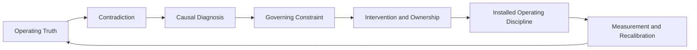
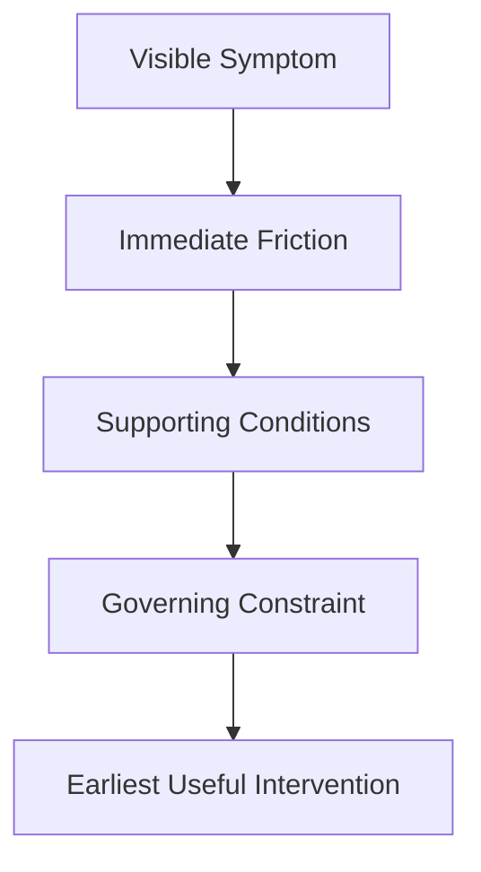

# GTM Diagnostic Framework v8 Public Architecture

*Public architecture specification for a private GTM diagnostic system*

> Field-test draft | September 2026

## Status and Scope

GTM Diagnostic Framework v8 is a private commercial framework for diagnosing GTM systems before leadership scales people, process, technology, or AI.

This document is a **public abstraction** of that framework.

It does not publish the complete v8 blueprint, full diagnostic architecture, question library, engagement method, operating templates, commercial packaging, or execution rules.

The canonical source remains the private **GTM Diagnostic Framework v8 Blueprint**.

## Operating Thesis

> **Diagnose the constraint. Install the operating system.**

The framework starts from a simple problem.

Commercial organizations often know what is happening without knowing what is governing the outcome.

Pipeline is below plan.

Forecasts slip.

Conversion is weak.

Managers are inconsistent.

Deals stall.

AI investment produces activity without measurable commercial movement.

Those symptoms matter, but they do not automatically identify the condition that should be changed.

The operating thesis is therefore

> **Diagnosis without execution is observation. Execution without diagnosis is guessing.**

The framework is designed to establish what is true, identify the governing constraint, and translate the diagnosis into an operating intervention that can be owned and inspected.

## Public Architecture Overview

This is a compressed public representation.

The private v8 framework contains substantially more diagnostic depth and execution detail.

## 1. Establish Operating Truth

The first task is not recommendation.

It is establishing what the organization can actually support with evidence.

The public architecture compares three evidence views.

| Evidence view | What it contributes |
| --- | --- |
| **Leadership belief** | Strategy, growth thesis, priorities, assumptions, and the explanation leadership currently trusts |
| **Business data** | Pipeline, conversion, forecast, bookings, velocity, retention, expansion, capacity, and other measurable signals |
| **Field and customer evidence** | Buyer behavior, seller execution, manager inspection, customer language, decision movement, and operating friction |

Agreement increases confidence.

Disagreement creates diagnostic signal.

The architecture does not assume that leadership belief is wrong, that data explains itself, or that one field observation proves a general pattern.

The job is to compare the sources before selecting a diagnosis.

## 2. Locate the Contradiction

The framework pays particular attention to places where the operating story stops matching the evidence.

Examples include

- pipeline coverage appears healthy while aging and conversion deteriorate
- sellers are highly active while buyer commitment remains weak
- technical validation succeeds while commercial decisions stall
- leadership describes a conservative forecast while commit repeatedly slips
- AI usage grows while the underlying business outcome does not move
- managers report coaching activity while seller judgment remains unchanged

The contradiction is not automatically the root cause.

It tells the diagnostic where deeper inspection is warranted.

A persuasive narrative should not be allowed to erase conflicting evidence.

## 3. Move From Chronology to Causal Diagnosis

Most operating systems are good at describing sequence.

What happened?

What stage is the deal in?

How many meetings were created?

When will it close?

What did the team do last week?

The framework asks a different class of question.

> **Why can’t the desired outcome happen today?**

That shifts attention from activity and chronology toward unresolved dependency.

The diagnosis may identify a missing buyer commitment, an unclear qualification standard, a decision right no one owns, a management behavior that reinforces weak execution, an unreliable evidence standard, or another operating condition that prevents movement.

The framework does not assume that every revenue problem has one simple root cause.

It looks for the **governing constraint** that currently matters most.

## 4. Identify the Governing Constraint

A governing constraint is the dependency that must change before the desired outcome becomes materially more likely.

It is different from the visible symptom.

For example

**Symptom**  
Pipeline is below plan.

**Possible friction**  
Created demand does not convert into legitimate opportunities.

**Possible supporting conditions**  
Targeting, messaging, follow-up, qualification, or buyer relevance may be inconsistent.

**Governing question**  
What unresolved dependency is preventing qualified buyer movement?

The architecture does not treat the example answer as universal.

The point is the distinction between the outcome leadership sees and the dependency leadership actually needs to change.

## 5. Connect Diagnosis to Intervention and Ownership

A diagnosis that does not change an operating decision has limited commercial value.

The framework therefore connects each prioritized diagnosis to

- the earliest practical intervention
- the person or role that owns the outcome
- the evidence expected to change
- the decision rights required
- the conditions that would weaken the diagnosis

The preferred intervention is not necessarily the largest transformation.

It is the earliest change likely to alter the trajectory.

That might mean changing qualification evidence before adding pipeline.

It might mean changing manager inspection before adding training.

It might mean clarifying buyer commitment before changing forecast methodology.

It might mean fixing the operating process before automating it.

The intervention should be proportionate to the evidence.

## 6. Install Operating Discipline

The framework is not intended to end with a recommendation deck.

The diagnosis should become part of how the organization operates.

That can include changes to

- recurring management inspection
- evidence required for decisions
- opportunity and forecast standards
- ownership and handoffs
- manager coaching
- demand feedback loops
- customer evidence
- leading indicators
- escalation and stop authority

The public principle is

> **Installed discipline over recommendations.**

If an engagement identifies the right issue but leaves ownership, cadence, evidence, and behavior unchanged, the diagnosis has not yet become execution.

## 7. Measure and Recalibrate

The framework separates early operating evidence from lagging financial outcomes.

Revenue remains important.

But many system changes should become visible before revenue fully reflects them.

Examples of leading evidence may include

- stronger buyer commitment
- higher-quality pipeline acceptance
- cleaner disqualification
- more evidence-based forecast calls
- improved conversion at a diagnosed friction point
- more consistent manager inspection
- clearer ownership
- faster feedback between functions
- lower decision latency

The purpose is not to manufacture ROI.

It is to define what should change if the diagnosis and intervention are correct.

If the expected evidence does not move, confidence in the diagnosis should decrease.

The framework should then be recalibrated rather than defended.

## Cross-Cutting Guardrails

Several disciplines operate across the public architecture.

### Evidence over narrative

A strong explanation is not proof.

Claims should remain distinguishable from observations, inference, working hypotheses, assumptions, and recommendations.

### Buyer movement over seller activity

Seller activity can be useful input.

Commercial progress requires evidence that the customer or buying system actually moved.

### Behavior without motive attribution

Leadership, manager, seller, and customer behavior matter.

Observable behavior can support a hypothesis.

It does not prove intent.

### Causality over chronology

Sequence explains what happened.

Diagnosis asks what unresolved dependency governed the outcome.

### Judgment before automation

Do not automate a workflow merely because the technology can perform it.

First understand what evidence, judgment, ownership, and exception handling the workflow requires.

### Change without organizational rejection

A theoretically correct operating model has limited value if the organization cannot absorb or sustain it.

Intervention depth and sequence should reflect the maturity of the revenue system.

## AI as a Leverage and Governance Layer

AI is part of the architecture, but it is not the framework’s identity.

The framework asks whether a workflow should be **fixed, augmented, automated, or protected** before AI is scaled into it.

The governing principle is

> **AI does not fix the motion. It accelerates the motion that already exists.**

A disciplined commercial system may gain leverage from AI.

A weak system can distribute its own noise faster.

The diagnostic therefore looks at the operating condition before the automation decision.

## How GTM v8 Relates to Full Stack v4

GTM Diagnostic Framework v8 and [Full Stack v4](full-stack-v4-public-architecture.md) are related but distinct systems.

**Full Stack v4** is a general reasoning architecture.

It focuses on evidence discipline, competing explanations, causal diagnosis, prognosis, pressure testing, confidence, and revision.

**GTM Diagnostic Framework v8** is a domain-specific commercial diagnostic architecture.

It applies related reasoning disciplines to market reality, pipeline, buyer movement, leadership behavior, field execution, operating cadence, ownership, revenue outcomes, and AI leverage.

Full Stack asks whether a conclusion deserves confidence.

GTM v8 asks what commercial condition is governing the outcome and what operating system must change as a result.

Neither framework replaces human executive judgment.

## What This Public Architecture Does Not Expose

The private v8 framework contains substantially more implementation detail than this document.

This repository does **not** publish

- the complete private diagnostic architecture
- the full operating sequence
- the detailed diagnostic question library
- internal dependency and decision rules
- engagement design and facilitation mechanics
- operating templates and client artifacts
- commercial packaging
- implementation-level AI governance rules
- the complete private evidence and scoring mechanisms

That boundary is deliberate.

The public architecture is intended to prove that a substantive, structured GTM diagnostic system exists and to make its governing logic inspectable.

It is not intended to make the commercial methodology fully replicable.

## Current Evidence and Limits

GTM Diagnostic Framework v8 is currently a **field-test draft**.

It is grounded in direct GTM operating experience, framework development, and practical application.

That is not the same as formal validation.

The current framework explicitly expects live application to validate, challenge, and sharpen it.

Field observations should be captured and calibrated without allowing one interesting case to become a permanent rule automatically.

A framework version should change only when evidence supports a meaningful improvement in clarity, sequence, usefulness, or repeatability.

## Related Public Documents

- [GTM Diagnostic Reasoning](../applications/gtm-diagnostic-reasoning.md)
- [Full Stack v4 Public Architecture](full-stack-v4-public-architecture.md)
- [Evaluation Approach](../evaluation/evaluation-approach.md)
- [Reconstructed Evaluation Case 01](../examples/reconstructed-example-01.md)
- [Reconstructed Evaluation Case 02](../examples/reconstructed-example-02.md)
- [Reconstructed Evaluation Case 03](../examples/reconstructed-example-03.md)

## Public Architecture in One Line

**Establish what is true → locate the contradiction → diagnose the governing constraint → choose the earliest useful intervention → install the operating discipline → measure whether the system changes**

That is the public architecture.

The private framework contains the deeper method used to execute it.
