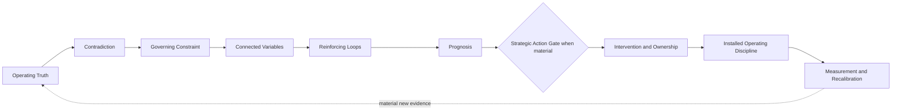
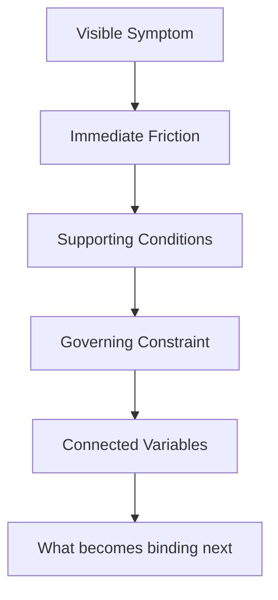

# GTM Diagnostic Framework v9 Public Architecture

*Public architecture specification for a private GTM diagnostic system*

> Current canonical GTM architecture | Field-test | September 2026

## Status and Scope

GTM Diagnostic Framework v9 is the current canonical version of a private commercial framework for diagnosing GTM systems before leadership scales people, process, capital, technology, or AI.

This document is a **public abstraction** of that framework.

It does not publish the complete private blueprint, diagnostic question library, detailed opportunity rules, engagement mechanics, commercial tactics, operating templates, or implementation-level decision rules.

GTM v8 remains preserved as the historical prior version.

Canonical does not mean formally validated. v9 is the active field-test architecture and remains subject to evidence, calibration, and future version discipline.

## Operating Thesis

> **Diagnose the constraint. Install the operating system.**

The framework starts from a recurring commercial problem.

Organizations can usually describe what happened.

Pipeline moved. Forecast slipped. A POC stalled. Procurement delayed. Conversion weakened. AI increased activity.

The harder question is what condition currently governs the outcome, what keeps recreating that condition, and what else changes when one variable moves.

The core operating thesis remains

> **Diagnosis without execution is observation. Execution without diagnosis is guessing.**

## What Changed in v9

v8 established the **governing constraint** as the intellectual center of the GTM framework.

v9 keeps that center and adds one important operating reality.

> **The governing constraint can move.**

GTM systems are dynamic.

Removing one dependency can expose another. A technical proof can remove product risk while making procurement or commercial duration the next binding constraint. A change in timing can alter negotiating leverage. A commercial concession can change buyer behavior. A leadership decision can change manager behavior, which changes seller behavior, which changes the customer experience.

The framework therefore cannot stop after identifying one constraint once.

v9 makes five connected reasoning disciplines more explicit.

- identify the variables materially connected to the current constraint
- inspect reinforcing loops that recreate the condition
- detect when another dependency becomes binding
- recompute the diagnosis when material evidence changes
- test whether commercial logic and buyer evidence survive handoffs across the operating system

The current v9 field-test architecture also adds bounded reasoning refinements inside that same structure. They strengthen resistance to an initial preferred diagnosis, distinguish independent corroboration from repeated reporting, make behavioral attribution more disciplined, and make the conditions for reopening a prior diagnosis or action decision more explicit.

This is still v9. The six-lens architecture, governing-constraint center, and reasoning spine remain intact.

This is the primary architectural evolution from v8 to v9.

## Public Architecture Overview

This is a compressed public representation.

The private v9 framework contains substantially more diagnostic depth and execution detail.

## 1. Establish Operating Truth

The first task is not recommendation.

It is establishing what the organization can support with evidence.

The public architecture compares three evidence views.

| Evidence view | What it contributes |
| --- | --- |
| **Leadership belief** | Strategy, growth thesis, priorities, assumptions, and the explanation leadership currently trusts |
| **Business data** | Pipeline, conversion, forecast, bookings, velocity, retention, expansion, pricing, capacity, and other measurable signals |
| **Field and customer evidence** | Buyer behavior, seller execution, manager inspection, customer language, decision movement, procurement behavior, and operating friction |

Agreement increases confidence when the supporting evidence is meaningfully distinct.

Disagreement creates diagnostic signal.

The framework also checks whether apparent agreement is actually independent. A leadership explanation repeated through a dashboard, manager inspection, and seller-entered fields can still trace back to one underlying source. Repetition across surfaces should not be mistaken for separate corroboration.

The framework does not assume leadership belief is wrong, that data explains itself, or that one field observation proves a general pattern.

## 2. Locate the Contradiction

The framework looks for places where the operating story and the evidence stop matching.

Examples include

- pipeline coverage appears healthy while aging and conversion deteriorate
- sellers are active while buyer commitment remains weak
- technical validation succeeds while commercial decisions stall
- leadership describes a conservative forecast while Commit repeatedly slips
- managers report coaching activity while seller judgment remains unchanged
- AI usage rises while the underlying business outcome does not move

A contradiction is not automatically the cause.

It identifies where deeper inspection is warranted.

The starting explanation also does not control the evidence search. When leadership enters the diagnostic with a strong preferred explanation, v9 treats that explanation as a hypothesis to test rather than an instruction about what the evidence should prove.

## 3. Diagnose the Governing Constraint

The core question remains

> **Why can't the desired outcome happen today?**

A governing constraint is the dependency that must change before the desired outcome becomes materially more likely.

It is different from the visible symptom.

The governing constraint is always relative to a defined outcome and level of analysis.

An opportunity-level constraint and a company-level constraint can both be valid because they govern different outcomes.

## 4. Reason Across Dependencies

v9 adds stronger reasoning about movement inside the system.

The framework asks

- what variables materially affect the constraint
- what behavior or system rule keeps recreating the condition
- what feedback loop is operating
- what changes downstream if one variable moves
- what dependency is likely to become binding next
- what evidence would show that the constraint has migrated

This distinction matters because fixing one issue can reveal another.

A POC may remove technical uncertainty but expose weak commercial timing.

A pricing change may remove budget resistance but expose duration or optionality risk.

A stronger buyer deadline may remove timing uncertainty but expose procurement, paper process, or approval authority.

The architecture therefore treats diagnosis as recursive rather than static.

## Opportunity Availability and Commercial Capacity

v9 also makes one connected operating variable more explicit.

Legitimate opportunity availability can change the decision environment around the rest of the sales system.

When legitimate opportunity is scarce relative to available commercial capacity, the relative cost of saying no can rise. That can change qualification, disqualification, prioritization, or continued investment even when buyer evidence has not improved.

When legitimate opportunity is abundant, selective freedom can increase. That advantage depends on capacity governance. Available legitimate opportunity is not the same as active opportunity workload, and excess active pursuit can dilute execution.

The framework therefore inspects whether opportunity conditions are changing decision thresholds rather than assuming pipeline volume is only an output measure.

This is not a claim that more pipeline fixes downstream execution. It is a diagnostic requirement to test whether scarcity, sufficiency, or overload is changing how the organization allocates scarce commercial attention.

## 5. Use a Strategic Action Gate When Consequence Warrants It

A correct diagnosis does not automatically make every diagnosed problem worth fixing.

When consequence, scarce-resource tradeoffs, or difficult-to-reverse downside are material, v9 adds a conditional action gate before intervention design.

The public questions are simple.

- What strategic value becomes available if the constraint changes
- What scarce resource does the intervention consume
- What competing use exists for that resource
- Is the downside bounded and reversible
- Can the intervention be staged or contained
- Is fixing the constraint better than tolerating, deferring, working around, simplifying, exiting, or reallocating

This is not a mandatory extra phase for every decision.

It is used when the consequence of acting is material enough to justify the additional friction.

## 6. Translate Diagnosis Into Installed Discipline

A diagnosis that does not change an operating decision has limited commercial value.

The framework connects prioritized diagnosis to

- intervention or deliberate non-intervention
- outcome ownership
- evidence expected to change
- decision rights
- management cadence
- field behavior
- disconfirming evidence
- conditions that should reopen the diagnosis

The preferred intervention is not automatically the largest transformation.

It is the earliest defensible change likely to alter the trajectory when action is warranted.

> **Installed discipline over recommendations.**

Maturity can change where a critical GTM responsibility sits without eliminating the responsibility itself. The diagnostic asks whether the work is deliberately owned and performed, rather than treating the absence of a specialized role title as the problem.

Evidence standards become operational when they affect decisions. If required evidence is missing or insufficient, the associated decision should change or remain unresolved rather than proceed as though the evidence existed.

## Buyer Progression Without Becoming a Sales Methodology

v9 makes several buyer dependencies more explicit without prescribing CRM stages.

At the public level, the diagnostic distinguishes four motions.

**Qualification** asks whether a credible buying motion exists and whether further seller investment is warranted.

**Discovery** develops the understanding of the customer outcome, problem, consequence, decision process, people, timing, alternatives, and risk.

**Solution Education** translates that discovery into a customer-specific solution hypothesis.

**Validation** tests whether the business and technical hypothesis can actually be proven.

A client may combine or rename stages.

The framework cares about whether the underlying buyer dependencies exist and whether they are supported by evidence.

One failure pattern is breadth substituting for relevance during Solution Education. A buyer can become interested in the product without a sufficiently specific customer hypothesis being established. When that happens, Validation can inherit unfinished education work and become another product-learning event rather than a test of what remains uncertain.

A stalled validation event may therefore originate upstream rather than being a technical-validation problem.

## Time, Compelling Events, and Forecast Integrity

v9 makes time more explicit as a cross-cutting GTM variable.

The governing principle is

> **A compelling event is not a date. It is the credible consequence that makes the date matter.**

A buyer can see value without having sufficient reason to act within a particular period.

The framework therefore distinguishes buyer urgency from seller preference and asks what happens if the date is missed, who experiences the consequence, who controls timing, and whether the buyer has actually confirmed that the consequence affects the buying decision.

Sales stage and forecast category remain different concepts.

Sales stage describes the buyer's position in the buying process.

Forecast category expresses confidence in whether and when an opportunity will close.

The public forecast logic is

- **Pipeline** means a legitimate opportunity exists but material buying facts remain unresolved
- **Best Case or Upside** means buyer intent to purchase from us and what they intend to buy are sufficiently understood, but the buyer-confirmed when is still missing
- **Commit** means what the buyer is buying and when are both supported by buyer evidence, including a credible compelling event behind the timing

The category changes because the evidence changes.

Calendar time also matters. Remaining time changes the probability that unresolved dependencies can realistically be resolved and therefore changes where seller and manager attention should go.

## Stakeholder Incentives and Commercial Structure

Urgency is not necessarily an account-level property.

Different members of the buying system can have different incentives.

An economic buyer may care most about business outcome and timing. Procurement may care more heavily about commercial terms, risk, savings, and negotiating leverage.

One public diagnostic question captures the issue well.

> **Who benefits from waiting?**

Visible agreement in a group setting does not automatically establish independent stakeholder commitment. When alignment materially affects the buying motion, the diagnostic looks for actions, decisions, or subsequent behavior from the stakeholders who can advance or block the decision rather than treating shared meeting behavior as sufficient confirmation.

Discovery should also test how the buyer is categorizing the solution when that interpretation could materially change the comparison set, buying path, decision criteria, or perceived alternatives.

The framework also separates observed behavior from explanations of motive. When a behavioral explanation materially affects the diagnosis, it tests credible alternatives and asks whether role design, incentives, authority, information, or other structural conditions could produce the same behavior. Unresolved motive uncertainty does not automatically prevent a commercial decision.

v9 also separates commercial variables that are often collapsed together.

Price, duration, total contract value, renewal economics, and buyer optionality can interact without being the same problem.

The framework does not prescribe negotiation tactics or contract structures publicly. It makes the diagnostic distinction visible so leadership does not assume another price concession solves a duration, risk, or optionality problem.

## Manager Inspection Evolves With the Diagnosis

The framework continues to distinguish several levels of manager inspection.

- activity inspection
- evidence inspection
- judgment inspection
- behavior-change inspection
- dependency inspection

The additional v9 question is

> **What else should change because this variable changed?**

That question helps managers inspect the buying system rather than isolated facts.

## Commercial System Coherence

v9 also makes an operating-system requirement explicit.

A GTM system can contain individually strong artifacts and still produce weak execution when those artifacts do not reinforce the same commercial logic.

Messaging, discovery, qualification, opportunity progression, CRM stages, forecasting, manager inspection, coaching, and enablement have different jobs. They should still use compatible definitions of buyer progress, evidence, and good judgment.

The public coherence test asks whether material commercial logic survives the handoffs between those mechanisms.

Examples include

- whether messaging leads naturally into discovery
- whether discovery produces evidence used for qualification and progression
- whether CRM and forecasting reflect the same buyer reality
- whether manager inspection reinforces the evidence and behavior the process requires
- whether coaching and enablement address gaps exposed through inspection
- whether new customer evidence can change earlier assumptions and subsequent action

The requirement is coherence, not uniformity.

The diagnostic does not assume every connected component should be redesigned at once. It identifies the governing break in coherence and prioritizes the highest-leverage repair.

## Operating Continuity

v9 adds a second operating-system test alongside Commercial System Coherence.

Commercial System Coherence asks whether GTM mechanisms reinforce the same commercial logic.

Operating Continuity asks whether commercial truth remains usable as work moves across records, operating guidance, teams, and changes in buying state.

At the public level, the framework inspects three forms of continuity.

- **Record continuity** asks whether commercial records have clear decision roles, authoritative scope, ownership, and evidence handoffs without creating conflicting versions of truth.
- **Field usability continuity** asks whether the people executing the commercial motion can reach current authoritative guidance when the work requires it.
- **Buying-motion continuity** asks whether closing an active opportunity preserves enough evidence to distinguish the end of the current buying motion from permanent account irrelevance and to recognize rational future re-entry when conditions change.

The framework does not prescribe specific record types, playbooks, CRM fields, or documentation formats.

The requirement is functional.

Commercial evidence, decision context, and operating guidance should survive the transitions that matter to execution.

As with Commercial System Coherence, the framework does not assume every connected mechanism should be redesigned at once.

It identifies the continuity break that materially affects the governing outcome and prioritizes that repair.

## AI as a Leverage and Governance Layer

AI remains part of the architecture, not the identity of the framework.

The framework still asks whether a workflow should be **fixed, augmented, automated, or protected** before AI is scaled into it.

The governing principle remains

> **AI does not fix the motion. It accelerates the motion that already exists.**

v9 adds more explicit attention to **context readiness**.

Connected context can improve AI usefulness, but unreliable connected context can also distribute error faster.

The public guardrail is

> **Capture can be automated. Commercial interpretation remains accountable judgment.**

AI may capture meetings, emails, stated next steps, or contradictory evidence. Material commercial judgments such as qualification, compelling-event credibility, stage completion, forecast category, or buyer commitment still require governed evidence and accountable human ownership.

## Evidence Re-entry and Constraint Migration

The framework is not designed to produce one diagnosis and then defend it.

When material new evidence arrives, the diagnosis should be reopened.

v9 now makes that re-entry condition more explicit when consequence warrants it. A prior diagnosis or action decision can carry a **reconsideration boundary** such as a material event, dependency change, evidence threshold, or time-based condition supported by the causal hypothesis.

Crossing the boundary requires reconsideration. It does not automatically prove that the prior diagnosis was wrong or that intervention is now required.

A positive outcome can strengthen confidence without proving causality.

A negative outcome can weaken confidence without automatically disproving the original diagnosis.

The key v9 question is whether the evidence weakens the original causal hypothesis, exposes an execution failure, or shows that another constraint has become binding.

> **Reality retains the right to change the diagnosis.**

## How GTM v9 Relates to Full Stack v5

GTM Diagnostic Framework v9 and [Full Stack v5](full-stack-v5-public-architecture.md) are related but distinct systems.

**Full Stack v5** is a general reasoning architecture for evidence, challenge, diagnosis, prognosis, strategic adjudication, pressure testing, and confidence.

**GTM Diagnostic Framework v9** is a domain-specific commercial diagnostic system.

It applies related reasoning disciplines to market reality, buyer movement, pipeline, forecasting, leadership behavior, field execution, operating cadence, stakeholder incentives, commercial structure, revenue outcomes, and AI leverage.

Full Stack asks whether reasoning deserves confidence and whether action is strategically warranted.

GTM v9 asks what commercial condition is governing the outcome, what variables sustain or move that condition, and what operating system should change as a result.

Using Full Stack to challenge the GTM framework does not make Full Stack mechanics part of GTM architecture automatically. A concept still has to earn domain-level inclusion.

Neither system replaces human executive judgment.

## Public and Private Boundary

The complete v9 framework remains private.

This repository does **not** publish

- the complete private blueprint
- the full diagnostic question library
- detailed opportunity inspection rules
- internal dependency and decision rules
- full engagement design and facilitation mechanics
- detailed commercial tactics and contracting guidance
- operating templates and client artifacts
- implementation-level AI governance controls
- the complete private evidence and calibration mechanics

The public architecture is intended to prove that a substantive, connected GTM diagnostic system exists and to make its governing logic inspectable.

It is not intended to make the commercial methodology fully replicable.

## Current Evidence and Limits

GTM Diagnostic Framework v9 is the current canonical **field-test architecture**.

It is grounded in direct GTM operating experience, framework development, live engagement calibration, a full Full Stack v5 review, and a separate self-audit.

That is meaningful evidence of disciplined development.

It is not formal validation.

Several commercial observations remain explicitly classified as field hypotheses rather than universal truths, including the behavior effects of unenforced discount deadlines and the degree to which rapid AI-market change is increasing buyer preference for contractual optionality.

The current v9 reasoning refinements also remain field-test architecture. Their canonical inclusion reflects identified reasoning gaps and framework review, not formal validation that each refinement improves GTM diagnosis across cases.

The framework should continue to be challenged through live application, evidence capture, calibration, and future version discipline.

## Related Public Documents

- [GTM Diagnostic Reasoning](../applications/gtm-diagnostic-reasoning.md)
- [GTM Framework Evolution](gtm-evolution.md)
- [GTM Calibration Log](gtm-calibration-log.md)
- [GTM Diagnostic Framework v8 Public Architecture](gtm-diagnostic-framework-v8-public-architecture.md)
- [Full Stack v5 Public Architecture](full-stack-v5-public-architecture.md)

## Public Architecture in One Line

**Establish what is true → test whether the evidence is independently grounded → identify the governing constraint → inspect connected variables, reinforcing loops, operating-system coherence, and continuity → determine what becomes binding next → decide whether intervention is warranted when consequence is material → install the operating discipline → re-enter when evidence or a reconsideration boundary changes the decision state**

That is the public architecture.

The private framework contains the deeper method used to execute it.
