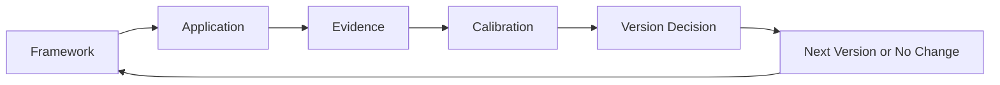

# Evolution of the GTM Diagnostic Framework

*The documented design changes that moved the framework from v7 to the current v8 field-test architecture*

> Public evolution history | September 2026  
> Canonical source remains the private GTM Diagnostic Framework v8 Blueprint

## Status and Scope

This document records **material GTM framework changes that are explicitly supported by the current canonical v8 source**.

It does not reconstruct undocumented intermediate versions.

It does not publish GTM v7 or the private v8 implementation in full.

The purpose is to make intellectual evolution inspectable without turning version history into a release of the underlying commercial methodology.

## Why This History Matters

A version number is useful only when it represents a meaningful change in how the system diagnoses or operates.

The GTM framework is intended to evolve through evidence rather than accumulation.

The governing development pattern is

**Framework → live application → evidence → calibration → version decision**

The important question is not how many edits occurred.

It is what changed in the underlying judgment system and why that change mattered.

## Documented Shift From v7 to v8

The canonical v8 source identifies six substantive changes.

| v7 emphasis | v8 evolution | Why the change matters |
| --- | --- | --- |
| **AI-centered headline** | Operating truth and the governing constraint become the headline. AI moves to a leverage and governance layer. | Keeps the framework focused on the commercial system rather than treating AI as the diagnosis. |
| **Root-cause language** | Governing constraint replaces the expectation that one isolated root cause explains a complex revenue system. | Better reflects GTM environments where several conditions may contribute but one unresolved dependency currently matters most. |
| **Chronology-heavy inspection** | Causal inspection becomes explicit. The question moves from what happened to why the desired outcome cannot happen now. | Shifts operating reviews from reporting sequence toward identifying the dependency preventing movement. |
| **Behavior as a domain** | Leadership and field behavior become part of the execution system rather than a separate observational category. | Connects behavior to incentives, reinforcement, judgment, adoption, and operating outcomes. |
| **Static diagnosis** | Anticipatory operating judgment extends the diagnosis into likely consequences and the earliest useful intervention. | Creates a stronger bridge between understanding the current state and deciding what leadership should do next. |
| **Engagement outputs listed** | Ownership, activities, participants, operating artifacts, timeframes, and value realization become more explicit. | Moves the framework closer to installed operating discipline rather than diagnosis that ends as a report. |

These changes are architectural, not cosmetic.

They alter what the framework treats as the problem, how it reasons about causality, and how diagnosis is expected to become execution.

## 1. AI Moved Out of the Center

An important v8 change is what the framework is **about**.

AI remains material, but it is no longer the organizing identity.

The framework instead begins with operating truth and the condition governing the commercial outcome.

That matters because AI can improve the speed, reach, and consistency of an existing motion without proving that the motion itself is sound.

The resulting principle is

> **AI does not fix the motion. It accelerates the motion that already exists.**

In v8, AI therefore sits downstream of diagnosis.

The first question is whether the commercial system is worth accelerating.

## 2. Root Cause Became Governing Constraint

Complex revenue systems often resist a single-cause explanation.

Pipeline quality may reflect targeting, buyer urgency, qualification, management inspection, demand handoffs, incentives, or several conditions interacting at once.

v8 does not require the diagnostic to claim that one factor explains everything.

Instead, it asks which dependency must change before the desired outcome becomes materially more likely.

That is the **governing constraint**.

This change matters because it makes the framework more useful for intervention.

Leadership does not need a total theory of the company before acting.

It needs a defensible view of what is currently preventing movement and what should change first.

## 3. Inspection Shifted From Chronology to Causality

Operating reviews naturally ask chronological questions.

What happened?

What changed?

When will it close?

What stage is the deal in?

How much pipeline was created?

v8 makes causal inspection more explicit.

The central question becomes

> **Why can’t this outcome happen today?**

That question can be applied to an opportunity, pipeline, forecast, demand system, management process, expansion motion, or AI workflow.

The purpose is to identify the unresolved dependency rather than simply describe the path that produced the current state.

## 4. Behavior Became Part of the Operating System

Earlier framing treated behavior more as a domain to inspect.

v8 integrates behavior more directly into execution.

Leaders, managers, sellers, and cross-functional partners interpret standards, respond to incentives, reinforce norms, make tradeoffs, and decide what evidence matters.

Those behaviors can sustain or weaken an operating condition.

At the same time, v8 adds an important guardrail.

**Observable behavior is evidence of what occurred. It is not proof of motive.**

Behavior can create a hypothesis about incentives, beliefs, fear, interpretation, or operating rules.

Those explanations still require evidence.

This distinction is especially important when diagnosing human systems because confident motive attribution can turn observation into fiction very quickly.

## 5. Diagnosis Became More Anticipatory

v8 extends the diagnostic beyond explaining the current state.

It asks what the current condition is most likely to produce if nothing changes and what intervention could improve the trajectory.

This is not positioned as prediction certainty.

The purpose is to connect diagnosis to probable consequence, alternative outcomes, and an actionable next step.

That change makes the framework more decision-oriented.

A diagnosis matters more when it clarifies what leadership should expect, what could disconfirm the conclusion, and where intervention is most useful.

## 6. The Framework Moved Toward Installed Discipline

v8 makes a stronger distinction between producing recommendations and changing the operating system.

The framework now emphasizes the connection among

- diagnosis
- ownership
- recurring inspection
- evidence standards
- operating decisions
- field behavior
- measurable outcomes

The public principle is

> **Installed discipline over recommendations.**

A correct diagnosis that never changes ownership, inspection, decisions, or behavior remains observation.

The framework is intended to leave the organization with stronger internal inspection capability rather than dependence on a one-time readout.

## What v8 Preserves

v8 changes the architecture without abandoning several underlying principles.

### Diagnose before accelerating

More investment increases the cost of being wrong when the motion is not understood.

### Evidence over narrative

A persuasive explanation is not proof.

Claims should be tested against data, observable behavior, and customer movement.

### Buyer movement over seller activity

Seller activity may be useful input.

Commercial progress requires stronger evidence of customer commitment and reduced uncertainty.

### Judgment before automation

Automation should not remove work that currently forces important human judgment before the organization understands what would be lost.

### Human judgment remains necessary

The framework is decision support.

It is not a substitute for executive judgment, manager accountability, customer evidence, or commercial ownership.

These principles remain visible in the current v8 architecture.

## Current v8 Status

GTM Diagnostic Framework v8 is a **field-test draft**.

That status matters.

The canonical source explicitly expects live application to validate, challenge, and sharpen the framework.

It does not treat practical usefulness as formal validation.

The framework should therefore remain open to revision while preserving a clear distinction between

**using the framework** and **changing the framework**.

## Field Calibration Discipline

The canonical v8 source separates client or operating execution from framework development.

That separation protects both activities.

During live work, the priority is the commercial outcome.

Observed failures, useful patterns, and unexpected results can be captured for later review.

They should not silently rewrite the framework in the middle of execution.

The calibration loop is

A single interesting observation may justify further testing.

It does not automatically justify architecture.

## What Should Trigger a Future Version

A future major version such as v9 should represent a meaningful change to the framework itself.

Based on the current version discipline, a major change should improve one or more of the following in a substantive way

- diagnostic clarity
- reasoning sequence
- usefulness of the intervention
- repeatability across cases
- evidence discipline
- operating applicability

A major version should not exist merely because language was improved, examples changed, or a new client situation produced an interesting idea.

The evidence should justify changing the system.

## What Should Not Trigger a New Version

Not every improvement belongs in architecture.

The following may be worth preserving without creating a new major version

- wording improvements
- clearer examples
- presentation changes
- isolated observations
- one-off client adaptations
- additional supporting artifacts
- hypotheses that have not survived unrelated cases

This prevents the framework from becoming more complicated simply because more ideas are available.

## How v9 Should Be Recorded

There is **no canonical v9 defined in the current source set**.

When a future canonical v9 is approved, the public repository should preserve v8 rather than silently overwrite its history.

The public evolution record should then explain

1. what v8 believed or emphasized
2. what evidence challenged or extended that position
3. what changed in v9
4. why the change was material
5. what was deliberately preserved
6. what remains unresolved

The goal is to show intellectual development, not merely document a new file name.

## Public and Private Boundary

This evolution history deliberately describes **why the architecture changed** at a higher level than the private implementation.

It does not publish the complete v7 design, the full v8 diagnostic sequence, proprietary decision rules, the diagnostic question library, client operating artifacts, or commercial execution mechanics.

Version history should increase credibility without increasing replication risk unnecessarily.

## Related Public Documents

- [GTM Diagnostic Framework v8 Public Architecture](./gtm-diagnostic-framework-v8-public-architecture.md)
- [GTM Diagnostic Reasoning](../applications/gtm-diagnostic-reasoning.md)
- [Full Stack v4 Public Architecture](./full-stack-v4-public-architecture.md)
- [Evolution of the Reasoning System](./evolution.md)
- [Evaluation Approach](../evaluation/evaluation-approach.md)

## Current Position

v8 represents a documented shift from a more AI-centered and chronology-heavy framing toward a diagnostic architecture organized around operating truth, causal constraint, execution, and calibration.

It is not presented as finished.

The stronger claim is narrower.

**The framework has a documented reason for changing, a discipline for deciding what becomes architecture, and a versioning model intended to preserve evidence of that evolution.**
