# Self-Audit as a Reasoning Control

*How model self-critique becomes a governed review mechanism inside a human-directed reasoning system*

**Status**

Public architecture note describing an existing control in Full Stack v5.1 and its standalone use inside the governed reasoning environment.

This document does not modify canonical Full Stack v5.1. It makes an existing control relationship more inspectable without publishing the private execution procedure.

## Purpose

AI models can be asked to critique or reconsider an answer.

That underlying capability is useful. It is not, by itself, a governed review system.

Inside this body of work, self-audit has a defined operating meaning. The system determines how the audit is applied and what should happen when it exposes a material weakness.

The design contribution is therefore not model self-critique itself.

It is the control architecture around that capability.

## Model capability and designed control

The model provides the underlying ability to inspect and revise an answer.

The reasoning architecture gives that capability a defined role.

A generic request to reconsider an answer can still produce a useful critique. The result depends on the available context and how the request is interpreted.

Self-audit in this system is narrower and more deliberate. It is an output-specific review control. It challenges the current artifact and revises it when warranted.

When a lesson appears reusable, the system separately considers whether it should carry forward rather than assuming that every successful correction belongs in the architecture.

Capability and control are therefore different things.

A capability says the model can perform a kind of work.

A control defines how that capability participates in the larger reasoning process.

## Two execution modes

Self-audit operates in two modes.

```mermaid
flowchart TD
    subgraph Embedded["Embedded inside Full Stack"]
        A[Evidence and context] --> B[Full Stack reasoning]
        B --> C[Draft and pressure testing]
        C --> D[Human Authenticity Final Pass]
        D --> E[Silent self-audit]
        E --> F[Confidence Self Audit]
        F --> G[Delivered output]
    end

    subgraph Standalone["Standalone"]
        H[Existing artifact] --> I[Output-specific self-audit]
        I --> J[Critique and revision]
        J --> K[Revised artifact]
    end
```

### Embedded self-audit

Inside Full Stack v5.1, self-audit is part of the pre-release control structure.

It operates after the substantive reasoning and draft pressure testing are settled. Its job is not to restart Full Stack from the beginning.

Its job is to test whether the artifact being prepared for release still reflects the reasoning that produced it and whether a material weakness remains in the output.

This makes embedded self-audit a pre-release quality control rather than another reasoning framework.

A correctly executed Full Stack run should therefore already contain the benefit of this review before the output is delivered.

### Standalone self-audit

Standalone self-audit begins with an artifact that already exists.

It critiques that artifact and revises it when the challenge exposes something material.

The artifact may have been produced through Full Stack. It may also have come from ordinary AI interaction or another process.

Standalone self-audit does not retroactively change how the original answer was produced.

It can improve an ordinary answer without turning the original reasoning process into a Full Stack execution.

In practice, standalone self-audit functions as a retrospective red-team of the released artifact rather than a substitute for Full Stack.

## Same audit kernel, different upstream state

The simplest shorthand for the relationship is

> **Same audit kernel, different upstream state.**

Here, *audit kernel* is conceptual shorthand for the shared core audit discipline. It is not a claim about hidden model internals or a software kernel.

The important difference is the state of the artifact entering the audit.

Embedded self-audit receives an artifact after Full Stack has already applied its broader reasoning architecture.

Standalone self-audit receives the artifact that currently exists and inherits whatever reasoning produced it.

The two modes can therefore use the same core audit discipline without being equivalent processes.

## Self-audit and Confidence Self Audit

These controls are related, but they do different work.

| Control | Primary question | Effect |
| --- | --- | --- |
| **Self-audit** | Is there a material weakness in the current artifact that should be corrected | Can change the artifact |
| **Confidence Self Audit** | How much trust does the reasoning deserve given the evidence and remaining uncertainty | Makes the confidence boundary more inspectable |

The distinction prevents artifact review from being confused with confidence reporting.

A polished artifact can still rest on weak evidence.

A strong diagnosis can also carry uncertainty that should remain visible even after the artifact itself no longer needs revision.

## Execution fidelity

This control creates an important systems question.

What should happen when an explicit standalone self-audit immediately produces a materially better version of an artifact that was already created through Full Stack?

Some incremental improvement is normal.

Once an artifact exists, it can be inspected as a fixed object instead of being produced and evaluated at the same time. That can expose something the earlier process did not select for revision.

Repeated material improvement is different.

If a later audit consistently finds a major reasoning miss that the embedded audit was supposed to catch, the first question should be whether the existing control was executed with sufficient fidelity.

The architecture already contains the control.

Adding another mandatory control could create redundancy while hiding the fact that the existing control was not being executed reliably.

The governing principle is

> **Do not add architecture until you know whether the problem is missing capability or weak execution of an existing capability.**

That principle extends beyond self-audit.

A reasoning system can become more complicated while becoming less reliable if every execution failure is answered with another layer.

## Review independence

Self-audit also has a known limitation.

The same reasoning context that creates an artifact can preserve some of the assumptions or attention patterns that shaped it.

A same-context audit benefits from continuity because it retains the surrounding requirements and reasoning path.

That continuity can also create correlated blind spots.

The repository already preserves an observational case in which a same-context self-audit missed a hard-rule violation that a later fresh-context review identified.

That observation supports a narrower hypothesis.

> **Review independence may expose a valid material issue that survives same-context self-audit.**

It does not establish that fresh-context review is inherently better.

A fresh reviewer can introduce a different error or overcorrect a sound decision. The useful test is whether the new challenge is valid and material, not whether the second reviewer disagrees.

Review independence should therefore remain an evaluation variable rather than a universal requirement.

See [Fresh-context review after same-context self-audit](./evidence/2026-09-20-fresh-context-review-after-self-audit.md) for the current observational evidence and its limits.

## Evidence and limits

This architecture note explains an existing control model.

It does not establish that self-audit guarantees correctness or that the control has been formally validated.

It does not claim that this work invented model self-critique.

The evidence supports a more bounded position.

The system gives self-audit a defined operating role.

Practical use has also exposed execution-fidelity risk and a possible review-independence effect that still requires structured testing.

Those limits are part of the architecture rather than something to hide.

## Public and private boundary

The public portfolio should make the control model inspectable without publishing the complete execution procedure.

This document exposes the distinction between model capability and designed control. It also explains the relationship between embedded and standalone use.

The private implementation retains the detailed inspection sequence and other execution logic used to operate the control.

That boundary is deliberate.

The goal is to show that the reasoning system contains real control architecture without publishing everything required to reproduce it.

## Relationship to Full Stack v5.1

Self-audit is not a separate reasoning framework.

It is a control used within the Full Stack architecture and as a standalone review command in the governed reasoning environment.

Full Stack remains responsible for the broader path from evidence to diagnosis and strategic judgment.

Self-audit challenges the artifact produced from that reasoning.

Confidence Self Audit separately makes the trust boundary around the reasoning more visible.

The controls are related, but they should not be collapsed into one function.

## Related public material

- [Full Stack v5.1](./full-stack-v5.1-public-architecture.md)
- [Fresh-context review after same-context self-audit](./evidence/2026-09-20-fresh-context-review-after-self-audit.md)
- [Building Friction Into AI](./docs/building-friction-into-ai.md)
