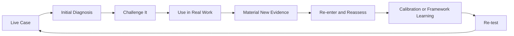

# Building Friction Into AI

*How I’m using AI to build a repeatable reasoning system for GTM judgment*

> Work in progress | September 2026

**The most useful thing I’ve built with AI isn’t a prompt. It’s friction.**

## Why I started

Most AI workflows optimize for faster output. I started from a different problem. In GTM, speed is not leverage if the diagnosis is wrong. AI can accept a premise, over-weight a vivid event, or turn a plausible explanation into more certainty than the evidence deserves.

The risk is not just bad writing. It is bad intervention. The visible issue can be a downstream symptom rather than the governing constraint. If that distinction is missed, AI can make the wrong action faster, cleaner, and more convincing.

## What I’m building

I call the core approach a **logic lens**. A prompt mostly defines the output. A logic lens defines how the problem should be examined before the output is trusted.

The current implementation is **Full Stack v5.1**. It preserves the evidence discipline, competing explanations, causal diagnosis, prognosis, recursive evidence re-entry, and pressure testing developed through v4. It carries forward the strategic decision discipline added in v5 and adds Compressed Diagnosis as a conditional capability before full diagnostic expansion.

The change came from a new failure mode.

> **A diagnosis can be correct and the intervention can still be strategically wrong.**

Full Stack v5 separated diagnostic correctness from the decision to act.

When the distinction is material, it asks whether a communication has been interpreted in the right functional context, whether a proposed action creates credible material downside that is difficult or impossible to reverse, and whether removing the governing constraint is worth the scarce resources and opportunity cost required.

The governing distinction is simple.

> **A correct diagnosis is necessary for a good decision. It does not make every diagnosed problem worth solving.**

v5.1 adds another distinction.

> **Experience can compress diagnosis without bypassing it.**

The system can now ask whether more diagnostic evidence is likely to improve the decision enough to justify the time, delay, or opportunity cost required to obtain it. A strong prior remains challengeable and contradictory evidence can defeat it.

Today, that discipline is encoded in an Operating Manual and an Execution Prompt. The asset is not a single prompt. It is a repeatable reasoning system that can be applied across different problems and revised when evidence exposes a real reasoning failure.

## Where the idea is going

A separate research direction is the **Behavioral Inference Engine**. This is not a finished product.

The goal is for AI to maintain a longitudinal view of behavior without silently converting an observation into motive. Assumed intention stays a hypothesis, and competing explanations stay open until the evidence meaningfully favors one.

A current design problem is model revision. A vivid outlier may reveal something important, but it can also distort the broader pattern. The engine needs a disciplined way to decide which is happening.

## How I’m using AI to build it

AI is not just receiving instructions. It is also the design partner and test environment. I run real GTM situations, executive decisions, and public writing through the system, then inspect where the reasoning fails or overreaches.

If the lesson appears reusable, I compare it against the existing architecture before deciding whether it belongs in the framework.

The development loop is practical.

Material new evidence does not appear after every case. When it does, it can strengthen, weaken, or change the earlier reasoning without being treated as automatic proof of causality.

That loop is the point. AI is both the tool and part of the experiment. A revision should survive a new case rather than merely improve the answer that exposed the weakness.

## The two-part system

| Component | Plain English | Role |
| --- | --- | --- |
| **Operating Manual** | The playbook | Defines the deep reasoning architecture, evidence discipline, strategic decision gates, guardrails, and conditions that should force the system to challenge its own diagnosis or intervention |
| **Execution Prompt** | The game-day call sheet | Applies the same reasoning quickly to daily LinkedIn work, executive reactions, and GTM analysis |

## Build journey and current state

| Stage | What changed |
| --- | --- |
| **1 · Problem** | AI was fluent but too willing to accept the premise. The first design goal was deliberate reasoning friction before writing. |
| **2 · v3** | The framework moved beyond surface agreement. It added hidden-assumption analysis and a human-systems view, then began playing likely consequences forward. |
| **3 · v4** | The architecture became explicit around evidence discipline, competing explanations, causal diagnosis, prognosis, structured self-challenge, and confidence calibration. Later v4 refinements added system dynamics, perspective triangulation, experienced-operator proof, and explicit recursive evidence re-entry. |
| **4 · Two-part system** | The work split into an Operating Manual for deep reasoning and an Execution Prompt for daily application. A separate plain-English guide made the logic-lens concept easier to explain without AI jargon. |
| **5 · v5** | A new failure mode became visible. Correct diagnosis did not necessarily imply that the diagnosed constraint should be fixed. v5 added Communication Function when material and Strategic Adjudication between prognosis and intervention. |
| **6 · v5.1** | A new recurring reasoning gap became explicit. The system could judge evidence quality and action risk without deciding whether additional diagnosis was worth the delay. v5.1 added Compressed Diagnosis while preserving the v5 reasoning spine. |
| **7 · Now** | Full Stack v5.1 is the current canonical implementation. Full Stack v5 and v4 remain preserved as historical canonical source material rather than being rewritten retroactively. |

## Current state

Full Stack v5.1 is functional as a reasoning architecture with matched Operating Manual and Execution Prompt.

The evidence supporting the broader Full Stack development includes repeated practical use, observed reasoning failures, framework revision, later retesting, and structured reconstructed comparisons developed under v4.

That evidence should not be silently relabeled as formal validation of later capabilities.

The v5 additions remain accepted architecture changes with their own historical evidence status. Compressed Diagnosis is now accepted v5.1 architecture because it crossed the capability threshold, but it still requires v5.1-specific evaluation.

The Behavioral Inference Engine remains a work in progress.

## Work left

The next Full Stack work is to evaluate whether Compressed Diagnosis reduces unnecessary diagnostic expansion without turning experience into proof, suppressing contradictory evidence, or using speed as a substitute for judgment.

Existing v4 evidence remains v4 evidence and existing v5 evidence remains v5 evidence. The [Full Stack v5.1 Evaluation Plan](../evaluation/full-stack-v5-1-evaluation-plan.md) tests Compressed Diagnosis without relabeling the earlier evidence. The historical [Full Stack v5 Evaluation Plan](../evaluation/full-stack-v5-evaluation-plan.md) remains attached to the v5 architecture.

The Behavioral Inference Engine still needs a disciplined model-update rule for deciding when an outlier should change the pattern rather than be treated as noise.

## What this showcases about how I use AI

I am not using AI to outsource commercial judgment. I am using it to make the judgment process more inspectable and harder to fool.

AI helps me expose assumptions, pressure-test causal logic, inspect strategic tradeoffs, and revise conclusions when reality produces better evidence. I retain responsibility for the judgment.

Whether the visible output is public writing or executive GTM work, the asset being built is the reasoning discipline underneath it.

**The advantage isn’t getting to the first answer faster. It’s knowing when the first answer shouldn’t be trusted, when a correct answer should not automatically become an intervention, and when more diagnosis would add less value than the delay it creates.**
