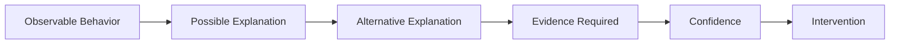

# Behavioral Inference Engine

*Design note for reasoning about behavior without converting observation into unsupported motive*

> Work in progress | September 2026  
> Research direction, not a validated or standalone canonical framework

## Status and Source Boundary

The Behavioral Inference Engine is **not a finished system**.

There is no standalone canonical Behavioral Inference Engine specification in the current source set.

This public design note is a Bucket Two research artifact derived from principles already documented in

- Full Stack v4
- GTM Diagnostic Framework v8
- Building Friction Into AI

It does not create or silently modify a canonical Behavioral Inference Engine.

Its purpose is to make the research problem, current guardrails, and unresolved design questions inspectable.

## The Problem

Human behavior matters in executive and GTM diagnosis.

Managers avoid certain questions.

Sellers preserve weak opportunities.

Executives protect a narrative.

Buyers delay.

Teams comply selectively.

People respond differently to the same standard.

Those behaviors can contain useful information.

The reasoning failure begins when an observed behavior is quietly converted into a story about **why** the person behaved that way.

A manager did not challenge the forecast.

That is an observation.

The manager was protecting the rep.

That is an inference.

The manager feared exposing a weak number to leadership.

That is another inference.

The manager lacked the evidence or confidence to challenge the deal.

That is another.

Several explanations may produce the same visible behavior.

The design problem is therefore

> **How can AI use behavioral evidence without turning plausible motive into fact?**

## Existing Guardrail

The current source frameworks already establish the core constraint.

> **Observable behavior creates a hypothesis about motive. It does not prove motive.**

Full Stack v4 treats an observation as high-confidence evidence that something occurred, but not necessarily evidence of why it occurred.

GTM Diagnostic Framework v8 applies the same discipline inside commercial diagnosis.

The current public reasoning pattern is

This pattern is already established.

The Behavioral Inference Engine research direction asks what additional discipline is required when those observations accumulate **over time**.

## Why Longitudinal Reasoning Is Harder

A single observation may be ambiguous.

Repeated observations may become more informative.

But repetition does not automatically reveal motive.

A pattern can reflect

- a stable preference
- an incentive
- a role constraint
- a learned response
- local context
- a temporary operating condition
- a relationship dynamic
- selection bias in what was observed
- changing circumstances
- coincidence

The system therefore needs to preserve two ideas at once.

**Repeated evidence can strengthen a hypothesis.**

**Repeated evidence can still support the wrong explanation.**

That tension is the core research problem.

## Current Design Direction

The current sources support several design requirements.

### 1. Preserve observation as observation

The system should record what was actually seen or reliably reported without embedding motive into the description.

Weak

> The manager protected the forecast.

Stronger

> The manager did not remove two opportunities after the stated exit criteria were no longer supported.

The second statement leaves interpretation open.

### 2. Keep multiple explanations alive

The system should resist collapsing quickly onto the most vivid or psychologically satisfying explanation.

For the same behavior, credible explanations might include

- incentive alignment
- role ambiguity
- information asymmetry
- lack of confidence
- political risk
- relationship protection
- process friction
- simple error

The point is not to generate endless possibilities.

The point is to prevent one unproven story from becoming the model.

### 3. Ask what evidence would distinguish the explanations

A useful behavioral hypothesis should create a test.

If the explanation is incentive-driven, what else should be observable?

If the explanation is lack of skill, what behavior should change after coaching?

If the explanation is political protection, when should the behavior appear or disappear?

If the explanation is process friction, does the behavior persist after the process changes?

The system becomes more useful when competing explanations imply different expected evidence.

### 4. Calibrate confidence to the evidence

Confidence should increase because the evidence improves, not because a narrative becomes coherent.

A strong story with weak evidence remains weak evidence.

The current frameworks use qualitative confidence rather than invented numerical probabilities.

The same discipline should carry into behavioral inference.

### 5. Connect inference to a low-regret intervention

Behavioral reasoning is useful when it improves a decision.

The intervention should not require certainty about motive when a lower-risk action can test or improve the condition.

For example, leadership may not need to know whether weak pipeline subtraction reflects fear, incentives, habit, or poor judgment before changing the inspection standard and observing what happens.

This preserves human judgment while reducing the temptation to psychoanalyze.

## The Model-Revision Problem

The most explicit unresolved BIE problem in the current source material is **model revision**.

Suppose a longitudinal pattern suggests one explanation.

Then a vivid new event appears to contradict it.

Should the model change?

Maybe.

But a vivid outlier can represent two very different things.

**Signal**  
The existing model is incomplete or wrong.

**Noise**  
The event is unusual and should not overturn a stronger accumulated pattern.

The current sources do **not** define a mature rule for resolving that distinction.

That is intentional.

A future BIE should not invent certainty merely to create a clean model-update mechanism.

## What a Future Model-Update Rule Must Handle

The following are research questions, not established BIE rules.

A stronger model-update method would need to consider questions such as

- How consistent is the prior pattern?
- Was the new event observed directly or inferred?
- Did the context materially change?
- Does the event contradict the pattern or only add an exception?
- Could selection bias explain why the event appears unusually important?
- Does the new evidence distinguish between existing competing explanations?
- Does the new event predict different future behavior?
- What evidence would justify revising the current hypothesis?
- What evidence would justify preserving it?

The important point is not the exact list.

It is that **model revision itself needs evidence discipline**.

## Pattern Strength Is Not Motive Certainty

One likely failure mode is allowing pattern confidence and motive confidence to collapse into the same thing.

They are different.

A system may become highly confident that a behavior repeats.

It may still have only moderate or low confidence about why.

For example

**High confidence observation**  
A manager repeatedly avoids removing unsupported opportunities before forecast calls.

**Possible inference**  
The manager may be protecting forecast optics.

**Alternative inference**  
The manager may not trust the qualification standard.

**Another alternative**  
The manager may lack authority to make the removal decision.

More repeated instances strengthen confidence in the behavior pattern.

They do not automatically select among the explanations.

That distinction is central to the design.

## The Intervention Test

A useful behavioral model should eventually improve intervention quality.

The question is not simply

**What does this behavior mean?**

A better question is

**What intervention would be appropriate given what we know, what remains uncertain, and what evidence the intervention itself could produce?**

This creates a feedback loop.

That loop is a design direction, not yet a validated engine architecture.

## Relationship to Full Stack v4

Full Stack v4 already contains the foundational behavioral guardrail.

It separates observation from inference, keeps alternative explanations open, asks what evidence would weaken the diagnosis, and calibrates confidence.

BIE should not duplicate Full Stack.

Its research question is narrower.

**Can those disciplines be maintained across repeated observations over time without allowing the accumulated model to become falsely certain?**

If the answer eventually requires a material change to Full Stack, that should be proposed separately and approved through normal version discipline.

This design note does not make that change.

## Relationship to GTM Diagnostic Framework v8

GTM v8 already treats leadership and field behavior as part of the operating system.

It also provides the current six-step behavioral inference guardrail

1. observable behavior
2. possible explanation
3. alternative explanation
4. evidence required
5. confidence
6. intervention

BIE extends the research question beyond a single diagnostic moment.

It asks how those behavioral hypotheses should persist, weaken, strengthen, or change across time.

The complete GTM v8 implementation remains private.

## What BIE Is Not

At its current stage, the Behavioral Inference Engine is not

- a personality model
- a psychological diagnosis system
- a motive detector
- a scoring model for people
- an automated truth engine
- a prediction system for human behavior
- a validated assessment methodology
- a substitute for direct evidence or human judgment

Those would all exceed what the current source material supports.

## Failure Modes the Design Must Avoid

A future implementation should be evaluated against several obvious risks.

### Motive inflation

A plausible explanation becomes treated as fact.

### Pattern overreach

Repeated behavior is interpreted as proof of a stable trait or intention.

### Vivid-outlier capture

One memorable event causes the system to abandon a stronger prior pattern too quickly.

### Model inertia

The opposite failure. New evidence is discounted because the system has become attached to its existing explanation.

### Context erasure

The same behavior is assumed to mean the same thing across different roles, incentives, relationships, or operating conditions.

### Confirmation loops

The system preferentially notices evidence that supports the current model.

### Intervention overreach

Leadership acts as though motive is known when a lower-regret action could test the condition first.

These are design risks.

They are not yet evidence that BIE reliably solves them.

## Evaluation Questions

A later evaluation layer should test whether BIE improves reasoning quality rather than merely producing richer behavioral narratives.

Useful questions would include

- Does it keep observation separate from motive?
- Does it preserve credible competing explanations?
- Does confidence change when evidence changes?
- Does it avoid overreacting to vivid outliers?
- Does it revise when genuinely disconfirming evidence appears?
- Does it improve intervention quality?
- Does it know when the evidence is insufficient?
- Does it reduce false certainty rather than add psychological sophistication?

A system that produces more elaborate stories about people would fail the intended design.

## Current Evidence

The evidence for BIE today is limited.

The underlying attribution guardrail exists in Full Stack v4 and GTM v8.

The need for longitudinal behavioral inference and disciplined model revision has been identified as a next-stage design problem.

That supports a **research direction**.

It does not support a claim that the Behavioral Inference Engine is implemented, validated, or ready for operational use as a standalone system.

## Open Questions

The most important unresolved questions currently include

- What constitutes enough repeated evidence to strengthen a behavioral hypothesis?
- How should context changes affect an existing pattern?
- How should contradictory observations be weighted?
- When should an outlier revise the model?
- When should an outlier remain an exception?
- How should the system prevent accumulated observations from becoming false motive certainty?
- What information should persist across cases?
- What should be deliberately forgotten or treated as local context?
- How should human review override, revise, or reject the model?
- What evaluation design can distinguish better inference from merely more sophisticated narrative?

These questions are part of the work.

They should not be hidden by prematurely formalizing an architecture.

## Public and Private Boundary

This note publishes the research problem and the current reasoning constraints.

It does not publish a complete operating prompt, persistence design, scoring method, model-update algorithm, internal behavioral record format, or execution procedure.

Some of those components do not yet exist as mature canonical methods.

Others may remain private if developed.

The public claim should remain proportional to the evidence.

## Current Position

The Behavioral Inference Engine is best described as a **work-in-progress research direction for longitudinal behavioral inference under evidence discipline**.

Its core principle is already clear.

**Behavior can inform a hypothesis about motive. It cannot prove motive by itself.**

The unresolved work is learning how to preserve that discipline when behavioral evidence accumulates over time and the model itself needs to change.
