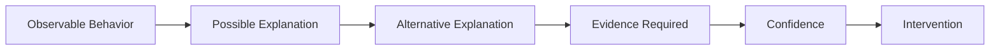
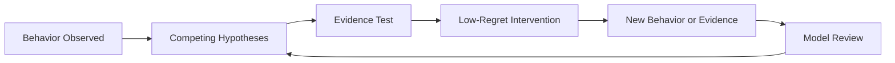

# Behavioral Inference Engine

*Design note for reasoning about behavior without converting observation into unsupported motive*

> Work in progress | September 2026  
> Research direction, not a validated or standalone canonical framework

> **Historical source context**
>
> This work-in-progress research note records development context drawn from Full Stack v4 and GTM Diagnostic Framework v8. References to current sources below describe that earlier context. The current canonical Full Stack and GTM Diagnostic Framework sources are authoritative. At the time of this note's most recent verification, those are [Full Stack v5.1](../architecture/full-stack-v5-1-public-architecture.md) and [GTM Diagnostic Framework v9](../architecture/gtm-diagnostic-framework-v9-public-architecture.md).
>
> This note does not claim a complete reassessment of the Behavioral Inference Engine against the later private frameworks. A September 2026 N-of-1 pilot has been added below as bounded research evidence about the evidence environment. It does not make BIE canonical or validated.

## Status and Source Boundary

The Behavioral Inference Engine is **not a finished system**.

There is no standalone canonical Behavioral Inference Engine specification in the current source set.

This public design note is a Bucket Two research artifact derived from principles already documented in

- Full Stack v5.1
- GTM Diagnostic Framework v9
- Building Friction Into AI

It does not create or silently modify a canonical Behavioral Inference Engine.

Its purpose is to make the research problem, current guardrails, and unresolved design questions inspectable.

## The Problem

Human behavior matters in executive and GTM diagnosis.

Managers avoid certain questions.

Sellers preserve weak opportunities.

Executives protect a narrative.

Buyers delay.

Teams comply selectively.

People respond differently to the same standard.

Those behaviors can contain useful information.

The reasoning failure begins when an observed behavior is quietly converted into a story about **why** the person behaved that way.

A manager did not challenge the forecast.

That is an observation.

The manager was protecting the rep.

That is an inference.

The manager feared exposing a weak number to leadership.

That is another inference.

The manager lacked the evidence or confidence to challenge the deal.

That is another.

Several explanations may produce the same visible behavior.

The design problem is therefore

> **How can AI use behavioral evidence without turning plausible motive into fact?**

## Existing Guardrail

The current source frameworks already establish the core constraint.

> **Observable behavior creates a hypothesis about motive. It does not prove motive.**

The current canonical Full Stack framework keeps observation, stated account, and inferred driver distinct when human behavior matters. Behavioral Inference Discipline makes that reasoning more explicit inside Human Pattern 1 without claiming motive certainty.

GTM Diagnostic Framework v9 applies the same attribution discipline inside commercial diagnosis. It states that behavior does not prove motive and that incentives are relevant evidence rather than proof of intent.

The current public reasoning pattern is

This pattern is already established.

The Behavioral Inference Engine research direction asks what additional discipline is required when those observations accumulate **over time**.

## Why Longitudinal Reasoning Is Harder

A single observation may be ambiguous.

Repeated observations may become more informative.

But repetition does not automatically reveal motive.

A pattern can reflect

- a stable preference
- an incentive
- a role constraint
- a learned response
- local context
- a temporary operating condition
- a relationship dynamic
- selection bias in what was observed
- changing circumstances
- coincidence

The system therefore needs to preserve two ideas at once.

**Repeated evidence can strengthen a hypothesis.**

**Repeated evidence can still support the wrong explanation.**

That tension is the core research problem.

## Current Design Direction

The current sources support several design requirements.

### 1. Preserve observation as observation

The system should record what was actually seen or reliably reported without embedding motive into the description.

Weak

> The manager protected the forecast.

Stronger

> The manager did not remove two opportunities after the stated exit criteria were no longer supported.

The second statement leaves interpretation open.

### 2. Keep multiple explanations alive

The system should resist collapsing quickly onto the most vivid or psychologically satisfying explanation.

For the same behavior, credible explanations might include

- incentive alignment
- role ambiguity
- information asymmetry
- lack of confidence
- political risk
- relationship protection
- process friction
- simple error

The point is not to generate endless possibilities.

The point is to prevent one unproven story from becoming the model.

### 2A. Test structural and systemic explanations

Behavior that looks personal may be materially shaped by the operating environment.

Compensation design, role constraints, reporting mechanics, approval systems, resource constraints, organizational politics, manager behavior, governance, and other structural conditions can produce recurring behavior without establishing a specific personal motive.

The system should therefore ask whether the behavior would predictably emerge from the operating system even if the actor's personal motive were different.

This should not become structural determinism.

Structural pressure and individual agency can operate together.

### 3. Ask what evidence would distinguish the explanations

A useful behavioral hypothesis should create a test.

If the explanation is incentive-driven, what else should be observable?

If the explanation is lack of skill, what behavior should change after coaching?

If the explanation is political protection, when should the behavior appear or disappear?

If the explanation is process friction, does the behavior persist after the process changes?

The system becomes more useful when competing explanations imply different expected evidence.

### 4. Calibrate confidence to the evidence

Confidence should increase because the evidence improves, not because a narrative becomes coherent.

A strong story with weak evidence remains weak evidence.

The current frameworks use qualitative confidence rather than invented numerical probabilities.

The same discipline should carry into behavioral inference.

### 5. Connect inference to decision-relevant action without requiring motive certainty

Behavioral reasoning is useful when it improves a decision.

The decision should not require certainty about motive when the unresolved behavioral explanation does not materially change what should be done.

For example, leadership may not need to know whether weak pipeline subtraction reflects fear, incentives, habit, structural pressure, or poor judgment before changing an inspection standard and observing what happens.

Inside the current canonical Full Stack framework, Behavioral Inference Discipline calibrates the behavioral explanation while Compressed Diagnosis can reduce additional investigation when the evidence and decision boundary support it. Strategic Adjudication retains responsibility for reversibility, downside, cost of delay, opportunity cost, and whether action is warranted. Compressed Diagnosis does not make motive more observable or change BIE's longitudinal research boundary.

This preserves human judgment while reducing both the temptation to psychoanalyze and the temptation to wait for motive certainty that the decision does not require.

## Framing Can Contaminate Behavioral Evidence

Behavioral evidence is not produced in a vacuum.

The way a question, choice, or challenge is framed can change the incentives around the response.

A prompt may make one answer easier because it protects status, competence, identity, relationship standing, or face. Another answer may require the person to concede that they missed something, were wrong, or should defer to someone else's judgment.

That does not prove ego, defensiveness, or any other motive.

It means the response may not be clean evidence of the person's underlying belief.

A useful research distinction is therefore

**What the person answered**

versus

**What the framing made easier or harder to answer**

For example, consider a forced choice between

> Is this a missing layer that others have overlooked?

and

> Is this overengineered?

A negative answer may reflect the merits of the work.

It may also be easier to give because the positive answer carries an implied status concession.

The current BIE does not contain a validated rule for separating those effects.

The research hypothesis is narrower.

> **Before interpreting a response as evidence, inspect whether the way the evidence was elicited created a status, identity, face-saving, relationship, or role incentive that could have influenced the response.**

This should not become a new form of mind-reading.

The point is not to infer that a respondent felt threatened.

The point is to recognize that **choice architecture can become part of the evidence environment**.

A more neutral question can sometimes reduce that contamination.

Instead of asking the respondent to validate or reject a status-loaded claim, the system can ask for an open judgment such as

> Where does this land for you?

Whether that produces meaningfully different evidence remains a research question.

## System-Status Cues Can Become Part of the Evidence Environment

The environment surrounding an AI answer can include visible signals about the system that produced it.

Examples include

- a higher-capability or premium model designation
- a higher reasoning-effort label
- an extended-reasoning indicator
- a named reasoning harness or framework
- another cue that plausibly changes the user's expectation of answer quality

These cues may matter even when they are not evidence for the correctness of the specific answer.

The BIE research question is behavioral rather than psychological.

> **When a system-status cue changes, does the person's observable scrutiny, confidence, deference, or decision behavior change with it?**

The direction of the effect should not be assumed.

A higher-status cue may increase deference.

It may increase scrutiny because the user expects more from the supposedly stronger system.

It may have no observable effect.

It may interact with prior experience, task difficulty, domain expertise, hypothesis awareness, or the person's existing confidence.

That means the cue can be worth preserving as part of the evidence environment without treating it as a motive.

For example

**Observation**  
A user challenges more assumptions when an answer is presented with a high-capability cue.

**Possible hypothesis**  
The cue may be changing the user's scrutiny threshold.

**Alternative explanations**  
The user may hold higher-status systems to a higher standard, may be compensating for awareness of the cue, may have learned from prior model errors, or may simply be reacting to differences in the cases.

The observation does not establish authority bias, distrust, ego, deference, or another motive.

### Current bounded evidence

A September 2026 N-of-1 randomized-label pilot tested neutral and high-capability presentation cues across twelve frozen business decision cases.

The participant knew the hypothesis before participation.

The pilot did not produce coherent evidence that the high-capability cue reduced scrutiny.

All six deliberately planted reasoning weaknesses were detected, with three detections under each label.

The participant later reported treating advanced capability labels as a reason for sharper stress testing.

Because the participant was informed, the cases became recognizable, and the paired design produced limited independent variation, the result remains indeterminate.

The durable BIE implication is narrower.

> **System-status cues are plausible contextual variables in the behavioral evidence environment. Preserve them when material, but do not assume either the direction of the effect or the motive behind the behavior.**

See [Model-Tier Confidence Effect N-of-1 Pilot](../evidence/2026-09-20-model-tier-confidence-n1-pilot.md).

## The Model-Revision Problem

The most explicit unresolved BIE problem in the current source material is **model revision**.

Suppose a longitudinal pattern suggests one explanation.

Then a vivid new event appears to contradict it.

Should the model change?

Maybe.

But a vivid outlier can represent two very different things.

**Signal**  
The existing model is incomplete or wrong.

**Noise**  
The event is unusual and should not overturn a stronger accumulated pattern.

The current sources do **not** define a mature rule for resolving that distinction.

That is intentional.

A future BIE should not invent certainty merely to create a clean model-update mechanism.

## What a Future Model-Update Rule Must Handle

The following are research questions, not established BIE rules.

A stronger model-update method would need to consider questions such as

- How consistent is the prior pattern?
- Was the new event observed directly or inferred?
- Did the context materially change?
- Does the event contradict the pattern or only add an exception?
- Could selection bias explain why the event appears unusually important?
- Does the new evidence distinguish between existing competing explanations?
- Does the new event predict different future behavior?
- What evidence would justify revising the current hypothesis?
- What evidence would justify preserving it?

The important point is not the exact list.

It is that **model revision itself needs evidence discipline**.

## Pattern Strength Is Not Motive Certainty

One likely failure mode is allowing pattern confidence and motive confidence to collapse into the same thing.

They are different.

A system may become highly confident that a behavior repeats.

It may still have only moderate or low confidence about why.

For example

**High confidence observation**  
A manager repeatedly avoids removing unsupported opportunities before forecast calls.

**Possible inference**  
The manager may be protecting forecast optics.

**Alternative inference**  
The manager may not trust the qualification standard.

**Another alternative**  
The manager may lack authority to make the removal decision.

More repeated instances strengthen confidence in the behavior pattern.

They do not automatically select among the explanations.

That distinction is central to the design.

## The Intervention Test

A useful behavioral model should eventually improve intervention quality.

The question is not simply

**What does this behavior mean?**

A better question is

**What intervention would be appropriate given what we know, what remains uncertain, and what evidence the intervention itself could produce?**

This creates a feedback loop.

That loop is a design direction, not yet a validated engine architecture.

## Relationship to the Current Canonical Full Stack Framework

Several BIE disciplines are now sufficiently defined to inform the current canonical Full Stack framework through **Behavioral Inference Discipline**, executed primarily through Human Pattern 1.

Those exported disciplines include

- separating observed behavior from inferred motive
- treating a stated explanation as evidence rather than privileged truth
- preserving a strongest credible behavioral alternative when it can change the reasoning
- testing structural and systemic explanations before over-attributing personal motive
- allowing structural pressure and individual agency to coexist
- recognizing evidence-environment effects
- separating confidence in a behavioral pattern from confidence in its driver
- using relevant operator experience as a prior rather than proof
- testing whether unresolved behavioral uncertainty actually matters to the current decision

Full Stack uses these disciplines inside the current reasoning execution.

It does not maintain a persistent behavioral profile, accumulate motive scores, or claim that repeated observations eventually make motive directly observable.

The boundary is

> **Full Stack decides how much behavioral inference the current decision requires. BIE develops how behavioral understanding should accumulate and revise across time.**

This export is an architecture decision inside the current canonical Full Stack framework. It was incorporated in Full Stack v5 and is not validation of BIE as a standalone system.

## Relationship to GTM Diagnostic Framework v9

GTM v9 treats leadership, manager, seller, buyer, and cross-functional behavior as part of the commercial operating system.

Its canonical behavioral guardrail remains

> **Behavior does not prove motive.**

The current six-step reasoning pattern is

1. observable behavior
2. possible explanation
3. alternative explanation
4. evidence required
5. confidence
6. intervention

GTM v9 also states

> **Incentives are relevant evidence. They are not proof of intent.**

BIE extends the research question beyond a single diagnostic moment.

It asks how behavioral hypotheses should persist, weaken, strengthen, decay, or change across time while preserving context and attribution discipline.

The complete GTM v9 implementation remains private.

## What BIE Is Not

At its current stage, the Behavioral Inference Engine is not

- a personality model
- a psychological diagnosis system
- a motive detector
- a scoring model for people
- an automated truth engine
- a prediction system for human behavior
- a validated assessment methodology
- a substitute for direct evidence or human judgment

Those would all exceed what the current source material supports.

## Failure Modes the Design Must Avoid

A future implementation should be evaluated against several obvious risks.

### Motive inflation

A plausible explanation becomes treated as fact.

### Pattern overreach

Repeated behavior is interpreted as proof of a stable trait or intention.

### Vivid-outlier capture

One memorable event causes the system to abandon a stronger prior pattern too quickly.

### Model inertia

The opposite failure. New evidence is discounted because the system has become attached to its existing explanation.

### Context erasure

The same behavior is assumed to mean the same thing across different roles, incentives, relationships, or operating conditions.

### Confirmation loops

The system preferentially notices evidence that supports the current model.

### Status-sensitive framing confound

A response is treated as clean evidence of underlying judgment even though the framing may have created a status, identity, face-saving, relationship, or role incentive that made one answer easier to give.

### System-status direction assumption

A visible capability, reasoning-effort, or framework cue is treated as though it must increase deference or trust. The cue may increase scrutiny, have no effect, or interact with other contextual variables.

### Intervention overreach

Leadership acts as though motive is known when a lower-regret action could test the condition first.

These are design risks.

They are not yet evidence that BIE reliably solves them.

## Evaluation Questions

A later evaluation layer should test whether BIE improves reasoning quality rather than merely producing richer behavioral narratives.

Useful questions would include

- Does it keep observation separate from motive?
- Does it preserve credible competing explanations?
- Does confidence change when evidence changes?
- Does it avoid overreacting to vivid outliers?
- Does it revise when genuinely disconfirming evidence appears?
- Does it improve intervention quality?
- Does it know when the evidence is insufficient?
- Does it inspect whether the way evidence was elicited could have biased the response?
- Does it reduce false certainty rather than add psychological sophistication?

A system that produces more elaborate stories about people would fail the intended design.

## Current Evidence

The evidence for BIE today is limited.

The underlying attribution discipline exists in the current canonical Full Stack and GTM Diagnostic Framework sources. Full Stack includes Behavioral Inference Discipline as a refinement, but that architecture decision is not validation of BIE as a standalone system.

The need for longitudinal behavioral inference and disciplined model revision remains a next-stage design problem.

A documented design observation also suggests that response framing may contaminate behavioral evidence when different answers carry different status, identity, face-saving, relationship, or role implications.

A September 2026 N-of-1 pilot adds a second bounded observation. Visible system-status cues registered to the participant, but the pilot did not show reduced scrutiny under the higher-capability label. The participant's retrospective account described the cue as a reason for sharper stress testing. Because the participant knew the hypothesis and the design had recognized limitations, the direction and mechanism remain unresolved.

These are working observations, not validation.

Together, they support a **research direction**.

It does not support a claim that the Behavioral Inference Engine is implemented, validated, or ready for operational use as a standalone system.

## Open Questions

The most important unresolved questions currently include

- What constitutes enough repeated evidence to strengthen a behavioral hypothesis?
- How should context changes affect an existing pattern?
- How should contradictory observations be weighted?
- When should an outlier revise the model?
- When should an outlier remain an exception?
- How should the system prevent accumulated observations from becoming false motive certainty?
- What information should persist across cases?
- What should be deliberately forgotten or treated as local context?
- How should human review override, revise, or reject the model?
- How should the system detect potentially status-loaded framing without itself inferring motive?
- When is neutral reframing a useful test of whether the original response was contaminated by the choice architecture?
- Do visible model-tier, reasoning-effort, or named-framework cues produce repeatable changes in scrutiny, confidence, deference, or decision behavior?
- When such a cue matters, is the direction of the effect stable across domains and over time or context dependent?
- What evaluation design can distinguish better inference from merely more sophisticated narrative?

These questions are part of the work.

They should not be hidden by prematurely formalizing an architecture.

## Public and Private Boundary

This note publishes the research problem and the current reasoning constraints.

It does not publish a complete operating prompt, persistence design, scoring method, model-update algorithm, internal behavioral record format, or execution procedure.

Some of those components do not yet exist as mature canonical methods.

Others may remain private if developed.

The public claim should remain proportional to the evidence.

## Current Position

The Behavioral Inference Engine is best described as a **work-in-progress research direction for longitudinal behavioral inference under evidence discipline**.

Several of its bounded reasoning disciplines now inform the current canonical Full Stack framework through Behavioral Inference Discipline and Human Pattern 1.

That does not make BIE implemented or validated as a standalone engine.

Its core principle remains clear.

**Behavior can inform a hypothesis about motive. It cannot prove motive by itself.**

The unresolved work is longitudinal: how behavioral hypotheses persist, accumulate, weaken, survive context change, respond to contradictory evidence, and eventually decay or revise without turning pattern confidence into motive certainty.
